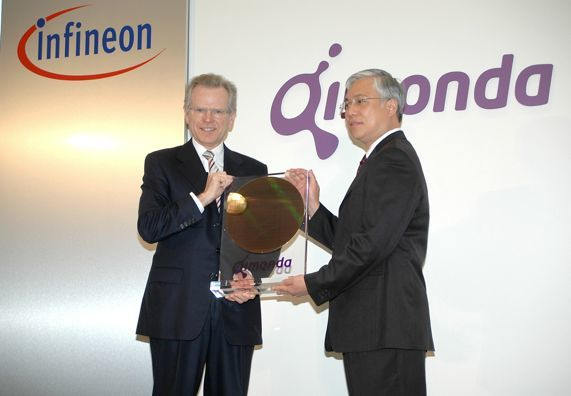
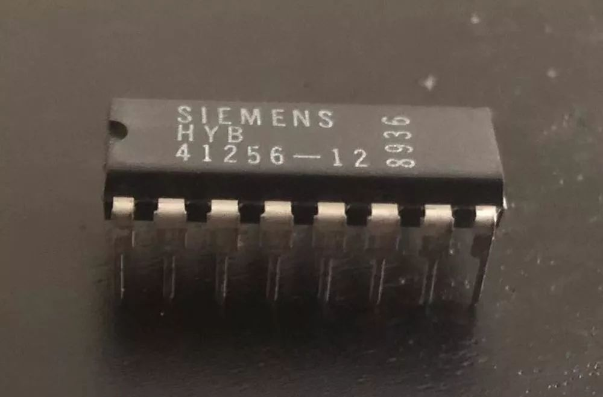
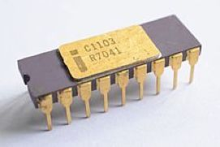
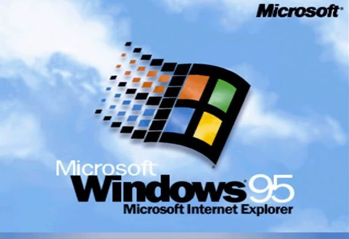
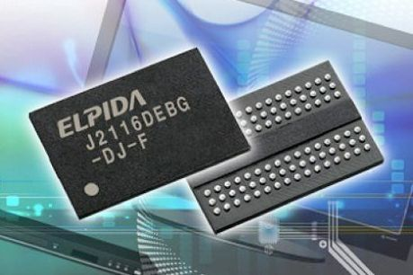
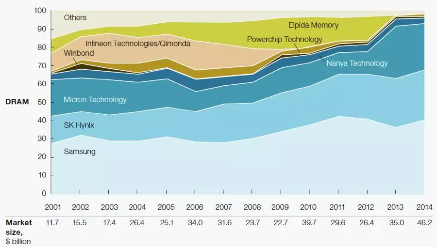
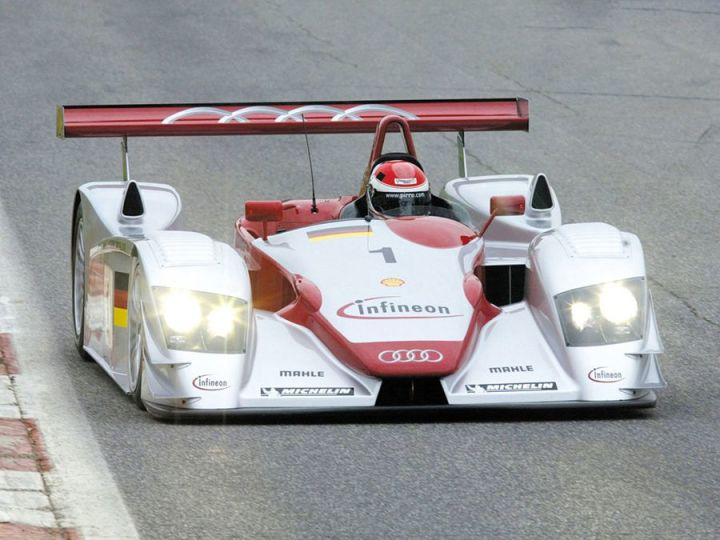
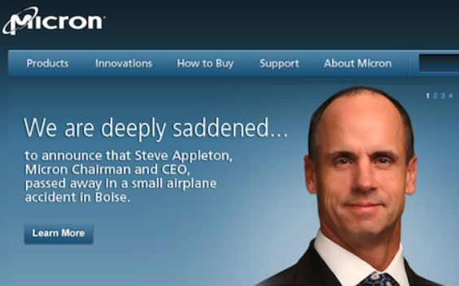
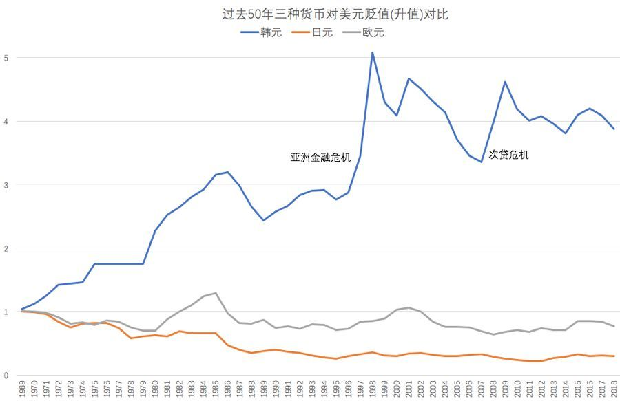
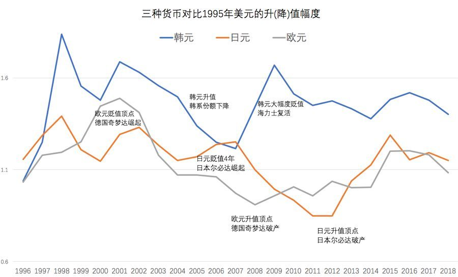

### Preface

On May 1, 2006, German semiconductor giant Infineon spun off its memory business unit and listed it on the New York Stock Exchange with the ticker symbol Qi. According to the company, Qi has two meanings: one is the Chinese word "气" meaning energy flow, representing the dynamic energy flow of the business; the other meaning is its pronunciation, which sounds like the English word "key," representing the opening key to the world.

However, this philosophically meaningful name has not brought good luck.

This company is called Qimonda, and today few people know about it because it only lasted three years before it collapsed as the world's second largest memory company.



Infineon announced the spin-off of Qimonda, with two CEOs holding 12-inch wafers.

Infineon is a semiconductor company that was spun off from Siemens in 1999. Its first CEO was Ulrich Schumacher, who was only 41 years old at the time. With a daring spirit, Schumacher invested 1.1 billion euros in a 12-inch wafer plant, making Infineon take a lead in the memory industry and surpassing Micron and Hynix in the early 2000s.

Unfortunately, in 2004, Schumacher was forced to resign due to a strange bribery scandal (which will be detailed later). Since then, this German company has become cautious, which ultimately led to their dejected exit four years later.

In stark contrast to this, Micron's CEO Steve Appleton, who was younger and more adventurous with a love for flying planes, seized every opportunity and rose to the top through networking and partnerships until his untimely death in a plane crash in 2012.

1999 was a year of big changes in the memory industry: South Korea's third-ranked semiconductor company, Hyundai, acquired fifth-ranked LG Semiconductor; Hitachi and NEC merged their memory divisions to form Elpida; IBM withdrew from its joint venture with Toshiba, Dominion, and exited the memory business; Micron, which had just completed its acquisition of Texas Instruments' memory division, also entered the mainland Chinese market at that time; and the 921 earthquake in Taiwan caused a threefold increase in memory prices within a week in Zhongguancun due to production line losses, which is unimaginable today.



Why are various electronic giants all selling off their memory businesses one after another? It is because the prices of memory fluctuate greatly, and the profit is often insufficient. Companies and investors who are publicly listed do not like financial reports that have inconsistent profits and losses.

Why do memory prices fluctuate? Why don't other chips behave like this?

Simply put, memory chips are classified as commodities, similar to bulk commodities, and belong to general raw materials. Their prices are determined by supply and demand.

Memory is the oil of the electronics industry, as it is required by almost every product.

### Chapter 1: 1960-1970s

Robert H. Dennard of IBM is recognized as the father of DRAM for his concept of refreshing MOS capacitor storage. The earliest 256-bit memory produced by Fairchild could only store a few dozen letters. After several key members defected from Fairchild, the i1103 DRAM produced by Intel in 1970 was a groundbreaking achievement, bringing storage cost down to 1 cent per bit.



Intel's first pot of gold, the i1103 1KB memory chip.

In the first half of the 1970s, Intel was the dominant player in the DRAM market, but in the second half, it belonged to Mostek. This company, founded by engineers from semiconductor pioneer Texas Instruments (TI), expanded its market share to over 80% in the late 1970s, thanks to its 4kb and 16kb DRAM products.

In 1978, four employees of Mostek resigned and founded Micron in a basement. Their first design order was for Mostek's 64kb DRAM. Later, with the support of potato magnate J.R. Simplot, they bought second-hand equipment and began to enter the competition. Through a series of ups and downs, Micron became one of the top players, and we will discuss more about them later.

In 1974, Lee Kun-hee ignored his opposition and acquired the bankrupt Korea Semiconductor to enter the semiconductor industry. He said that even if everyone was against it, he would do it himself. As a result, he used his personal funds to purchase a 50% stake.

This visionary move has led to the brilliance of Samsung today.

It should be noted that in 1974, only 20 years had passed since the end of the Korean War and South Korea was the poorest country in the world, built upon the ruins of the 1950s.

It is worth noting that China also made significant efforts to develop DRAM in the 1970s. Peking University's physics department and the Chinese Academy of Sciences were responsible for research and production, and their level of development lagged behind that of the United States by only about five years.

### Chapter 2: 1980s

In countless fields with immense potential, Mostek ultimately chose to focus its resources on the memory industry, which is a cut-throat business, but ultimately lost to government-backed companies from Japan and South Korea in the competition.

Mostek was sold at a low price to French company Thomson in 1985, and later with the merger of Thomson and SGS, it became part of STMicroelectronics.

Why is it said that the soul has returned? It is because while Mostek's body is no longer present, their vast array of memory-related patents live on. STM has actually profited many times over their acquisition of Mostek by using these patents in lengthy litigation against memory manufacturers.

Later on, various lawsuits between companies in the memory industry became a common occurrence in the business.

Mostek was the first giant to fall in the memory industry, signaling the consecutive collapses of American powerhouses to come.

Memory was not a high barrier to entry in the 1980s, gradually becoming an industry of manufacturing. The entry of Japan's Five Giants (Hitachi, Mitsubishi, Toshiba, NEC, Fujitsu) and major South Korean companies (Samsung, Hyundai, LG, Daewoo) caused industry profits to drop to freezing point. Japanese memory manufacturers like OKI, Matsushita, and Nippon Steel were also affected.

The game console market crashed from 1983 to 1985, causing sales to drop to less than 10% of previous levels, which was a significant factor in the severe excess of memory. This collapse, known as the Atari Shock, led to American manufacturers such as Intel and National Semiconductor abandoning the DRAM field.

Mostek and Intel's exit gave other competitors a chance to breathe, and the popularity of PCs and Nintendo's Red and White Machines in 1985 made everyone's lives better.

Japanese manufacturers received strong government support in funding, and in the mid-80s, Nikon and Canon defeated GCA, a US company with defective products, with their lithography machines, resulting in their semiconductor yield being 30% better than Americans', and consequently monopolized most of the memory market in the late 80s.

At that time (1987), our future protagonist Samsung Electronics had less than 10% market share and couldn't even make it into the top 5, while the other protagonist Micron had less than 5% market share.

These two later rival companies joined forces, and most of Samsung's core technology back then came from Micron. However, due to outdated processes and high costs, Samsung Semiconductor suffered a loss of up to 300 million US dollars by 1986.

In the 1980s, four South Korean companies (Samsung, Hyundai, LG, and Daewoo) invested over 2 billion US dollars, which is equivalent to billions of dollars today, and can be considered a bold bet on the national economy.

In 1985, the US Department of Commerce initiated a 301 anti-dumping investigation and in 1986 signed the US-Japan Semiconductor Agreement, forcing Japan to open up its closed semiconductor market.

The signing of the Plaza Accord in 1985 and the appreciation of the Japanese yen finally curbed the aggressive momentum of Japanese manufacturers. Although Japanese manufacturers still hold a technological advantage, they can no longer suppress their competitors with price weapons.

The consequence of the U.S.-Japan semiconductor agreement was administrative intervention in the market, which led to consumers having to pay more money to buy computers with mainstream memory. Later, due to complaints from major memory buyers such as IBM and HP, the anti-dumping agreement was dissolved in 1991.

In the 1980s, China's reform and opening up saw Japanese yen loans and Japanese technology become the main driving force. Wuxi 742 Factory introduced Toshiba's 3-inch production line to mass produce 64Kb DRAM, perhaps leading to Wuxi's later semiconductor obsession. Since then, the 908 Project has settled in Wuxi Huajing and built the first 6-inch production line, introducing process technology from AT&T.

However, due to various reasons, the long construction period led to technological backwardness and loss of competitiveness. Under the guidance of the policy of introducing foreign technology comprehensively and achieving rapid development with high efficiency, China's domestic memory research and equipment manufacturing began to stagnate.

Today, our semiconductor equipment technology is approximately 20 years behind, becoming the biggest bottleneck in China's manufacturing industry without exception.

### Chapter 3: 1990s

The first half of the 1990s was the golden era of PC development, and the release of Windows 95 was the pinnacle of its success.

I was extremely excited when I installed Win95 on a 486 with only 4MB of memory. I still remember why I didn't upgrade the memory - at that time, 16MB of memory in Zhongguancun would cost about 4000-5000 yuan, which is less than 1 yuan today.  (Nostalgic for the blue sky and white clouds of Windows 95, while Vista started to become that hazy blue.)

NEC and Hitachi remained among the top three in the early 1990s, but their competitiveness gradually decreased due to the appreciation of the yen and the bursting of the economic bubble.

At the 1988 Seoul Olympics, Korean manufacturers made their debut on the world stage and seized the opportunity. Samsung, Hyundai Electronics, and LG Semiconductors have successfully caught up and entered the top six.

Toshiba has been consistently placed within the second tier (ranked 5th to 10th) in the DRAM field throughout the entirety of the 1990s. Korean manufacturers offered high salaries to poach Toshiba engineers and even invited those who were unwilling to leave their lifetime employment to fly over and provide guidance on weekends. As a result, Korean enterprises quickly caught up in terms of technology.

After Micron became the first in the industry to adopt ASML lithography machines exclusively, Samsung, who has maintained a good relationship with Micron for a long time, also realized that the capacity of ASML PAS5500 was significantly better than that of Nikon from Japan. Starting in 1995 with the installation of the first ASML machine, Samsung replaced all Nikon machines in just two years.

Hynix followed Samsung's lead and replaced their ASML lithography machines in the 1990s, while Japanese DRAM manufacturers continued to use Nikon and Canon. This led to a disparity in manufacturing costs between South Korea and Japan.

In 1997, Japan Steel discontinued DRAM production and transferred the factories to Hitachi and UMC. In 1998, Matsushita also withdrew, and the following year, Hitachi and TI ended their joint venture in the United States.

By the late 1990s, Japanese manufacturers' market share had fallen from 70% in the early 1990s to 42%. The ultimate result was the merger and establishment of Elpida in 1999.

It is worth mentioning that NEC established the joint venture Shougang NEC with Shougang in 1991 and mass produced 4Mb DRAM in 1994, cultivating the first group of semiconductor manufacturing talents in China.

In 1997, NEC established a joint venture company, Huahong NEC, in Shanghai, and constructed China's first 8-inch production line, successfully achieving mass production of memory. However, as NEC withdrew from the DRAM sector following the establishment of Elpida, Huahong was forced to shift to contract manufacturing.

Unfortunately, Huahong was relegated to a supporting role due to insufficient funds and overseas technology blockade, and missed out on the great opportunity to keep up with international technology by building a 12-inch wafer production line. Its low-end production line later became a major supplier for the second-generation ID card.

In the early 1990s, many manufacturers formed alliances in memory technology to reduce research and development investment. These included NEC and AT&T, Sony and AMD, Mitsubishi and TI, as well as Motorola, OKI, and SGS-Thomson. The results showed that companies with ambivalent attitudes towards technology research and development, relying on others for it, ultimately went out of business relatively early.

In the development of 1Gb chips, three major technological camps were formed in the late 1990s: 1. The South Korean camp; 2. Hitachi,Mitsubishi, and TI; 3. IBM, Motorola, Infineon, and Toshiba.

Toshiba was the first to withdraw from the last group, followed by Motorola and IBM, which led to Infineon's lone struggle in the trench capacitor technology and ultimately resulted in failure.

During the 1997 Asian financial crisis, Korean companies suffered from high debt ratios and insufficient foreign exchange reserves. Tightening of European and American debts caused the Korean won to plummet by 60% in a matter of weeks towards the end of the year. However, this unexpectedly greatly strengthened the export competitiveness of Korean companies.

In 1998, South Korean companies surpassed Japanese companies in DRAM market share.

To deal with an unprecedented crisis, the South Korean government sought assistance from the International Monetary Fund and demanded large-scale layoffs and cooperation among enterprises, such as ordering Daewoo Motor to acquire Samsung Motors, Samsung Electronics to acquire Daewoo Electronics, and Hyundai Electronics to merge with LG Semiconductors.

It should be said that South Korea's rebuilding this time around has been very successful. After all, with a small land area and population, it's clear that they wouldn't have had competitive power across all industries. Since then, South Korea has shone in areas that have been prioritized for development, such as high-tech, household appliances, automobiles, shipbuilding, petrochemicals, and entertainment.

The background of the NEC and Hitachi merger of the DRAM business in 1999 was that NEC's market share had fallen to 11% and fourth place, while Hitachi had fallen to 7% and eighth place. Both parties recognized that such market share could not survive independently, especially after Micron's acquisition of TI DRAM and termination of its technical cooperation with NEC.

 _（Elpida Chips）_

However, the joint venture company Elpida did not achieve the 20% market share as expected by the two parent companies, instead falling to 5% in 2002 until the legendary President Yukio Sakamoto took over. (Elpida memory chip)

### Chapter 4: 2000s

 _（2001-2014 DRAM Market Share）_

In the year 2000, there were still over 20 global memory manufacturers, but by the end of the 00s, there were less than 10 left. After the major consolidation in 1999, the ranking was settled by 2001 with Samsung, Micron, Hynix, and Infineon holding nearly 80% of the market share. (DRAM market share from 2001-2014)

At this time, the first to encounter problems was Hitachi.

The dramatic plunge in DRAM prices in 2001 resulted in a staggering loss of 2.5 billion US dollars for Hynix, leaving them unable to repay the massive loan of more than 14 billion US dollars owed for the purchase of LG Semicon on schedule.

Hynix's debt-to-asset ratio is an astonishing 206%, and everyone believes that it will soon go under.

The creditors led by Korea Exchange Bank (KEB) have taken over the management of Hynix and have started searching for a buyer. However, with such a huge debt burden, both Samsung and LG have refused to take over.

At this time, the creditors of Hynix approached Micron, who was most adept at taking advantage of others' difficulties, and reached an agreement to sell the company at a very low price.

As a result, Hynix employees have erupted, and the union has issued a statement to Micron claiming that once the acquisition is completed, all employees will collectively resign.

In this situation, Micron had no choice but to retreat.

All major DRAM manufacturers are hoping for Hynix's collapse to bring memory prices back up.

To everyone's surprise, the creditors of Hynix, especially KEB, did not give up. 130 creditors formed a union and appointed Professor Eui-Jei Woo of KEB Bank as the CEO of Hynix.

The pressure on Professor Woo at that time can only be imagined. According to his recollection, he considered the day of his appointment the worst day of his life. These bankers conducted extremely serious industry research and developed a stunning revival plan:

Canceled $8 billion in debt by converting it to equity to achieve absolute controlling ownership and reduce the asset-liability ratio.

1. Collaborating with Nanya Technology Corp., Italy-based semiconductor manufacturer STMicroelectronics will develop and produce NAND flash memory, in order to alleviate the pressure on DRAM prices.
    
2. We negotiated a highly profitable investment with Wuxi, China. The South Korean side only invested 250 million dollars in cash to construct an advanced 12-inch wafer factory that has a total investment of 2 billion dollars. (In other words, it could be said that Wuxi saved Hynix.)
    
3. Transfer the creditors' shares gradually to the market for the public to take over.
    
4. Infineon acquires Promos's production capacity amid the Infineon-Mosel dispute.

The capacity of Hynix's 12-inch plant in Wuxi and the explosive increase in demand for NAND flash memory in the market will bring billions of dollars in profits to Hynix in the coming years and maintain its core competitiveness in the market.

Infineon was another highlight during the years of 2000-2006. Due to its bold investment in 12-inch wafer fabs, Infineon quickly surpassed Micron and ranked third, and even surpassed Hynix for a few quarters in 2006.

In 2004, Michael Schumacher suddenly resigned as CEO, citing mismanagement of funds during infrastructure construction and accusations of receiving kickbacks for racecar sponsorships. Schumacher denied these accusations and counterattacked.

After 7 years of long litigation, the two sides reached a settlement, in which Infineon paid 5.9 million euros in compensation. Michael Schumacher, who supported radical memory investments, resigned, laying the foundation for Infineon's memory collapse four years later.



Schumacher is the flagship of Infineon's memory expansion. His carefully planned strategy has been almost successful. If both Promos and Nanya are under his leadership, plus SMIC, the market share will nearly reach 30%, which can compete with Samsung.

Also due to a lack of favorable circumstances and the dispute involving Promos, as well as TSMC's suppression of SMIC, this strategic failure was caused. After Schumacher resigned, the Infineon board started taking measures to separate the memory business, and after two years, Qimonda was spun off and listed.

One of the reasons for the decrease in investment, is the extremely serious problems that Kyocera faced during the process conversion in 2007.

Another winner from 2003-2008 is Elpida. As mentioned earlier, Elpida was experiencing heavy losses in the early 2000s.

At the end of 2002, former gymnast Yukio Sakamoto took office and, despite opposition, built a new 12-inch wafer factory in Guangzhou.

The successful alliance between Elpida and Powerchip has also expanded their market share, surpassing Qimonda and Micron before the financial crisis erupts, securing a relatively safe position.

The loser prior to 2008 was Micron. Its main production capacity at that time remained in the 8-inch factory, with single-piece costs almost the highest, which resulted in its market share being almost halved from 20% to just 10%.

However, every cloud has a silver lining. Having less market share actually resulted in less losses, and Micron was the least affected by the 2008 financial crisis. The money saved by Micron was invested in the research and manufacturing of flash memory, as well as saved for major stock market crashes.

In the 2000s, a major event occurred in the DRAM industry when the US Department of Justice launched an investigation into allegations by Dell and Gateway that Samsung, Micron, Hynix, Infineon, and other companies had colluded to control memory prices between 1999 and 2002.

In the end, Samsung was fined $300 million, Hynix $185 million, and Infineon $160 million. Micron, as a whistleblower, was exempt from punishment.

One cannot overlook SMIC in the 2000s. Richard Chang is also from the TI system, having worked at TI for 20 years and managed 20 wafer fabs. This experience makes him a patriarchal figure in mainland China's semiconductor manufacturing industry.

In 2000, the semiconductor company founded by Richard Chang, WorldPeace Technology, was forcefully sold to Taiwan Semiconductor Manufacturing Company (TSMC) by major shareholders for 5 billion US dollars.

Richard Chang, who had no opportunity to show his skills, met Shanghai's pragmatic official Jiang Shangzhou. With Jiang's push, SMIC (Semiconductor Manufacturing International Corporation) completed its fundraising and started construction in Zhangjiang within half a year. An 8-inch wafer factory was built and put into operation in just one year, and a 12-inch wafer factory was started in Beijing the following year, all at rocket speed.

Subsequently, the 12-inch factories in Shanghai and Wuhan also emerged. TSMC felt threatened and used various legal actions to deal with Richard Chang.

The rapid increase in production capacity at SMIC initially limited its business to contract manufacturing of DRAM memory chips, as there was not enough business for contract manufacturing of logic chips for this young company. Infineon is SMIC's most important technology partner, providing guidance in the production of memory chips.

However, what probably gives Zhang Ruqing the biggest headache is equipment. Due to restrictions on the export of semiconductor equipment, Zhang Ruqing and Jiang Shangzhou have made every effort to turn SMIC into an independent enterprise dominated by foreign capital rather than state capital in order to avoid technological blockades. Zhang himself is a US citizen with many industry connections, and thanks to his personal influence, SMIC's equipment imports have basically reached international first-class levels.

Unfortunately, the ending of the story is not always happy. The settlement of the lawsuit with TSMC and later the introduction of state-owned enterprise shareholders caused a dispute that led to Zhang Ruijing's departure from SMIC due to a funding shortfall. Additionally, it is regrettable that the extensive coordination work between government and enterprise after Zhang's departure resulted in the respected Chairman of SMIC, Jiang Shangzhou, working tirelessly until his death in 2011, and triggering an ugly power struggle between shareholders and management in the following years.

Fortunately, before his passing, Jiang Shangzhou entrusted his former classmate Zhang Wenyi to take over as chairman of the company. Zhang Wenyi then brought on another remarkable manager, Qiu Ciyun, to serve as CEO. Over the course of several years, they accomplished the miraculous rebirth of SMIC.

### Chapter 5: 2008-2009 Financial Crisis

There is a reason why we have a dedicated ### Chapter on the financial crisis, as it serves as a microcosm of the entire memory industry during that period.

In 2007, Windows Vista, which was greatly anticipated by manufacturers, suffered a devastating defeat, and the expected replacement wave did not occur. The production capacity prepared by memory manufacturers suddenly exceeded demand.

By the end of 2007, memory prices had plummeted to one-fourth of the previous year's prices. The first manufacturers to collapse were those with the highest costs, such as Qimonda.

Most things in the world are not caused by a single reason, and the problem of Qimonda can be traced back to the withdrawal of Toshiba and IBM, two major allies, from the technology alliance. This led to Qimonda alone researching and developing trench memory technology.

A memory cell is simply composed of a transistor and a capacitor. The transistor functions as a switch, determining whether to charge the capacitor to store a 0 or 1. If the capacitor is stored below the transistor in a trench, it is called a trench capacitor. If the capacitor is stacked on top of the transistor, it is called a stacked capacitor.

Qimonda first encountered the 58-nanometer technology bottleneck, and coincidentally the Vista problem erupted. Qimonda was stuck at this critical point and suddenly had a higher cost than all its competitors.

Because all memory manufacturers lost money in 2007-2008, it was only a matter of who could lose money faster and run out of cash first. In 2007, Qimonda held 700 million euros in cash, more than most of its competitors, but its burn rate was also much faster than others.

In 2008, memory prices fell by 70%, leading to a total industry loss of 8 billion USD in the first three quarters. Qimonda was forced to sell off its joint venture with Nanya Technology, Inotera, at a low price due to cash depletion. Meanwhile, Formosa Plastics Group lent money to Micron Technology to acquire its shares.

The Trench technology of Qimonda has one advantage, which is a better energy efficiency compared to others. This made it occupy half of the market share in the low-power Mobile DRAM field in the mid-2000s.

Unfortunately, Kimondra fell on the battlefield before the eruption of smartphones. The Trench technology was later inherited by Bosch Semiconductor and greatly developed in the industry.

If we speak plainly about the financial crisis, it means a lack of money. There is no money circulating in the market.

Almost all companies are laying off employees, and very few are purchasing new computers. The memory industry has truly encountered an unprecedented collapse. At that time, memory chips were cheaper than cabbage.

The most critical situation is for Kingston and Hynix.

Hynix secures strong support from creditors with KRW 800 billion bailout loan.

The German and Portuguese governments, along with Infineon (which still holds a 70% stake in Qimonda), originally reached an agreement to provide 325 million euros in bailout funds. However, at the last minute Infineon refused to contribute, and thus the German and Portuguese governments also abandoned Qimonda, reasoning that if the major shareholder would not save the company, there was little they could do.

Er Bida, who relies on Chi Mengda, is the most eager to form an alliance with Qi Mengda. However, Infineon's resolve forces Er Bida to dance alone with the pack of lions.

Kirin-Mirai declared bankruptcy in January 2009. Despite continuously reducing production, it only held about 5% of the market share at that time, and the overall situation of oversupply did not improve.

In March, the Taiwan authorities announced the establishment of the Taiwan Memory Company, hoping to integrate smaller Taiwanese companies and introduce Elpida technology to jointly confront strong opponents. However, the various Taiwanese companies had different goals and ideas, with Powerchip Semiconductor being the first to decline participation and followed by Nanya Technology and Micron Technology, resulting in the integration efforts falling apart.

Taiwan originally planned to invest billions to revive its economy, which was an excellent opportunity to acquire equity in Elpida and Micron. At that time, Micron CEO Appleton made several visits to the Taiwan authorities to request funding for investment, but all were rejected.

It can be said that opportunities come and go quickly, with the successful release of Windows 7, iPhone 3GS, and various brands of Android phones in the second half of 2009, the demand for memory rapidly increased. Memory manufacturers turned losses into profits in Q4 of 2009 and made big profits in 2010.

Years ago, the Wave Group had negotiated to buy out Qimonda at a discounted price. In hindsight, it would have been quite a profitable investment, but in the end, they only purchased the research and development center in Xi'an. Qimonda's advanced packaging and testing factory in Suzhou was bought by the Suzhou Industrial Park and remained abandoned for many years.

### Chapter 6: 2010s

The major event of the first year of the 2010s was the collapse of Japan's Elpida. Although the company managed to survive the subprime crisis with assistance of 30 billion yen from the Japanese government's "Corporate Revitalization Law," a strong yen and a lack of flash memory products caused Elpida to suffer a huge loss of 1.2 billion dollars in the fiscal year of 2011.

After Elpida announced bankruptcy in early 2012, Micron acquired it at a low price of $2.5 billion in the middle of the year, and also acquired Taiwan's joint venture company Rexchip Electronics owned by Elpida.

After the alliance with Qimonda failed a few years ago, and then the alliance with Micron failed due to Steve Appleton's plane crash, it can only be said that Elpida had bad luck and did not survive until the next economic cycle.

Micron's CEO Steve Appleton is a legendary figure in the memory industry. He graduated from a third-rate university and started his career as a Micron night shift worker earning less than $5 an hour. Through sheer hard work, he became the company's CEO at the age of 34.

The headquarters of Micron, located in Boise, is a small city with a population of only about 200,000, yet it is the largest city in Idaho. This highlights the underdeveloped state of the state.

Micron's friends said that they live in a remote area without much to do, so everyone likes working overtime. Perhaps for this reason, Micron has become a company with a unique and indescribable atmosphere. I believe that if it had operated like a traditional American company, it would have long ago abandoned its memory business and would not have survived until today.

Appleton was passionate about extreme sports throughout his life, including car racing, surfing, skydiving, and flying. Despite surviving several plane crashes, he tragically passed away in February 2012 after piloting his own plane that crashed. (Micron official website mourns Steve Appleton)



"I don't have any remorse. I have enjoyed a remarkable life filled with experiences beyond what one person could imagine." - Steve Appleton (This statement is moving.)

Almost at the same time Elpida went bankrupt, Hynix's creditors agreed to transfer about 20% of the company's shares to the South Korean telecommunications giant SK Telecom, and renamed it SK Hynix.

After being tormented by financial difficulties for ten years, Hynix has finally found a savior and soared to new heights. In 2017, SK Hynix reported a profit of 9.4 billion US dollars, making them the third largest semiconductor manufacturer in the world, just behind Samsung and Intel.

The 2010s were a decade of tremendous change in the electronics industry. In the previous decade, about 70-80% of memory applications were still on computers. However, in 2009, the number of smartphones surged from 170 million to nearly 1.5 billion in 2018, taking up approximately 40% of the DRAM market. The extensive growth of the internet and cloud computing also led to servers' DRAM share reaching about 25%, while PCs only accounted for approximately 20%.

In the application of NAND flash memory, mobile phones account for approximately 40%, SSD hard drives account for 25%, and storage cards such as SD cards account for 15%.

Therefore, without a doubt, the mobile phone industry has become the largest customer of memory.

Mobile phone memory.

The memory in smartphones is divided into three categories, Low-power DRAM (equivalent to computer memory); NAND flash memory (equivalent to computer hard drive); NOR flash memory (similar to computer BIOS).

NOR Flash

The use of NOR Flash is more like a type of read-only ROM, characterized by a one-time write that basically remains unchanged in the long term. Correspondingly, reliability and reading performance are comparatively important.

NOR Flash can be directly connected to the data bus, eliminating the need for DRAM for reading. This allows programs to be run directly on NOR, resulting in extremely high efficiency.

The market for NOR Flash is quite extensive, as it is required in various embedded systems devices, such as routers.

Flash Memory was invented by Toshiba Corporation's then junior engineer Fujio Masuoka in 1980, but Toshiba initially overlooked its importance and allowed Masuoka to publish his invention in IEEE.

Subsequently, with discerning eyes, Intel immediately invested in a team of several hundred people to research and develop NOR Flash, which went into mass production in 1988. It is ridiculous that Toshiba actually admitted that NOR Flash was an invention of Intel.

Masuoka is truly a superstar in the industry, having invented NAND Flash in 1986. This achievement will surely lead him to a Nobel Prize in the future, as he has created an industry worth billions of dollars and revolutionized human life.

NOR Flash has gradually replaced the slow byte-write EEPROMs of earlier times due to its convenient erasability and low cost.

Due to its capacity being only one thousandth or even smaller than that of NAND Flash, NOR Flash requires much lower demands on the semiconductor process.

Intel, a pioneer in NOR technology, formed a joint venture with STMicroelectronics (STM) and established Numonyx in 2008, effectively divesting its NOR business. Micron Technology subsequently acquired Numonyx for $1.2 billion in 2010. Despite Micron's successful track record in bargain hunting, the acquisition did not prove profitable and the company decided to sell the division in early 2017 due to lackluster financial performance.

However, Micron's indifferent battle in the low-end market and the popularity of applications such as AMOLED, smart cars, and drones caused a shortage of NOR in 2017, leading to an increase in prices. Micron didn't seem as eager to make a move either.

In 1993, AMD and Fujitsu spun off their NOR Flash division to establish Spansion. After years of losses, the company announced bankruptcy protection in 2009 during the financial crisis, but eventually managed to recover and achieved consecutive profits due to market improvement. In 2014, Spansion merged with Cypress and the name Spansion was eventually discontinued.

In 2018, the market share of Taiwan's Hua-Bang and Macronix Electronics was approximately 1/4 each, with Cypress at around 1/5. Meanwhile, Mainland China's GigaDevice reached nearly 15%. In mid-2017, GigaDevice attempted to acquire industrial DRAM manufacturer ISSI but was unsuccessful. It hopes to challenge the throne in the future with ChangXin's production capacity.

### Chapte 7:NAND Flash Memory

NAND flash memory is a battlefield that only big players can compete in, and in the early 2000s, only Samsung and Toshiba, the two major manufacturers, had significant market share.

Sanjay Mehrotra, an Indian, was involved in the creation of Sandisk, which was a dark horse in the industry. At that time, NAND was mainly used in storage cards, so the king of cards, Sandisk, joined forces with Toshiba. The two powerhouses teamed up and, after blocking Samsung's hostile takeover in 2008, surpassed Samsung in the early 2010s to become the largest NAND manufacturer. (2001-2014 NAND Flash market share) After Western Digital, a traditional hard drive company, supported by Tsinghua Unigroup, acquired Sandisk for $16 billion in 2016, Mehrotra retired from Sandisk and immediately joined competitor Micron as CEO.

From this result, it appears that Mehrotra himself is probably not fond of being acquired by Western Digital.

In the situation where mechanical hard drives are becoming obsolete, Western Digital's acquisition of Sandisk was a risky move, while Sandisk lacked confidence after splitting from Toshiba in 2013. However, their competition is three fierce lions who have fought fiercely in the DRAM field.

In 2017, Toshiba Group was forced to sell its profitable chip business in order to save the entire group from being delisted due to huge losses in the nuclear power business. Today this separated NAND manufacturer is named Kioxia. As semiconductor technology approaches the limit of optical lithography, 3D stacking has become the choice of many companies. This is 3D NAND, and manufacturers can now stack up to a scary 96 layers or more.

Micron and Intel have been on and off in flash technology, but their market share is relatively small and also the most dangerous. Their new technology 3D XPoint claims to be 1000 times faster than NAND, but currently it is expensive and only limited to ultra-high-end servers.

### Chapter 8: Taiwan

The story of Taiwan's memory industry deserves its own chapter. Despite Taiwan-based companies dominating the global market for laptops and PC motherboards for many years, their memory industry has experienced various ups and downs. There are too many experiences and lessons that mainland counterparts can learn from.

The semiconductor industry in Taiwan began its roots in the 1970s when the government purchased technology from RCA in the United States. Subsequently, United Microelectronics Corporation (UMC) was established in 1980 based on this technology, and for the first five years, it mainly produced low-end chips. The technology transfer team from RCA became the spark that ignited the entire island's huge semiconductor industry.

In 1986, Taiwan's Industrial Technology Research Institute and Philips established a joint venture that is now known as TSMC, which is a top player in the semiconductor industry today.

In 1989, Acer and Texas Instruments (TI) established a joint venture named TI-Acer, which became Taiwan's first memory (DRAM) manufacturing company. Initially, Japanese companies were unwilling to transfer their technology, but Shih Chin-rong eventually secured technical support from TI in the United States by trading equity for technology, which helped the company overcome its difficult early stages.

However, at that time, the memory market was in a slump and it seemed that Acer's profitability was a distant prospect. The massive investment in the eight-inch wafer factory left the company struggling for funds. Fortunately, in 1992, a explosion at a Sumitomo resin factory caused a memory shortage and prices surged, allowing Acer to turn losses into profits.

However, TI is not the leading company in the DRAM industry. In the mid to late 1990s, it ranked around 6th or 7th place. The success of its DSP and continuous losses in DRAM motivated TI to decide to exit the DRAM sector. TI sold its memory factory to Micron Technology, while Acer lost its technological source and had to sell its factory to TSMC for contract manufacturing. TSMC, which was in need of production capacity, also acquired thousands of experienced Acer engineers at the same time.

The world's advanced (Vanguard) was the first in Taiwan to independently research and develop DRAM, but due to limited funds, it never made it into the top 10. Other manufacturers mostly come from traditional industries and lack technology, so they have to seek cooperation from Europe, America, and Japan. For example, Hua Bang Electronics, invested by Hua Xin Li Hua and Pacific Electric Wire, has technology from Toshiba and Infineon; Powerchip, invested by Shin Kong Mitsukoshi Group, has technology from Mitsubishi; MOS Technology, invested by Pacific Electric Wire, has technology from OKI and Siemens; and Nanya Technology, invested by Formosa Plastics Group, has technology from OKI and IBM.

Taiwanese memory manufacturers, lacking the advantages in both funds and technology, initially relied heavily on partnerships with larger factories for contract manufacturing. Among them, the most complex story is the love triangle between Infineon, Mosel Vitelic, and Nanya.

In 1996, Mosel Vitelic and Siemens (predecessor of Infineon) got married and gave birth to a child named Promos. Around 2002, Mosel Vitelic was short of cash and pledged Promos to its creditors. Infineon was not happy about it as they only had 38% stake in the company and if their son's production capacity went to someone else, their efforts would have been in vain.

The daughter of the neighboring Formosa Plastics family, Nanya Technology, happened to have a technical gap due to IBM's withdrawal from DRAM. It teamed up with Infineon and gave birth to Inotera. Seeing that he was about to be left with nothing, Promos quickly recognized Hynix from Korea as the godmother.

Hynix's acquisition of Promos is the biggest catch, as Hynix at the time did not have the funds to build a 12-inch wafer fab. With the introduction of Hynix's stacking technology, Hynix's alliance's market share of 12-inch fabs exceeded that of Samsung at one point. This significantly reduced costs and allowed Hynix to achieve Schumacher's original goal.

In 2008, the global financial crisis broke out, and Infineon (formerly known as Qimonda) could no longer afford to support the daughter of Nanya, leading to their divorce. The Nanya tycoon then turned around and remarried to Micron with Inotera, at a time when their market share had dropped to only 10%. This allowed Micron to acquire the most advanced 12-inch wafer plant at a tenth of the price. At the end of 2015, in order to take on Tsinghua Unigroup's acquisition of a stake in Micron, Micron purchased Inotera for a historic price of 130 billion New Taiwan dollars.

Taiwanese firm Nanya Technology is different from other companies because it does not have a wealthy founder. In its early days, it received investments and technology cooperation from Mitsubishi, making it a part of the Japanese faction. In 2006, after the revival of Elpida, Nanya Technology formed a joint venture called Rexchip with Elpida, which was the most advanced wafer plant in Taiwan.

After Micron acquired Elpida, Powerchip was forced to sell Rexchip to Micron in exchange for technology authorization. Since then, Micron has taken away the essence of Taiwan's memory industry, leaving only crumbs behind.

By 2017, the three major DRAM manufacturers in the US and South Korea had a market share of over 95%, while Taiwanese firms held less than 5%. It is worth noting, however, that Taiwan's semiconductor foundry and packaging and testing businesses have become the global leaders. Winbond and Macronix's NOR Flash business have also achieved global leadership. After a decade of debt repayment, Powerchip has finally emerged strong from the shadow of the 2008 financial crisis and may become a technological pillar for the rise of mainland memory. Looking back on the 50-year story, it seems that competition in the memory industry is about more than just courage and financial strength. However, explaining the results with a single reason has always been a trick played by the media.

Perhaps we shouldn't believe in timing or luck, but they are always undeniable factors. The decline of Japanese manufacturers and the rise of Korean manufacturers, as well as the fluctuations of American manufacturers, all have a common thread that provokes them, and that is the exchange rate. Looking at the chart below, the long-term depreciation of the Korean won is the engine of the Korean economy. Each rapid depreciation caused by financial crises is like a lifesaving injection for Korean export-oriented enterprises.



(1969-2018 Three Currency Exchange Rate Trend Charts) I have carefully drawn the following charts. Having experienced these moments personally, I deeply understand the fate of Infineon (Qimonda), Elpida, and Hynix seemed to be not entirely in their own hands.



(1996-2018 Three Currency Exchange Rate Trend Charts)

```
                             Epilogue                                
```

The memory war is far from over, with the current level of spending in the billions of dollars each year. With the volatile international situation and the new technological revolution, the future is sure to be even more thrilling.
