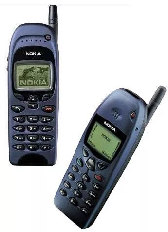
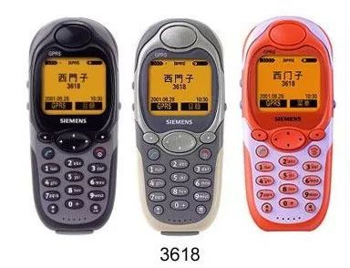
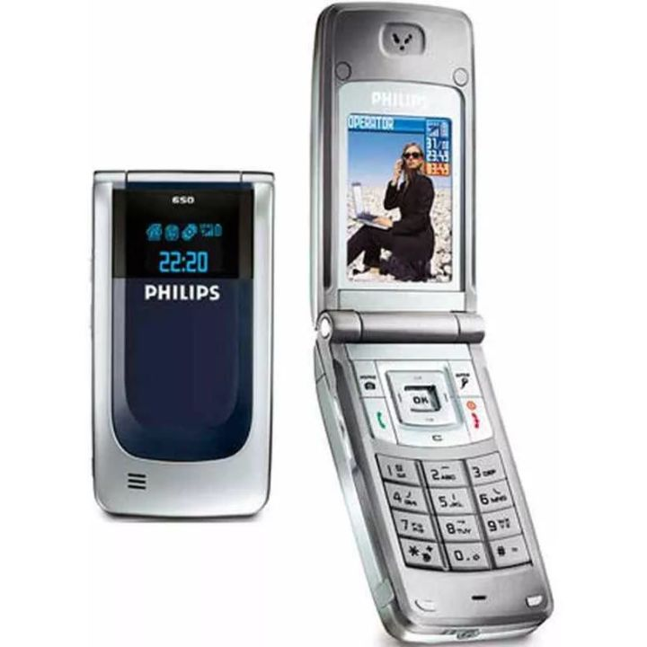
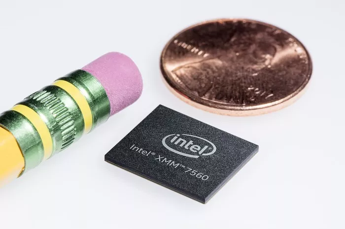

On April 16, 2019, Intel announced its decision to abandon its mobile 5G modem business. The news of iPhone's return to Qualcomm caused the company's stocks to skyrocket by nearly 25% in just one hour.

### Prologue

12 years ago, when Steve Jobs released the first generation of iPhone, he actually didn't have much confidence. Jobs rehearsed for six days before the press conference, but problems kept arising: the iPhone couldn't make calls or access the internet. What's worse, the baseband chip provided by Infineon didn't even support 3G, while Nokia and Motorola had already had 3G phones four to five years earlier.

In order to catch up with the summer schedule of the operator AT&T and finalize the binding contract, Steve Jobs had to release the first generation of iPhone early: a semi-finished product, a music player that can only make calls. Because it did not have an application store, it could not install software, and Chinese characters could not be inputted. Its sale would not begin until half a year later.

The hasty release of the iPhone gave Google enough time to emulate and learn from it, and by the time the first Android device was released, it had caught up with the iPhone's progress by offering 3G support and an app store. Since then, Android's market share has skyrocketed, leaving the iPhone in the dust. Apple's CEO, who had previously believed to be leading by at least two years, was furious and declared, "I will use all of Apple's $40 billion in savings to launch a thermonuclear war and destroy Android, because it's a stolen product."

Looking back, why did Apple choose Infineon, which was not a leading provider of communication chips at the time, as its main supplier? For friends who are new to the semiconductor industry, perhaps they don't know about the fierce competition in the 2G-3G era of mobile phone chips. Let's slowly review.

### One, the battle among the warlords.

During the era of simulated mobile phones (1G), Motorola was undoubtedly the leader, occupying over 70% of the market share. Its semiconductor division (later known as Freescale) was also very powerful at that time, such as providing Apple computers with CPUs that were half a generation more powerful than Intel's.

Interestingly, it seems that there were no British mobile phone brands to be seen. However, a British company named Acorn, which later became Apple, swept the world. After Apple abandoned the Newton tablet, it was Texas Instruments who truly had a discerning eye. TI introduced the ARM7 to the Nokia 6110 and contributed 70% of its revenue exclusively to Acorn, allowing ARM to make a big comeback after 10 years.

The situation with semiconductor manufacturers in the United States is rather complicated. There are a lot of companies that make mobile phone processors, such as TI, Skyworks, ADI, Agere, Broadcom, Marvell, Qualcomm, and so on. However, there is basically only one major player in the mobile phone market, which is Motorola. They have their own chip and are very strong. Consequently, these companies have been seeking customers overseas, resulting in a series of chaotic battles that have ultimately led to their downfall.

It is worth analyzing that so many manufacturers are rushing into the GSM market, which on the one hand indicates the explosion of the mobile phone market, and on the other hand shows that the technical barrier for making mobile phone chips was not high in the 2G era.

However, unlike today where the integration of mobile phone core chips is very high, there were a variety of designs back then. A task that can be completed with a single chip today would require ten or more chips and separate components such as MCU, DSP, and ROM back then, and different companies had different kits and development tools, making debugging even more troublesome. This brought great inconvenience to mobile phone manufacturers and required a very high level of technical ability. Designing a mobile phone board was very time-consuming, so various Design Houses appeared later, providing original designs or modules directly to the manufacturers.

### 3\. Destination of European mobile phone chips

In 1999, Siemens spun off its semiconductor division, which became Infineon. When I first started working at Infineon, Siemens phones were standard issue. The company also had a strange benefit: if you lost your phone, you could get another one for free. Looking back, perhaps this wasn't really a benefit - if you lost your phone, it was best to quickly get a new one so as not to disrupt your work. :-)

The quality of Siemens mobile phones is really good, it feels like you can use it as a hammer to knock nails without it breaking. However, in the era when the phone had limited features, appearance was more important than substance, and slow-moving companies like Siemens really couldn't keep up. In 2005, after unsuccessfully attempting to sell to Motorola, the wealthy Siemens company actually paid 350 million euros to transfer its phone department to Taiwan's Benq. Then, within a year, the dream of the world's largest mobile phone manufacturer, Benq, was shattered, and the reason was that the so-called German craftsmanship was just too slow.

When Siemens' mobile phone business was struggling, Infineon's Wireless Division, a single large customer, was also on the brink. In 2005, Infineon made a strong push by launching the industry-leading single-chip solution X-Gold for $100 low-cost mobile phones, which quickly attracted and successfully entered Chinese manufacturers such as Nokia, LG, Samsung, Konka, and ZTE.

Meanwhile, while secretly developing the iPhone, Steve Jobs was also searching for a high-integration, easy-to-use baseband chip. We will discuss this later on.

After giving up on Siemens phones, I switched to the Philips 9@9c, which not only looks sleek and lightweight, but also has a magical feature of being able to last for a month in standby mode. It's unbelievable that one doesn't need to carry a charger when going on a business trip nowadays.

Unfortunately, Philips phones only survived one year longer than Siemens before being sold to CEC. The Philips chip platform was then played with for a few years under CEC's subsidiary companies. In 2005, Alcatel's phone brand was sold to TCL. Let's take a look at the outcome of two other European mobile chip giants, NXP and STMicro.

In 2002, Alcatel's mobile chip division was merged into STMicroelectronics (ST).

In 2006, Philips Semiconductor became independent and formed NXP.

In 2008, NXP's wireless division separated and formed a joint venture company with ST called ST-NXP Wireless.

In 2009, ST-NXP Wireless and Ericsson Mobile Research and Development merged to form ST-Ericsson.

In 2013, ST-Ericsson closed (equivalent to bankruptcy).

Unlike other European mobile phone manufacturers, Nokia excels in outsourcing design. From the beginning, Nokia chose Texas Instruments (TI), with the strongest semiconductor industry and the most complete product line, as its design partner.

TI's superb technical capabilities have brought Nokia a rich product line and stable communication signal quality. There are few other manufacturers who have launched so many models without compromising the quality of their products. However, when Nokia, which almost exclusively used TI as a single platform supplier, achieved a staggering 49% market share in the mobile phone market, it was no longer satisfied with its bargaining power.

In 2007, Nokia launched a new multi-supplier strategy, with STM and Infineon both offering very low-profit quotes in a bid for market share. Texas Instruments began to dislike the baseband chip business because of the fast and frequent updates, which led to far lower returns on their investment compared to industrial chips.

In 2008, TI announced plans to gradually withdraw from the baseband business, forcing Nokia to complete a complete platform shift before 2012. As a result, coupled with the sudden attack by Apple and Android, Nokia began a long and steady decline in market share from 2008 onwards. Starting in 2011, Nokia exclusively used Qualcomm's SOC in its Windows Phone Lumia series, which could be seen as Microsoft's successful move to indirectly deal a blow to its competitors.

### 4\. Mobile phone chips in the United States.

In 1999, Conexant separated from industrial automation company Rockwell. At that time, it was quite common for notebooks to be equipped with a Conexant telephone modem. In 2002, Skyworks separated from Conexant and focused on wireless communications. The newborn Skyworks quickly became skilled in the platform of Dr. Wireless, and developed branches in many medium-sized companies in China.

However, the good times didn't last long as MediaTek's Turnkey solution swept across China in 2004, and two years later, Skyworks announced its abandonment of baseband business. Since then, Skyworks has focused on the RF field and, thanks to Apple, Samsung and Huawei phones, as well as the merger of TriQuint and RF Micro to form Qorvo, has become one of the RF giants.

ADI is a very diligent company that has been quietly working in China. Its mobile phone chips have appeared in many second-tier domestic brands, but only barely supported them. After MediaTek achieved great success in the knockoff feature phone market, it urgently needed TD technology to enter the mainstream 3G market and compete with Spreadtrum, and ADI happened to have TD chips. In 2007, ADI sold its mobile phone division to MediaTek for $350 million, which was a win-win deal. ADI is a bit of an outlier and has not been acquired by a large company and is still doing well today. The reason is simple: the founder is still the chairman. This is consistent with the conclusion in another article I wrote, "The Story of BIOS and PC."

Broadcom has always been at the forefront of the Wi-Fi, Bluetooth, and GPS industries, but it is rare to see its baseband manufacturers. Its basebands are often sold as add-ons, which is quite unique. However, as a communication company with "com" in its name, cutting out the large market of basebands was not an option, so it held its ground during the 3G era. In 2012, Broadcom acquired Rosh's LTE platform, attempting to make a comeback in the 4G field. However, developing the LTE chip proved to be too costly and unsuccessful, with progress being constantly delayed. In 2014, they finally announced that they were no longer playing in the Baseband field.

Marvell is the pride of the Chinese-American founded company, with a strong ability to seize opportunities, it decisively grasped the trends in storage and wifi. In 2006, Marvell showed its far-sightedness again by acquiring Intel's XScale mobile platform, which included the then-popular Palm smartphones. This happened to occur one year before the birth of the iPhone. Another example was when TD-SCDMA was considered unfavourable by everyone, Marvell launched a chip that supported TD, which hit the mark with China Mobile. Marvell's major customer for its Baseband platform was BlackBerry, which it also seized upon accurately. Unfortunately, Marvell's technological capabilities were still not deep enough to compete with Qualcomm in the US, nor MediaTek in China. One year after Broadcom's exit, Marvell also disbanded its Baseband team.

Agere was originally a semiconductor company of Lucent, and as a traditional player in the field of voice communication, they have done well to survive until the new century. In 2006, Agere was acquired by LSI, and in 2007, LSI sold Agere's mobile baseband unit to Infineon. It's worth mentioning that Qualcomm once licensed CDMA IP to LSI to resist anti-monopoly laws. LSI sold the CDMA IP to VIA Telecom (also known as VIA Technologies) in 2002. Later, this IP became very valuable, and VIA Technologies licensed it to MediaTek and Intel, allowing everyone to make unified network mobile phones without paying Qualcomm.

### 5\. Short Commentaries.

In short, there are no players left in Europe for mobile baseband modem. The big players left are Samsung from South Korea, Qualcomm from the United States, MediaTek, HiSilicon, and Spreadtrum from China, and possibly ZTE. As a customary practice, we will not provide any evaluation of current Chinese companies. If you have read up to this point, you should also be very familiar with Qualcomm.

With various major shuffles in the international baseband platform, over ninety percent of the once flourishing Design Houses in China have died out. For example, CETC-SI lost its competitiveness and went out of business due to issues with Philips chips, with whom they had worked together. JiaSheng LianQiao, who had worked with Infineon, became a famous runaway company. Those that moved early to the MediaTek platform (MStar was acquired by MTK in 2013) and shifted to ODM phone manufacturing for Design Houses, after surviving the chaos of 2G-3G, are currently expanding their reach in 4G production. Companies such as Wintek, Longcheer, and WahTeh have become mainstream by primarily working on Qualcomm platforms, with the era of various IDH competing in technology, costs, and production capacity long gone.

In fact, during the era of the Warring States when every state was vying for supremacy, several chip companies emerged in China's TD-SCDMA market, such as Tian Qi which received investments and technical support from Philips and Motorola, and Kai Min which received investments from Nokia and TI. Tian Qi eventually sold to ST-Ericsson, while Kai Min went bankrupt due to overspending. The story of TD cannot be fully told in just 100 pages; it is a story that involved burning through billions of dollars, and my own TD-SCDMA phone was never able to fully load a single webpage. The fruits of TD should be credited to Spreadtrum, but as agreed, we will not be commenting on Chinese companies.

### 6\. Apple.

Continuing on with the discussion of Apple and Infineon, Infineon was only a backup low-cost second or third source for customers such as Nokia, Samsung, and LG. Also, due to the fact that the sales of the first three generations of iPhones were not high, Infineon's wireless division had been losing money. When the revolutionary iPhone 4 was launched, although Infineon remained the main supplier of the WCDMA version, Qualcomm joined as the supplier of the CDMA2000 version. The strengths of the two were compared and the gap was evident. Qualcomm had an absolute monopoly advantage in the CDMA platform, but Apple did not choose them at the time.

Not only was the development progress of Infineon's 3G platform slow at that time, but the first three generations of iPhones also had a weak signal issue, leading to the fourth generation of devices where Jobs added a complete ring of antennas on the outside of the phone to improve the signal strength, resulting in the infamous "Antennagate" issue.

Although he dislikes the way Qualcomm charges (5% of the phone's sale price), Jobs was forced to switch to the Qualcomm platform from Infineon because of the company's superior technology, especially in the upcoming 4G LTE platform where Qualcomm is leading by a wide margin.

In 2010, Infineon sold its unprofitable wireless division to Intel for $1.4 billion, which was a very good outcome considering that other companies such as Freescale, TI, and Skyworks had to close their baseband departments because no one was willing to buy them. Steve Jobs commented on Intel's acquisition of Infineon's wireless division, saying "I'm pleased."

At that time, no one knew why he was happy, and some technology media suggested that Apple should acquire Infineon themselves. However, in 2016, everyone began to understand a little better.

The most crucial factor is the absence of a financial backer like Intel. Without such a deep-pocketed parent company, Infineon Wireless simply could not survive. The wireless department saw losses of billions of dollars over the course of six to seven years after being acquired, and yet development progress continued to lag behind that of Qualcomm. Had it not been for Intel's wealth, Infineon would have long since collapsed. Tim Cook faced countless condemnations from internet users and experts alike, but he persisted with reintroducing Intel's LTE baseband chip starting from the iPhone 7, even though the performance was significantly inferior to Qualcomm's. In fact, to compensate for the weaknesses of the Intel chip, Apple even implemented limits on the Qualcomm chip's processing speed.

In this year's iPhone XS, the Intel Baseband Modem XMM7560 officially replaced Qualcomm, as if fulfilling the late Steve Jobs' wish and saving a lot of money by not paying Qualcomm's taxes.

The new 5G baseband modem will reach speeds of up to 5-20 Gbps, perhaps with 10 modules and 50 frequencies. Testing a single chip will require the cooperation of global operators. Companies such as Qualcomm and Huawei have integrated various application processors (CPU/GPU/AI/security, etc.) into a single chip, making it the king of complexity in the field of semiconductors. As the saying goes, the trend of the world is cyclical, and Intel as a single customer can no longer hold out.

The green hills still stand tall, Under several sunsets' crimson glow.
