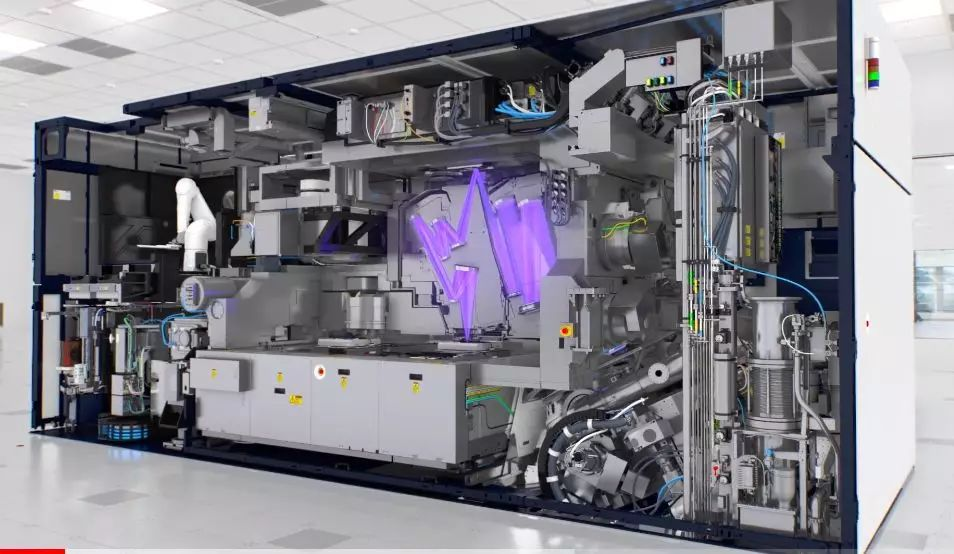

Aircraft engines have always been regarded as the crown jewel of human industry. However, in the past decade, semiconductor lithography machines that constantly challenge the limits of physics seem to be trending towards challenging the king of jewels.

Aerospace engineering challenges the limits of materials and energy density under extreme high temperature and pressure, while lithography challenges the limits of laser wavelength and quantum tunneling in places that are finer than a human hair by a thousandfold.

What is even more remarkable is that, unlike space technology, which strives for excellence and is unafraid of failure, the reliability of aerospace engines and photolithography is also a source of pride for humanity. The former ensures the safety of 100,000 planes flying in the sky every day, while the latter accurately produces billions of transistors per second in factories around the world.

"Take a shock and have a look at the inside of the chip."

Note: 1nm=0.000000001 meters, Credit: ASML

```
                             Epilogue                                
```

In the year 2000, the Dutch company ASML, which was ranked second in the world at the time, had successfully captured the markets in Korea and Taiwan, but was still deliberating on how to sell lithography machines to the absolute chip leader at that time, Intel.

The lack of technology for anti-reflective lenses required for the next-generation 157nm laser is also a major concern for ASML. At the same time, ASML is still a minor player in the EUV lithography alliance jointly established by the US Department of Energy and several major chip giants.

No one knows how the next generation of lithography technology will develop in the semiconductor industry.

At a turning point, ASML decided to take a different approach and offered to acquire Silicon Valley Group (SVG) for $1.6 billion, despite the fact that its market value was only $1 billion. At that time, SVG was only holding less than 8% of the market share for photolithography machines, with an annual revenue of only $270 million, and its 193nm product level was far inferior to that of ASML. As a result, Wall Street believes that ASML overpaid, and ASML's stock price plummeted 7.5% on the same day.

However, as seen from the subsequent results, ASML essentially spent money to acquire the most valuable ticket in the photolithography industry: Intel's vendor code, while also rocking Nikon's foundation. Additionally, SVG possessed the most mature 157nm optical technology, which equated to ASML obtaining a double insurance for technology. This will be further elaborated later on.

However, don't assume that all Westerners are the same. This acquisition is still being hindered by the US government and business associations. The US Department of Defense review stated that the ASML chairman had served as a director for a Dutch company that had surreptitiously sold night vision devices to Iraq in violation of sanctions.

The long-time rival of the Chinese company, the United States Foreign Investment Committee, finally added a bunch of conditions to the acquisition agreement, including the prohibition of acquiring Tinsley, a subsidiary of SVG responsible for polishing lenses, as well as ensuring that various technologies and talents remain in the United States.

These conditions, on the other hand, have naturally made ASML almost an American company, benefiting immensely from the strong foundation of science in the United States, laying a solid foundation for its dominance in EUV many years later.

Early on, the 1960s and 1970s.

The principle of photolithography is actually as simple as that of a slide projector. It projects light through a mask (later called a photomask) containing circuit patterns onto a wafer coated with photoresist. In the early 1960s, photomasks were of 1:1 size and placed directly onto wafers, which were only one inch wide at the time.

Therefore, photolithography was not considered high-tech at that time. Semiconductor companies usually designed their own equipment and tools. For example, Intel started by buying 16mm camera lenses and using them after disassembling them. Only a few companies like GCA, K&S, and Kasper had some relevant equipment.

In the late 1960s, Japanese companies Nikon and Canon began to enter this field, as the lithography technology was not more complex than that of cameras at that time.

In the early 1970s, lithography machine technology focused more on how to ensure that ten or more masks could be accurately aligned together. Kasper Instrument Company was the first to introduce contact alignment machines and led the way for several years. Cobilt Company developed an automatic production line, but contact alignment machines were later replaced by proximity alignment machines because masks and photoresist were too easy to contaminate when they came into contact multiple times.

In 1973, Perkin Elmer, a company funded by the United States military, launched a projection lithography system that proved to be highly effective when used with positive photoresist and yielded high rates of success. As a result, it quickly dominated the market.

In 1978, GCA introduced an automated stepper lithography machine that was revolutionary in its modern sense. It had a resolution five times higher than that of a projection system, reaching 1 micrometer. The peculiar name came from the photography term "Step and Repeat". Simply put, this machine exposed about one square centimeter of light through a mask onto a wafer, then moved onto the next as it repeated the process. Due to its initial low production efficiency, Perkin Elmer remained the dominant player in the industry for quite some time.

In the 1980s, various factions vied for power.

The photolithography machine market is small, and even selling dozens of machines per year can be considered as a large factory. This is because there are only a few semiconductor manufacturers, and a machine can be used for many years. This means that if your machine falls behind in technology, no one will want to buy it. Being technologically advanced is the key to capturing the market, and the winner takes it all.

At the beginning of the 1980s, GCA's stepper was slightly ahead, but soon Nikon released its first commercial stepper, the NSR-1010G, which had a more advanced optical system that greatly improved production capacity. The two companies squeezed out other manufacturers' market share, especially Perkin Elmer's projection lithography. P&E's market share rapidly declined from over 30% in 1980 to less than 5% in 1984.

Friends who have read my story "The Story of Memory" know that the 1980s were the most glorious time for Japanese semiconductors, with almost every major company and conglomerate in the country entering the semiconductor industry. This provided huge support for the two giants, Nikon and Canon, and they began to counterattack the American market.

Due to the fact that GCA's lens group comes from Zeiss, unlike Nikon who owns its own lens technology, cooperation issues caused flaws in GCA products. In 1982, Nikon established Nikon Precision in Silicon Valley and began to take away one major customer after another from GCA: IBM, Intel, TI, AMD, and so on.

By 1984, Nikon had already caught up to GCA, with both companies enjoying a market share of around 30%. Ultratech held about 10%, while the remaining companies such as Eaton, P&E, Canon, and Hitachi each had less than 5%.

Why do we need to specifically watch 1984?

First of all, let us pay tribute to Apple for releasing the first generation of Mac with the world-shaking advertisement "1984". Then, let us introduce the protagonist of our story: ASML.

ASML is widely spread as being separated from Philips, although it is not entirely incorrect, it is still different from what everyone imagined.

Philips developed a prototype of stepper in the laboratory, but it was not mature enough. Due to the small size of the lithography market, Philips also could not confirm its commercial value, and after talking to P&E, GCA, Cobilt, IBM, and others in the United States, no one was willing to cooperate.

The owner of a small Dutch company called ASM International, Arthur Del Prado, learned about this and proactively requested to collaborate. However, this agency-only company only has experience in the front and back end of the semiconductor industry; they don't really understand photolithography, which means they are half an angel investor plus half a distributor.

Philips hesitated for a year and finally reluctantly agreed to set up a 50:50 joint venture. When ASML was established on April 1, 1984, there were only 31 employees working in a makeshift wooden house outside the Philips building.

 ASML最早成立时的简易平房，后面的玻璃大厦是飞利浦。Credit: ASML

The simple bungalow seen in ASML's earliest days is followed by a glass building, which belongs to Philips. Credit: ASML.

In its first year, ASML only sold one stepper, but in the second year, they sold four. The first generation of the product was not very mature, but ASML survived due to its various resources and tolerance, backed by the Philips conglomerate.

In 1985, ASML collaborated with Zeiss to improve their optical system, which resulted in the excellent second generation product known as PAS-2500, launched in 1986. This product was first sold to the start-up company Cypress, which is now a giant in the Nor Flash industry.

Interestingly, in 1986, the semiconductor market experienced a major downturn (for example, Samsung Semiconductor lost $300 million), leading to severe financial problems for a group of American lithography machine manufacturers. ASML was still small, so the losses weren't significant, and they could continue developing new products according to their existing plans. Meanwhile, the development of new products by GCA and P&E stagnated during the same period.

In 1988, GCA suffered from severe financial difficulties and was acquired by General Signal. After a few more years, GCA was unable to find a buyer and was eventually shut down. Another company under General Signal, Ultratech, was later bought through a management buyout, but its size was reduced. In 1990, P&E's lithography department was also unable to continue operating and was sold to SVG.

In the 1980s, the three giants of the United States, who dominated most of the market, were completely replaced by the two giants of Japan. At that time, ASML only had about 10% market share.

Competition in wavelength.

Ignoring marginalized American companies such as SVG and Ultratech, the competition between ASML and Nikon has dominated the landscape from the 90s until now, with Canon watching from the sidelines.

"So, we need to start talking about some technology now."

The primary driving force in the semiconductor industry is Moore's Law. Moore's Law, in fact, should be called Moore's prediction, which has been revised once. Dr. Gordon Moore's earliest prediction in 1965 was that the density of integrated circuits would double every year, but in 1975 he revised it to double every two years.

Some people say that this is the greatest "self-fulfilling prophecy" in human history, because Intel has been running madly along this prophecy for decades, until the lithography technology was stuck at 193nm for more than ten years, becoming what netizens call the "toothpaste factory."

Shortening the wavelength is the most direct means. In the first half of the 1990s, photolithography began to use a wavelength of 365nm i-line, and in the second half, it began to use 248nm KrF laser. There are only a few available wavelengths for lasers. In the 2000s, photolithography began to use DUV lasers with a wavelength of 193nm, which is the famous ArF excimer laser. This type of laser is used in many applications, including refractive surgery. The related laser generators and optical lenses are relatively mature.

However, no one expected that the photolithography light source would be stuck at 193nm for 20 years without any advances. Even today, all the main chips used in our phones and computers are still produced using lithography sourced from a 193nm light source.

In the late 1990s, scientists and industry professionals proposed various solutions that exceeded 193nm, including 157nm F2 laser, Electron Beam Projection (EPL), Ion Beam Projection (IPL), EUV (13.5nm), and X-ray. These proposals led to the formation of several major groups.

157nm F2: Every company is researching it, but SVG and Nikon are closest to productization.

Light of 157nm wavelength is absorbed by the lenses used in existing 193nm machines, and the photoresist also needs to be redeveloped, so the difficulty of transformation is extremely high. Additionally, the progress made with the 193nm wavelength is only less than 25%, with low research and development investment returns. ASML acquired reflection technology after purchasing SVG and finally produced 157nm machines in 2003. However, it missed the time window and was severely defeated by the low-cost immersion 193nm machines.

13.5nm EUV LLC: Intel, AMD, Motorola, and the United States Department of Energy. ASML, Infineon, and Micron later joined.

As for EUV, let me discuss it later.

1nm proximity X-ray: Japanese companies (ASET, Mitsubishi, NEC, Toshiba, NTT) and IBM.

This can be considered a romantic camp, and no one has thought about industrialization.

0.004nm EBDW or EPL: Invited by Lumentum Bell Labs, IBM, Nikon, ASML and Applied Materials were the first to withdraw.

This is a choice of confrontation between Nikon and ASML. Nikon is attempting to directly leap to future technology to defeat ASML, but unfortunately this decisive battle should have happened in 2020 instead of 2005. Nikon did not choose the wrong technology, but it chose the wrong time. Nikon's most important technology ally, IBM, also became distracted and joined the EUV Alliance in 2001.

0.00005nm IPL: Infineon and EU, with participation from companies such as ASML and Leica.

From a wavelength perspective, ion lithography is the most romantic, but resolution is not only determined by wavelength, it also depends on NA. The NA of the optical system for ion lithography that can be utilized with current human technology is 0.00001, which is exactly 100,000 times lower than the NA of 193nm = 0.5~1.5, nullifying its advantages.

All of the efforts made above have almost entirely failed.

They were defeated by the simplest engineering solution, adding water 1mm thick above the wafer photoresist. The 193nm light waves are refracted into 134nm in the water.

Immersion lithography successfully overcame the 157nm barrier and achieved a half-pitch of 65nm. Together with the continuously improved high-NA lenses, multi-masks, FinFET, pitch-split, and photoresist with band-sensitive technology, immersion lithography at 193nm has reached 7nm to date (such as Apple A12 and Huawei Kirin 980).

In 2002, Dr. Burn Lin of TSMC proposed an immersion 193nm scheme during a seminar. Afterwards, ASML developed a prototype within a year, fully demonstrating the engineering feasibility of this scheme.

Later on, TSMC became the first company to successfully achieve immersive production, eventually catching up to Intel which had previously been far ahead in process technology. As a result of this achievement, Dr. Lin received numerous and prestigious honors and awards.

The Lincoln Laboratory at MIT seems to be dissatisfied as they believe they proposed the immersive plan back in 2001. It appears that ASML has not provided any written statement acknowledging that their development was inspired by Dr. Lin's work.

In fact, the method of changing the refractive index using oil-immersed lenses has a long history. The debate in the industry over whose idea came first is irrelevant, actions speak louder than words. Dr. Lin's contribution was to turn the idea into a reality through the collaboration between TSMC and ASML.

"Battle for Domination between Japan and the Netherlands."

As ASML launched its immersion 193nm product, Nikon also announced the completion of its 157nm and EPL product prototypes. However, immersion is a small improvement with great effect, and the product maturity is very high, so almost no one ordered Nikon's new product. Nikon was forced to follow suit and announced its plan to develop immersion lithography machines.

Previously, we mentioned that the lithography field is a winner-takes-all situation, and new products always require at least 1-3 years for multiple vendors to work together in the front and back end. If someone else starts mass production earlier than you, they will have more time to improve issues and increase yield.

A photolithography machine is like a printing press, where material costs can be negligible, but time is as precious as gold.

Semiconductor manufacturers prefer to buy mature ASML products and do not want to become lab rats for Nikon.

This led to Nikon's big defeat in the later years. In 2000, Nikon was still the leader, but by 2009 ASML had almost 70% market share, far ahead. Nikon's immature new products also indirectly contributed to the collective decline of many Japanese semiconductor manufacturers who used its equipment.

Canon has never competed for the top spot in the lithography field. Back in the day, its digital cameras dominated the world market with good profits, but it didn't pay enough attention to the lithography machines that sold only about a hundred units in a year.

Canon's philosophy is to sell products for a long time. When they saw that Nikon and ASML were doing well in the 193nm market, they withdrew from that area. Currently, Canon still supplies LCD panel and semiconductor manufacturers with 350nm and 248nm products.

Nikon lost its ability to fight back completely after its defeat in the immersion war because the development of EUV requires a huge investment and the future is uncertain. Intel's switch to ASML has caused Nikon to lose its courage to challenge Moore's Law.

EUV lithography machine.

Next, let's talk about EUV (extreme ultraviolet lithography machine). This product was actually developed by ASML without any competitors, and has been in development for over a decade without being mass-produced yet.

What is the driving force behind it? After reading some literature, it's clear that Intel is absolutely the most steadfast supporter, as one of their missions is to keep Moore's Law going.

As early as 1997, Intel saw the enormous challenge posed by the 193nm barrier and made the determined decision to bring together the best and brightest minds in a collective effort akin to The Wandering Earth. They convinced the Clinton administration, which was the most forward-thinking in terms of high technology, to launch a cooperative organization in the form of EUV LLC.

This organization was led by Intel and the US Department of Energy, and brought together Motorola and AMD, which were still thriving at the time, as well as the prestigious Lawrence Livermore National Laboratory, Lawrence Berkeley National Laboratory and Sandia National Laboratories. They invested $200 million and gathered hundreds of top scientists to theoretically validate the technical issues that could exist with EUV.

Intel also invited ASML and Nikon to join EUV LLC because American lithography was not doing well at the time. However, this was hindered by the US government as they were unwilling to let foreign companies share their cutting-edge technology.

The final result was Nikon being excluded, while ASML was allowed to join after making a number of promises to contribute to the United States. Another exception was non-US company Infineon, which was allowed to join EUV LLC alongside Micron.

Looking back at the various technological solutions that crossed the 193nm threshold in the past, many companies placed their bets on different options, but only Intel stood firm in choosing EUV, and ultimately made it a reality.

Looking back at some memoirs, it is said that Intel did not send out many engineers themselves, but listed hundreds of challenging issues and continuously drove those scientists with a whip to keep working hard.

EUV can be considered as soft X-rays, which scatter and absorb heavily when penetrating through objects. This necessitates an extremely strong light source for the photolithography machine, making the difficulty enormous.

The EUV light source is a plasma generated by high-energy carbon dioxide laser hitting tin droplets of only 30 microns in size. ASML specifically acquired related light source technology through the acquisition of the American company, Cymer. However, the extremely low energy collection efficiency has led to the production capacity problem for EUV being a bottleneck.

Many of the lenses used in traditional photolithography have to be replaced with reflection mirrors because they absorb X-rays. It is said that the lenses in the latest 193nm photolithography machines weigh up to one ton, and these technologies are no longer needed.

Even the air can absorb EUV, so the entire optical path inside the machine is made in a vacuum. Even so, by the time the light reaches the photoresist, energy loss is already over 95% or more. If exposure time is forced to be increased, the amount of printing, like a "money printing machine," will decrease drastically.

Due to the accuracy of a few nanometers in lithography, EUV requires extremely high concentration of light, equivalent to shining a flashlight onto the moon and the beam not exceeding the size of a coin. How flat do the required mirrors need to be in terms of reflection? It requires a fluctuation of less than 0.3 nm over a length of 30 cm, which is equivalent to constructing railway tracks from Beijing to Shanghai with a fluctuation of not more than 1 millimeter.

Therefore, EUV is not only a research area of top-level science, but also a domain of top-level precision manufacturing.

These extremely precise reflection mirrors are manufactured by Carl Zeiss of Germany and consist of several layers of composite materials such as silicon and molybdenum. Each layer is only a few nanometers thick, with the purpose of reflecting the maximum amount of light based on the wavelength of EUV. ASML has therefore specifically purchased a 24.5% stake in Carl Zeiss SMT.

Between 1997 and 2003, EUV LLC's scientists published hundreds of papers verifying the feasibility of EUV lithography. Then, the EUV LLC alliance disbanded.

The next question for ASML is whether to do it or not?

Fortunately, ASML never hesitated. In 2006, it launched a prototype and in 2007 built a 10,000-square-meter super clean room, ready to receive the first research and development prototype to be born in 2010: the NXE3100.

In 2012, ASML invited Intel, Samsung, and TSMC to invest in themselves, hoping that everyone would jointly undertake this great engineering feat for humanity, as R&D investment requires an annual amount of 1 billion euros.

In 2015, a producible prototype was released. Although the price was as high as 120 million dollars per unit, it received orders like snowflakes. Waiting in line for delivery could take several years.

An EUV photolithography machine weighs 180 tons, has over 100,000 parts, requires 40 shipping containers for transportation, and takes over a year for installation and debugging.

Next year, we will be able to purchase smartphones made with chips produced through EUV technology.



EUV lithography machine Credit: ASML

```
                            Afterword                                
```

In the future, I believe that humanity will certainly be able to surpass the limits of optical lithography, whether by using electron ion or ultimately abandoning silicon-based technology. However, at this moment, just after finishing writing this article, I simply want to sincerely applaud these great companies.

It should be emphasized that in semiconductor manufacturing, photolithography is only one of the steps, and there are countless advanced technologies used in the upstream and downstream processes.

It is precisely because of their unwavering efforts that we are able to enjoy the wonderful life brought to us by various mobile phones, computers, home appliances, cars, airplanes and the internet, in this great era driven by chips.
