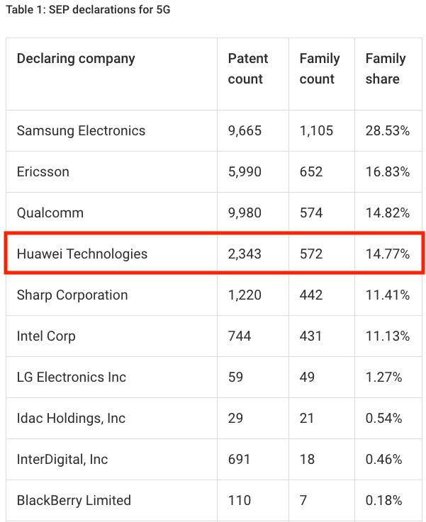
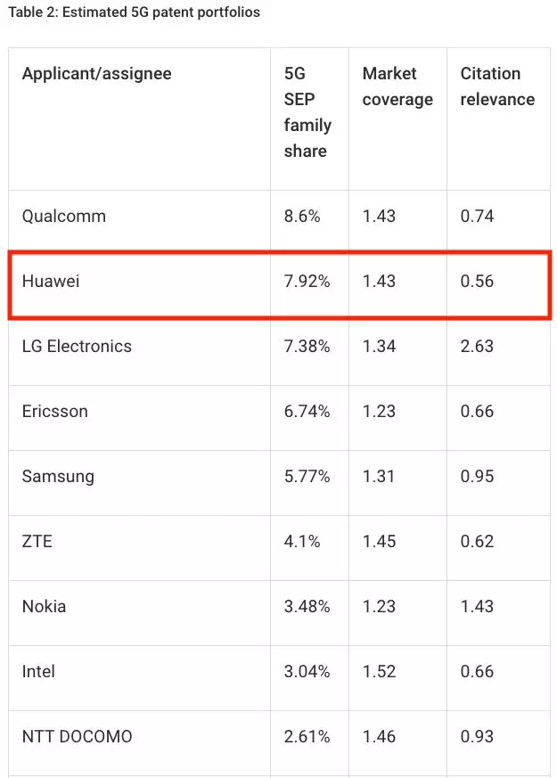

This article was originally written before Christmas in 2018, but was later deleted due to certain factors. In recent days, some friends have encouraged me to set aside my concerns and perhaps there may be a tiny spark of inspiration. Therefore, I have rephrased and edited it, and welcome any criticism.

Today's Huawei is a divine company. Huawei is currently experiencing the most glorious moment in its history, yet it is faced with "extremely difficult external conditions". Although there have been countless discussions and analyses about Huawei in the outside world, various kinds of excessive praise and criticisms make it difficult for people to see the truth clearly. From my perspective, I will try to take a fresh look at the enigmatic Huawei.

Firstly, I will address the following questions since there seems to be limited accurate information available online. Afterwards, I will attempt to delve deeper and uncover explanations that are convincing to myself.

Is the US security accusation just an excuse for the wolf to eat the sheep?

Does the United States really have the ability to shut down Huawei?

Will the failure of global 5G be caused by the absence of Huawei?

Is the United States' accusation of Huawei equipment's security merely an excuse for the wolf to devour the sheep?

Articles online such as "Lobster Dinner" and "Five Eyes Alliance" cater more to readers' penchant for conspiracy theories. While the UK and Canada belong to the so-called "Five Eyes" and have not rejected Huawei, Japan and the Czech Republic, although not part of the "Five Eyes", are also worried.

Concerns about security are directly related to changes in the architecture of the telecommunications industry. As various protocols become more complex, earlier specialized equipment has fully transitioned to network function virtualization (NFV) and software-defined networking (SDN), and in 5G, this has even extended to virtualizing the front-end CU.

What does this mean? It means that the current communication core network has been transformed into multiple servers, running Linux-like operating systems and some communication software. A few years ago, this was a part of Huawei's all-IP Single strategy, and in the future, the industry calls it SoftCOM (Software Communications).

This framework is not so different from an internet company - it consists of a bunch of servers hanging on the network (commonly referred to as the cloud). Huawei is, to some extent, a systems integrator that provides servers and software. The abundance of open source software makes this architecture low-cost and easy to upgrade and maintain, but they are more vulnerable to hack attacks compared to dedicated devices. Like personal computers that require regular security updates, servers also need frequent updates of various components and patches.

The concern of the United States and its allies is that Huawei may insert a "backdoor". Even if Huawei submits its source code for review, they believe it is difficult to control any potential tampering during the subsequent patching and maintenance processes, especially since Huawei engineers often work overnight in the data center. Huawei also has a bad reputation for extensively modifying open source code without contributing back to the open source community. Even more concerning is that, even if they were truly hacked, it can be difficult to explain that it wasn't done by themselves.

That being said, Ericsson and Nokia actually have exactly the same problem. Maintaining universal servers is a very, very large workload, and the probability of errors also greatly increases. There have been two recent examples.

On December 6th, 2018, the SSL certificate on Ericsson's network server expired, resulting in tens of millions of mobile phone users in the UK and Japan losing their network connection. Meanwhile, Alibaba, the technology giant in China, experienced a server certificate expiration on November 22nd, 2018, which caused a loss of security protection for Taobao users.

Singling out Huawei as unsafe is clearly unfair, but the United States is using China's intelligence law implemented two years ago as an excuse to require Chinese companies to cooperate, causing great concern. This dispute is like a married couple's argument, unable to resolve because it is impossible to prove innocence in advance.

As a small example, most people believe that having grandparents and aunts take care of children is more reassuring than relying on licensed professional caregivers from outside the family, and it's difficult for these caregivers to prove their innocence in advance.

Safety is the core pillar of the next technological era. Trust is the cornerstone of this pillar, and Huawei is currently in an awkward position. Japan's SoftBank has even chosen to replace all of its existing Huawei 4G devices due to some pressure.

Does the United States have the ability to shut down Huawei?

There are countless angry youth online who provide examples, stating how powerful Huawei's HiSilicon semiconductor is and how Huawei will not be helpless like ZTE when subjected to extreme sanctions.

Unfortunately, if the United States were to impose sanctions on Huawei similar to what it did with ZTE, Huawei would most likely cease its operations. Every year, Huawei makes purchases from American suppliers amounting to hundreds of billions of yuan. I will only provide a few key examples.

Huawei produces over one million x86 servers annually for backbone networks, backhaul networks, and cloud services, among others. These servers' CPUs are all sourced from the United States, and Intel has just received Huawei's top ten-year excellent supplier award. Huawei also relies on American companies such as Xilinx and TI for commonly used FPGA and DSP chips in their base stations. Various American EDA development tools and database authorizations also pose serious issues for Huawei.

Did not the Huawei phones that produced billions of units per year come with Kirin chips? Let us not even discuss whether they can continue to obtain ARM authorization. There are also difficulties in obtaining a large number of other chips for phones, such as storage chips and high-level radio frequency chips from American companies like Skyworks.

It cannot be ignored that the Android authorization from Google in the United States is also essential. If the authorization from Google cannot be obtained due to sanctions, it may still be a problem whether your Clone OS and APP are fully compatible with Android, and whether they can be sold overseas.

Of course, Huawei has been striving to overcome these constraints, such as researching server transition to ARM architecture, FPGA transition to self-developed ASIC, and self-researched optical communication and operating systems. However, these efforts obviously cannot be achieved overnight.

### 3\. Will worldwide 5G fail without Huawei?

There is a widely circulated statement online that a certain British expert says Huawei is the only 5G equipment manufacturer that is fully prepared, and without Huawei, countries will fall far behind in their 5G development.

Unfortunately, this can only be believed half way. AT&T and Verizon are among the few earliest 5G commercial operators who did not use Huawei equipment.

Undoubtedly, Huawei's early layout and huge investment in 5G have made it a leader in the 5G market. However, how far ahead is Huawei's position? Let's take a look at two tables from the German professional intellectual property analysis company IPLytics.

(5G Manufacturer's Statement Patent Ranking)

(Ranking of 5G vendors' patent portfolio strength)

In terms of the number of patents, Huawei does not hold a leading position, but in terms of strength, Huawei is second only to Qualcomm.

These three major players are no longer involved in the mobile phone industry, so Huawei's terminal needs to pay net fees, which means Huawei will pay billions of dollars in patent fees each year. This clearly does not demonstrate Huawei's monopoly advantage in 5G.

It is very likely that Huawei will choose to do cross-licensing with Qualcomm, but in that case, many mobile phone manufacturers who use Qualcomm's SOC, such as Samsung, Xiaomi, and OPPO, may not need to pay Huawei patent fees under Qualcomm's protection. What about the large number of second and third-tier mobile phone brands that use MediaTek and Spreadtrum chips, which are mostly concentrated in China? Is Huawei only able to collect patent fees from them? This is not a case of self-inflicted damage caused by resentment.

Perhaps for this reason, even though the three giants have announced their 5G patent royalty rates for a long time, Huawei seems to have not officially disclosed its patent rates yet.

From just the perspective of patents, Huawei has not received the deserved benefits of its 5G technological leadership. Furthermore, due to Western obstruction, even though it has signed many 5G operator contracts, if it is lacking some giants like the US and Japan, there will be a significant drop in revenue.

How rich are AT&T and Verizon in the United States? Their net profits are nearly three times higher than China Mobile, which has 900 million users. The revenues and profits of the three major carriers in Japan and Deutsche Telekom in Germany are also higher than those of China Telecom. Although the number of base stations of Chinese carriers far exceeds that of other countries in the world, it sounds a bit awkward to say that Huawei's main source of revenue from 5G comes mainly from China.

While Chinese manufacturers are being surrounded, Samsung, which has been struggling in the 3G/4G operator market, has quietly entered the US market and signed 5G contracts with AT&T and Verizon. The number of Samsung's patents in the attached image shows how ambitious they are.

### Situation

So, does Huawei 5G really have no advantage? No, Huawei's advantage is very significant. Huawei's CNBG has the most mature product line and the most powerful implementation execution. The army-style combat and the willingness to occupy at any cost make competitors completely unable to resist.

If the United States really sanctions Huawei, then who will maintain the telecommunications equipment of many American allies? Are American multinational companies operating in China not worried about retaliation? Can the United States really afford to face the accusations from hundreds of millions of users in 170 countries worldwide? Huawei's CBG's annual increase of 100-200 million new users and good reputation is a crucial charm.

Returning to the case of Meng Wanzhou, while there was widespread optimism in China after she was granted bail, the reality is that the United States has yet to play its hand with their ace. Looking at the use of a New York Eastern District prosecutor, specialized in dealing with Wall Street, it is evident that the crafting of charges was skillful. The charge of "bank fraud" was undoubtedly carefully considered by adept lawyers, making it a difficult one to break.

This case is difficult to end in the short term, and it will continue to show its side effects at many sensitive moments. The fury of the angry youth against Canada has only benefited the United States. In fact, Canada is a steadfast partner of Huawei. Its largest operators, Bell and Telus, have been using Huawei equipment for the past 10 years.

When Donald Trump runs for re-election in 2020, it will coincide with a potential downturn in the US economy, and a technological cold war would be a consequence he cannot afford to shoulder.

The conflict between interests is a showdown among experts. A true expert does not try to eliminate their opponent completely, but usually adopts a containment strategy.

"Painting a snake and adding feet" style of commentary.

Huawei is definitely one of the most admirable Chinese companies, and also the most self-critical. It is believed that Huawei is a company that can accept outside comments.

With the support of China's engineering dividend and its unstoppable culture of money incentives, Huawei is currently unbeatable, as it seems impossible to replicate its elite team of 80,000 engineers and vast knowledge base on earth. However, Huawei also has its disappointing aspects.

Huawei does not have outstanding basic research, so it does not have truly cutting-edge products and technologies that outdo its competitors. Huawei's research and development is focused on the application field, which allows it to launch new products or functions half a year or a year earlier than its competitors. However, this is achieved by piling up manpower and overtime, and Huawei seems to be proud of attracting non-top-notch university graduates. I can't help but say that in the field of biotechnology, China's top universities also rely on piling up manpower and data to publish Science/Nature/Cell papers, but critical innovations are few and far between. This seems to be a vicious circle in China's research and development, where making money quickly is king, just like making cars for decades, but still failing to make a good engine.

I believe Huawei's biggest shortcoming is in software. Their narrow focus on hardware aesthetics often results in impressive but superficial products. However, the future belongs to software.

Although Huawei places a great emphasis on IPD development processes, it has difficulty attracting top software talent due to its culture. Meanwhile, the majority of its coding personnel work on low-level protocols and interface functions, which can be tedious. The increasing importance of software issues is highlighted by the Boeing 737 Max incident.

Huawei aims to fully realize customers' requirements for safety, trustworthiness, and robust scalability, as well as comply with data security standards such as the EU GDPR. This requires active contribution to the open source community, as well as potentially extensive refactoring and recoding. The role of a top-notch expert is invaluable as their contribution can be equivalent to that of one hundred ordinary coders, as without experts, the result would be repetitive, low-quality code. Various vulnerabilities can be easily exploited by Western countries under new pretexts.

For a long time, the Mongolian Empire's expansion by conquering places like Loulan has been Huawei's main theme. Wherever they go, their opponents crumble, and names like Lucent and Northern Telecom fall like the ancient civilizations. However, Huawei is not a true multinational corporation with diverse cultures; it feels like they just send a governor and a colonial team to conquer a place. In the era of anti-globalization populism, potential risks are surging, and even within China, there are groups that strongly oppose Europe and the United States because of their support for Huawei. 5G was originally just basic infrastructure, and it was an immature thing. Why did it lead to ideological disputes? Perhaps there are things we are ignoring behind it.

I have observed a trend overseas that the bestselling cars like Toyota, Honda, Mercedes-Benz and BMW are hardly sold by Japanese or German people. Instead, locals with just a notebook can effortlessly sell these most complex and expensive things in the world. Trust is a magical thing, and a true empire where the sun never sets may require a broader mind and a synthesis of cultures.
