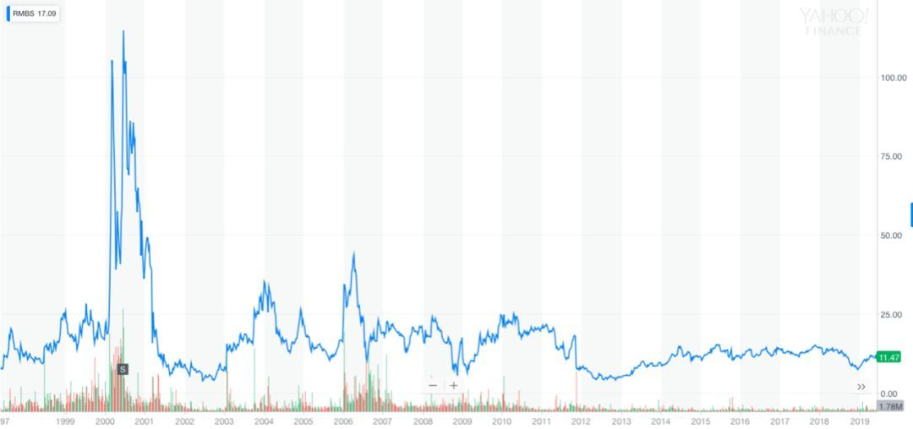
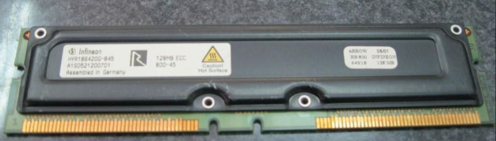
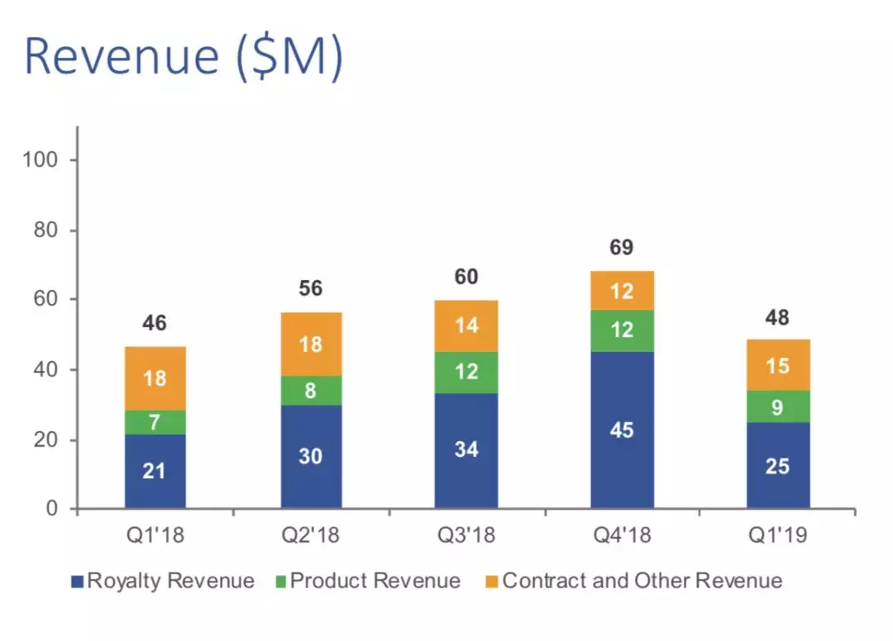

In the early 2000s, Intel announced that the new generation of Pentium 4 processors would use Rambus RDRAM to compete with the strong momentum of VIA PC133 and DDR at that time. As a result, Rambus (RMBS) stock price surged from under $20 to $75 in a short amount of time.

At the time, 53-year-old Rambus employee Fred Abramson held approximately 50,000 stock options with a cost of only $1-2. By June, when Rambus stock rose to $100, Fred chose to exercise his options and enjoyed a profit of approximately $5 million.

The 5 million dollars at the time was a huge sum of money, and Fred retired from the company immediately. However, he made a colossal mistake by choosing to continue holding onto his shares instead of selling, which ultimately led to his suicide a year and a half later.

Fred is a Massachusetts Institute of Technology graduate with a Master's degree in Electronic Computing and a Doctorate in Mathematics. He later taught at Stanford University. The number of people in the world smarter than him is probably not very high.

What exactly happened that led to this tragedy?

One, PC133.

In "The Story of Memory", it is mentioned that 1999 was a year of tremendous change for the memory industry. It was also a year of hardship for the Wintel Alliance.

Microsoft is struggling in its anti-monopoly trial and faces the risk of being dismantled, while Intel faces strong challenges from VIA and AMD. In 1999, Intel became entangled in the 180nm process quagmire, and AMD surpassed them by launching the Athlon processor. After acquiring Cyrix in the same year, VIA not only dominated the chipset field, but also made strides in CPU development.

To make matters worse, VIA has also taken over the authority of memory standards. While Intel sticks with PC100, VIA has introduced the PC133 standard, riding on the wave of SDRAM memory manufacturers capable of overclocking to 133Mhz.

I still remember clearly that during the bulk purchase of memory at that time, Infineon was already able to provide all 133Mhz DRAM, while Hynix was able to supply more than 70% of 133Mhz.

The industry standard for DDR200 and DDR266 with double frequency is also emerging. Intel, frustrated, hastily allied with Rambus in an attempt to reverse the speed disadvantage.

The computer motherboards of that era typically had two main chips besides the CPU - the Northbridge chip responsible for communicating between the CPU, memory, and graphics card, and the Southbridge chip responsible for communicating with peripherals like hard drives and optical drives. Together, these were known as the "chipset."

The Northbridge, also known as the Memory Controller Hub, was offered by various manufacturers such as VIA, SiS, Ali, Nvidia, and Micron, who were able to determine what type of memory was used to a certain extent. However, the Northbridge chip eventually became obsolete as AMD and Intel integrated the memory controller and graphics card into the CPU.

In order to beat the aforementioned manufacturers, Intel decided to exclusively adopt Rambus' RDRAM technology and gave it the catchy name PC800. Why the name 800? Because its clock speed is 400Mhz and both the rising and falling edges transfer data, thus making it 800.

Although it sounds much faster than the 133MHz clock of DDR266, RDRAM is a serial read-write data with long latency, and its actual memory read-write performance is not much faster than DDR.

Unfortunately, RDRAM has a high failure rate due to its high frequency and generates a significant amount of heat, requiring the addition of heat sinks, which makes it very expensive. Another unreasonable aspect is that in order for the entire serial channel to be complete, it is necessary to fill all memory slots with RDRAM, resulting in a slot being occupied without a memory chip: C-RIMM.

At that time, RDRAM memory modules were difficult to purchase with Hynix and Micron not yet having produced them, and Infineon only having produced small quantities. Only Samsung and Elpida were available for purchase, but neither of these companies were targeting OEM sales in China at the time. This caused frustration for domestic PC manufacturers who not only found them hard to come by, but also faced prices that were 2-3 times higher than DDR memory.

When Intel released the Pentium 4 in retail packaging, they included two RDRAM memory modules because it was difficult to purchase them separately.

In the year 2000, AMD and VIA were happily promoting DDR. AMD's stock price reached an all-time high of $43.75, while VIA's stock price reached 629 New Taiwan Dollars, becoming the stock king.

Three, Patent wars.

Intel is truly the king of PCs. When faced with difficulties, they immediately take decisive action, unafraid of the sunk cost. On one hand, they decided to abandon Rambus and support DDR, while on the other hand, they immediately engaged in a patent war with VIA.

Everyone has seen the ending - after facing patent disputes, VIA Technologies suffered a setback and today it has transformed into Zhaoxin, carrying the banner of national x86.

Rambus' stock has fallen 90% in a year. The ambitious Rambus is unwilling to become a supporting role and has launched numerous patent wars against memory manufacturers.

The memory standard is formulated by the American organization JEDEC, whose members include almost all major players in the electronics industry. When developing the standard, according to JEDEC's legal guidelines, member companies are required to disclose their relevant patents and waive their fees or charge them fairly.

Rambus joined JEDEC during the years 1992-1996, but did not disclose any information about the patents they were applying for that had the potential to affect relevant standards. In June 1996, Rambus withdrew from JEDEC after seeing Dell being punished by the FTC for not disclosing patents in standardization organizations. Subsequently, Rambus made specific preparations for patent ambushes against JEDEC memory standards.

Starting from 2000, Rambus sued almost all memory manufacturers. Samsung and other companies chose to quickly settle in order to avoid being caught in the quagmire. In 2001, the US Federal Trade Commission (FTC) ruled that Rambus was suspected of fraudulent monopolization for its behavior in JEDEC, allowing other sued companies to escape unscathed.

In 2003, the US Federal Appeals Court ruled that there was no fraud committed by Rambus. Subsequently, Rambus sued Hynix, Infineon, and South Asia Huaya and other companies. Infineon, which was rapidly rising in the DRAM field at the time, ultimately chose to settle and agreed to pay Rambus a maximum of $150 million for freedom.

In 2006, the FTC ruled that Rambus had excessively high fees and established a new, lower fee schedule.

Interestingly, when Rambus was in litigation against American companies such as Micron and Nvidia, the judges and patent office mostly ruled against Rambus. In addition, the US Supreme Court refused to hear the Rambus case twice.

A patent case is not a war of standard law, and each judge has their own reasoning. Therefore, it is not uncommon for foreign companies to suffer losses in international disputes. It is truly brilliant for Hefei Changxin to win the patent of Infineon Technologies' Qimonda.

1. Conclusion

Rambus Inc. has managed to survive until today by collecting royalties on patents for DDR and other types of memory. According to the FTC's ruling, it is estimated that 0.25% of the sales revenue for each DDR chip will be paid to Rambus as a copyright fee. Therefore, Samsung is Rambus' biggest customer without question, but Rambus' revenue will fluctuate with changes in memory prices.

Screenshot of Rambus financial report, with main revenue coming from licensing fees (orange) and copyright fees (blue), while green represents products such as server memory controllers.

Rambus' brilliance was only a brief flash in the year 2000, and now its quarterly revenue is less than 100 million.

Fred, who retired from Rambus in 2000, is an aviation enthusiast. He's not just an ordinary enthusiast, as he once won the California Free Flight Competition. Flying is Fred's lifelong passion, and his girlfriend is a flight instructor. After the sharp decline in Rambus stock, he was unable to pay the huge income tax he owed from the exercised options and had to mortgage his airplane to bet on the stock's recovery.

In mid-2001, Intel's resolute attitude caused Rambus stocks to drop to less than $10, which was only one-tenth of its peak. Desperate, Fred sold all his stocks, but it still wasn't enough to pay off his debt to the national tax bureau. Bankrupt, he was forced to give up on his dream of flying, but he chose to continue his final struggle.

On the afternoon of January 22nd, 2002, Fred locked himself in his beloved Su-26 aircraft and placed a plastic bag over his head.
