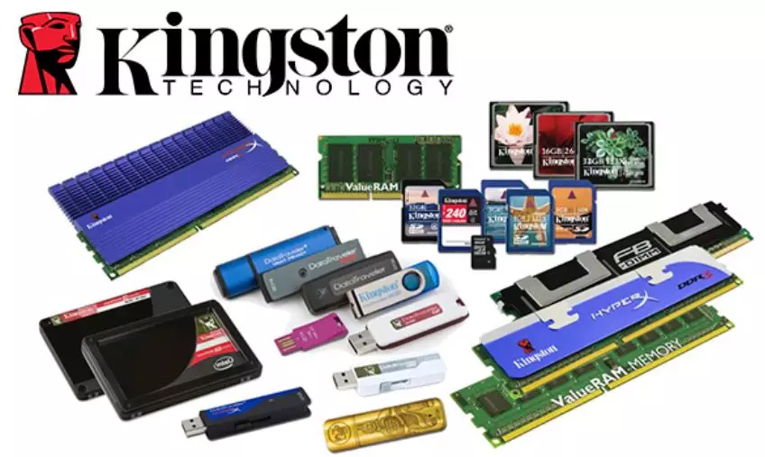

On August 15, 1996, SoftBank's Masayoshi Son spent $1.5 billion to acquire an 80% stake in Kingston Technology. Against the backdrop of the success of Win95 and Gates' ascent to the top of the richest list, Son's bet on PC memory has some similarities to his current bet on ARM.

At the end-of-year Christmas party for the company, the founders of Kingston who had sold the company's controlling interest, John Tu and David Sun, stunned around 500 employees by announcing that they would personally contribute one hundred million US dollars to express gratitude for the staff's help.

Then, just after two years, Masayoshi Son chose to incur a loss of one billion yuan, and sold Kingston back to the Tu/Sun brothers for 450 million US dollars.

What is the story behind this?

### Chapter One

John Tu, who was born in Chongqing, went to Taiwan with his parents in 1949. He was rebellious as a child and often skipped class, so his academic performance was not very good and he had no hope of getting into a good university in Taiwan. His parents agreed to let him go and join his uncle, who was running a Chinese restaurant in a small town in West Germany.

A priest who used to preach in China helped enter a German language school. At that time, West Germany had high requirements for university admission, requiring two years of apprenticeship first. John was forced to leave home and work in the coal mines near Kiel port for two years, reportedly suffering so much that he couldn't even wash his face with water. It wasn't until he was 29 years old that he obtained a bachelor's degree and demonstrated his perseverance.

In the 1970s, Germany was still relatively discriminatory towards Asians, which led John to once again move to the small town in Arizona where his sister and brother-in-law lived in the United States. After running a convenience store and real estate business for a few years, John and his sister relocated to Los Angeles.

There, he met David Sun, who was 10 years younger than him.

### Chapter Two

In 1981, these two Taiwanese men met on a basketball court. Sun, who worked at a computer company, suggested to Tu that they start a company together and manufacture compatible memory modules for the popular DEC mini computers in their garage. However, Sun only took on a part-time technical role while Tu served as the company's president, its only full-time employee.

In 1986, DEC discovered their compatible memory and called to arrange a meeting to discuss collaboration. Due to concerns that the customer would perceive the company as too small, Tu borrowed an office and enlisted all of his friends to pretend to work inside.

After two days of investigation by DEC personnel, they concluded that this was a fake company. However, DEC still wanted to obtain the design authorization for this memory module compatibility since the big company was too lazy to do it themselves.

This reversal was completely unexpected, as DEC paid $250,000. What's even more important is that Camintonn, the garage company, has essentially received an endorsement from DEC, resulting in a sudden boost in business.

This led to the computer company AST acquiring it for six million dollars. At that time, Lenovo made its first fortune by acting as an agent for AST, which is also the origin of "trade, industry, and technology" philosophy.

### Chapter Three

There is a small controversy surrounding the story that occurred in 1987. Most articles state that the personal investments of the two individuals suffered significant losses during the stock market crash on Black Monday, October 19th, leading to the establishment of Kingston.

But according to my research, Kingston was established on October 17th. In the same year that Huawei was founded, Tu and Sun established Kingston Technology in Fountain Valley, California, which is located next to Irvine.

According to David Sun's own account, during the stock market crash, it was likely the broker's use of high leverage that caused a loss of millions from a $30,000 investment.

The two of them decided to make a comeback and try their hand at compatibility of memory modules again, and this time they chose PC memory. It just so happened that they encountered a shortage of memory modules and business was unexpectedly good, as Tu said he fills shopping bags with cash collected every day.

They began to worry about what would happen if they ran out of memory in the future, which deeply influenced the company's operating style. They introduced a "benevolent" strategy of risk-free returns. At the early stage, there were many compatibility issues with memory, and this strategy resulted in high customer satisfaction.

The flourishing growth of the PC industry led to Kingston's smooth development until it was acquired in 1996.

### Chapter Four

SoftBank's acquisition contract was $1.5 billion in cash and stock, plus an additional $300 million to be paid after two years. To everyone's surprise, Tu and his partner said they do not want the $300 million because they believe Kingston is not worth $1.8 billion.

In 1999, Son Masayoshi decided to give up. He had a keen sense that software and the internet were the future, and memory companies often didn't make money. Son Masayoshi told Tu, "In return for your generosity two years ago, I will sell the company back to you for only 450 million yuan."

At first glance, it may seem that Son Masayoshi lost $1 billion in one deal, but he was actually raising funds to expand his Internet empire. His ability to cut losses and move on was truly remarkable. The following year, he invested in Jack Ma and made a fortune.

In "The Story of Memory", it is mentioned that 1999 was a year of great change for DRAM. As soon as Kingston Memory was recalled by the two individuals, the market began to recover, followed by years of rapid growth.

### Chapter Five

Kingston has devoted itself to its core business for more than 30 years: purchasing memory chips (either as particles or dies) from semiconductor plants and assembling them into memory modules, storage cards, SSDs, and other products.

Kingston is the earliest company to offer industry compatibility testing. DRAM is like billions of small batteries (capacitors) that charge and discharge in microseconds. If one of these small batteries has a problem, the system may experience a blue screen and crash. In addition, compatibility issues have always plagued manufacturers and users due to variations in PC motherboard design and materials. Kingston took the initiative to take on this difficult task of testing, which brought them a lot of business.

Currently, Kingston's annual turnover reaches up to 7 billion US dollars, and nearly every household has purchased its products.

Kingston was a major customer of Infineon at that time. Due to the fact that two of its founders came from Taiwan, the company had a close relationship with Infineon's partner, Mosel Vitelic. I also heard many stories about Kingston in those days.

In fact, the technical difficulty of products such as memory sticks or USB drives is not high, and there are dozens of brands that you have never heard of in China's eighth-tier cities, with prices that are frighteningly low. How did Kingston take the lead in this fiercely competitive environment?

Kingston's market share in third-party (non-chip manufacturer) memory modules, third-party SD cards, and SSDs is more than twice that of the second place.

### Chapter Six

Kingston is an absolute outlier among buyers of memory chips.

As previously mentioned, in the memory field, due to the huge investment in wafer fabs, it is typically necessary to operate at full capacity for 7x24 hours in order to quickly amortize costs. Therefore, when facing shortages, additional production capacity cannot be added. It takes 3 months from wafer processing to output for DRAM, and even if the market is oversupplied after output, it still needs to be sold, which often leads to price crashes.

Other clients would always push for lower prices during market downturns, but Kingston consistently offered much higher buying prices compared to others. David Sun insisted on reducing losses for the chip factories.

The concept of "benevolence and righteousness" in the business world is simply incredible. And during memory shortages, chip manufacturers will give priority to Kingston.

Kingston has always been a private company. The two owners have stated that they do not need more money, nor do they plan to go public or borrow from banks (which we suspect Old Godmother approves of). In other words, Kingston's business philosophy is "not being greedy".

David Tu believes that it is essential to overcome arrogance and be honest about one's shortcomings.

He said Kingston's philosophy is to let customers know that the brand is responsible for its products. Therefore, Kingston provides a "lifetime warranty" for its memory products. This not only reflects the brand's confidence in its products but also demonstrates its "benevolence" towards customers.

### Chapter Seven

The term "benevolence and righteousness" appears multiple times in this article because I couldn't think of any other word and also because of the $100 million cash prize mentioned at the beginning.

Some people believe that Kingston is a rare company that is managed by Confucian culture, as "benevolence, righteousness, propriety, wisdom, and faith" can be seen everywhere in this company.

Kingston's official values are: courtesy, respect, sympathy, honesty, and humility. In the fiercely competitive field of memory, this is truly a surprising and refreshing thing to see, and it makes one feel appreciative of such a kind and noble company.

There are many legends about Kingston, stating that the company lacks organization and discipline internally, and that employees can get away with not coming to work. These claims are certainly exaggerated.

The two founders are truly committed to creating a company atmosphere that feels like home, hoping that employees can come to work happily and fully considering the balance between work and family life, and rarely laying off employees. Golf, bowling, fitness, free lunch, and providing insurance for employees' families, as well as regular high bonuses, are all extremely commendable.

Confucianism style also has certain drawbacks, such as patriarchalism and lack of vitality. Senior employees may not be highly skilled, but they rarely resign and occupy most middle-level positions. Kingston's flat management structure restricts upward mobility for younger employees, and some consider the atmosphere of seniority to be a form of favoritism. Confucian style salaries are also based on rank, and do not rely on monetary incentives such as pay for performance or the "carrot and stick" approach.

The eternal dilemma for employers is whether to treat loyal yet inefficient old employees well, or to treat cheap yet proactive new employees well.

Based on the publicly available financial data from Kingston, it is estimated that the average employee productivity is a staggering $2 million, roughly four times that of Huawei or Alibaba. Considering that Kingston's technology content is relatively low, this to some extent demonstrates that a positive management style within tech companies is also capable of inspiring employee motivation, and this is worth reflecting on for bosses who implement a 996 work schedule.
