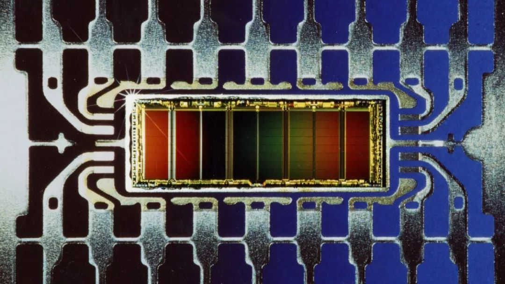
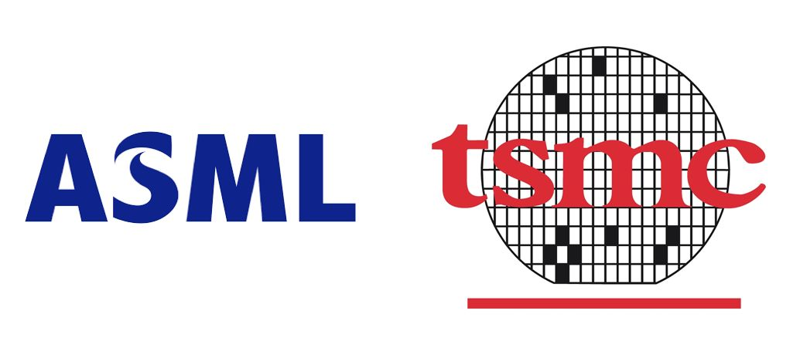

The depiction of how the Japanese defeated the United States in "The War of the Steppers" was very rough. Considering the significance of the situation in Japan and Europe at the time for the development of our country's integrated circuit industry today, I plan to discuss these stories in two or three installments.

### Chapter One

In the early 1980s, in order not to be left behind by the strong development of the United States and Japan, the European Union launched a government-led "Eureka program" in the high-tech field. Within this program framework, there was a sub-program about integrated circuits called JESSI.

One of the most important projects in JESSI is called MEGA, which produces Megabit (1Mb) memory. As my column's readers already know, memory is like the petroleum for the electronics industry, since most electronic products rely on it.

The core leaders of the MEGA project are Philips (formerly known as NXP) and Siemens (formerly known as Infineon). Due to the massive investment and high risks involved in the memory industry, the two companies divided the work as follows: Philips is responsible for SRAM and Siemens is responsible for DRAM.

The project officially started in 1984, with two major players planning to invest approximately 1.5 billion marks each over a period of five years. Of the total funds, around 500 million marks were sponsored by the governments of both countries, with the objective of catching up with the Japanese by the end of the 1980s.

At that time, the exchange rate of the US dollar to the German D-Mark was approximately 1:2 (the monthly salary of Chinese workers was less than 30 US dollars), so this was a very large sum of money.

The MEGA project has many supporting vendors, including ASML. In theory, it should benefit from the MEGA project, but how exactly remains to be seen. We will discuss this later.

### Chapter Two

Thomson, a company from France, approached Siemens in hopes of a collaboration to produce memory, but the Germans seemed to not take interest in the French company. As a result, Thomson sought out Italy's SGS company, which was also relatively small at the time, and together they decided to join JESSI for mutual benefit. After merging, SGS-Thomson became shortened to ST, which is now known as the famous semiconductor company ST Microelectronics.

Due to the sweeping trend of digitalization in electronic circuits at that time, both Japanese and American companies invested the majority of their resources in digital circuits. However, STM, with its outdated production process, chose to avoid the competition and found a foothold in analog and mixed circuits. They also made a considerable profit with low-level EPROM.

Siemens chose to take a shortcut and directly imported DRAM technology from Japan's Toshiba, successfully starting mass production of 1Mb DRAM in 1987 and even surpassing the Americans.

Due to this reason, Siemens directly introduced a complete set of Japanese production lines, including Canon lithography machines.

ASML is now speechless and deeply disappointed: the duck on the cutting board has flown away unexpectedly. Even though the project was originally promised to be subsidized by the European government, the benefits were eventually received by the Japanese.

At that time, ASML did not have very successful case studies for their products, so it is understandable that Siemens was hesitant to be a guinea pig.

This big business was lost for about ten years, and ASML only began to regain lithography business after Infineon became independent.

The success of Siemens MEGA project propelled its memory business to flourish for twenty years until Qimonda's bankruptcy, which was partly caused by Toshiba's withdrawal from the Trench technology alliance. (Is this a cycle? For more details, refer to "The Story of Memory")

 西门子1Mb内存 （Photo Credit: Siemens）

Siemens 1Mb memory.

### Chapter Three

Fortunately, ASML still has the parent company Philips. When ASML couldn't sell a single lithography machine, Philips was the first to purchase several. In 1987, when the Philips MEGA project was launched, they placed their trust in ASML's third lithography machine, the PAS2500.

However, the market demand for SRAM isn't high, and Intel has integrated it into the CPU (cache) as well.

The MEGA project of Philips ultimately failed. Some analysts say that the annual production capacity of Philips SRAM is enough for global use for four years.

Significantly, the failure of Philips MEGA has led to the development of a huge success: TSMC.

Many people do not know that when TSMC was founded in 1987, it was a joint venture between Taiwan's Industrial Technology Research Institute and Philips.

In TSMC, Philips holds a 27.5% ownership stake, making it the largest external shareholder.

Philips opened its MEGA production line to TSMC without reservation, and then moved the entire production line to Taiwan for TSMC without any changes.

Surprisingly, a fire broke out at the end of 1988 when the production line was almost ready. TSMC returned all smoke-damaged lithography machines to ASML and placed an order for seventeen new machines.

ASML was in urgent need of money, and these orders came to the rescue at a critical moment. As a result, the insurance company that paid the bill for the fire became ASML's biggest customer in 1989.

The PAS2500 can produce 70 6-inch wafers per hour, and it is ASML's first truly high-speed and stable lithography machine.

Perhaps it's true that the times make heroes. ASML and TSMC, two small companies that were once unknown, supported each other through serendipitous circumstances and have now become the unrivaled champions of the semiconductor industry.
