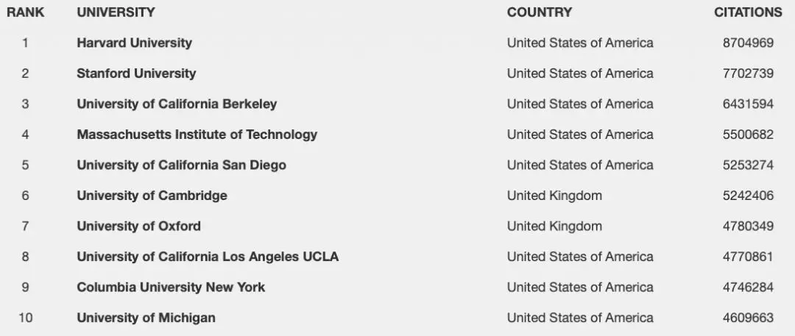

University rankings are not knowledge, they are a business.

The world's oldest and most authoritative university rankings include US News, QS, and Times. So, which one is more reliable? Unfortunately, all three have clear biases.

### One,

Times and QS used to work together on university rankings, but later split due to the profitability of the venture. The Times ranking clearly favors British universities, with the top two spots always taken by them and Harvard University deliberately placed in sixth place. Although the factors considered in the Times ranking appear comprehensive, the results are somewhat questionable and the official website is indeed filled with many recruitment advertisements.

The QS official website has a fair share of advertisements, and their rankings seem to be more favorable in recent years. In the top 10, there are 4 British universities that stand out. In the past two years, QS has placed Imperial College London (ICL) and Nanyang Technological University (Singapore) ahead of Yale and Princeton, which feels a bit odd. Chinese universities are ranking higher and higher, and it seems that QS is doing better and better business.

The Best Global University Ranking by US News is purely based on academic indicators, such as the number of research papers published and citations received. The quality of education, student satisfaction, and alumni popularity do not carry any weight in these rankings. Consequently, universities with a strong presence in research fields like biology and technology tend to rank higher. It is amusing that US News ranked Tsinghua University as the top global university for engineering and computer science based solely on the number of research papers it published. This made those unfamiliar with the ranking system proud, but caused a collective sigh from insiders.

The rankings of the two rising stars, ARWU and CWUR, seem much more pleasing to me personally. However, there are also some strange things that seem odd, such as CWUR ranking the quality of education at Tsinghua University at 403 in the world.

There are many aspects of the supposedly reasonable weighted scoring system that do not seem convincing, and there may be hidden secrets behind it. However, speaking of which, what should be the college ranking in everyone's mind?

### Two,

Jin took a unique approach to consider this problem, using internet thinking to calculate the world rankings by evaluating the traffic and design of each school's official website. Although this approach may seem somewhat absurd, it contains several compelling logics:

Respecting the official website of one's university is what makes a good university. Especially in the internet age, whether it's for application or academic publication, the official website is the most important medium.

Although the official website appears to be simple, the management and updating of a vast amount of data in the background, as well as the art design that embodies its history and tradition, are by no means achieved overnight.

The ultimate ranking should be based on reputation. But what is reputation? Reputation is the combination of years of teaching and research honors and reputation, which ultimately converges into internet traffic.

Regarding internet rankings, Web metrics is a serious field of study, and the parameter of web influence (Web Impact Factor) is something worth delving into.

The CSIC in Spain provides valuable and noteworthy data. For instance, academic rankings based on Google Scholar's citation count are very objective, so the Top-10 below mostly meets expectations, except for UCSD.

It is worth mentioning that the performance of the top two universities in China in this overall academic ranking is still not good: Tsinghua University ranked 112th, and Peking University ranked 199th.

If the citation data for the top 10% papers listed on SCImago is taken into account, Tsinghua University suddenly jumps to the 9th place. This may indicate that although the overall academic quality of Tsinghua is mediocre, the outstanding papers are also excellent.

The drawback of such rankings is that they are unfair to smaller scale (less published) schools and to third world universities that possess good reputation despite average academic performance. Therefore, I have given up on academic rankings.

### Three,

Does the reputation of a university have to be related to academia? Not necessarily. How would you rank institutions like the Foreign Affairs College and the Music College? Since it's a global ranking, it needs to have a bit of a world flavor. For instance, Zhejiang University and Nanjing University are impressive, but have 1.3 billion Indians heard of them? Have 200 million Brazilians heard of them?

The ultimate decision is to keep it simple, scoring based on the independent website access number, where 100,000 Unique Visitors per month equals 1 point.

The question is which website's statistics should be used as reference? After comparison, we have chosen SimilarWeb's latest data.

Since it's called the Jin's Ranking, let's add a fun factor of 10 and subjectively rate the website's design and feel on a scale of 1 to 10: 1 being the ugliest and 10 being the most beautiful.

Here are the ranking results. It is worth noting that, unlike other rankings, some well-known universities in the third world have appeared on the list for the first time, and well-regarded universities from often overlooked small European countries have also significantly increased.

Although you may not have heard of these universities, they are well-known locally. This is a truly unbiased ranking that reflects the global popularity of universities, free of any financial motives.

<table><colgroup><col style="width: 9%"> <col style="width: 21%"> <col style="width: 15%"> <col style="width: 21%"> <col style="width: 8%"> <col style="width: 23%"></colgroup><tbody><tr class="odd"><td>Ranking</td><td>University</td><td>Country and region</td><td>Traffic Score</td><td>Design Score</td><td>Total Score</td></tr><tr class="even"><td>1</td><td>
哈佛大学

Harvard University
</td><td>
美国

USA
</td><td>
195.40

195.40
</td><td>8</td><td>
203.40

203.40
</td></tr><tr class="odd"><td>2</td><td>
麻省理工学院

Massachusetts Institute of Technology
</td><td>
美国

United States
</td><td>
151.70

151.70
</td><td>5</td><td>
156.70

156.70
</td></tr><tr class="even"><td>3</td><td>
斯坦福大学

Stanford University
</td><td>
美国

United States
</td><td>
112.00

112.00
</td><td>7</td><td>
119.00

119.00
</td></tr><tr class="odd"><td>4</td><td>
墨西哥国立自治大学

National Autonomous University of Mexico
</td><td>
墨西哥

Mexico
</td><td>
93.68

93.68
</td><td>6</td><td>
99.68

99.68
</td></tr><tr class="even"><td>5</td><td>
宾州大学

Pennsylvania State University
</td><td>
美国

United States
</td><td>
84.78

84.78
</td><td>4</td><td>
88.78

88.78
</td></tr><tr class="odd"><td>6</td><td>
圣保罗大学

University of São Paulo
</td><td>
巴西

Brazil
</td><td>
79.37

79.37
</td><td>7</td><td>
86.37

86.37
</td></tr><tr class="even"><td>7</td><td>
康奈尔大学

Cornell University.
</td><td>
美国

United States
</td><td>
76.04

76.04
</td><td>7</td><td>
83.04

83.04
</td></tr><tr class="odd"><td>8</td><td>
加州大学伯克利分校

University of California, Berkeley
</td><td>
美国

United States
</td><td>
62.02

62.02
</td><td>6</td><td>
68.02

68.02
</td></tr><tr class="even"><td>9</td><td>
密歇根大学

University of Michigan.
</td><td>
美国

United States
</td><td>
49.64

49.64
</td><td>6</td><td>
55.64

55.64
</td></tr><tr class="odd"><td>10</td><td>
威斯康星大学

University of Wisconsin
</td><td>
美国

United States
</td><td>
46.67

46.67
</td><td>6</td><td>
52.67

52.67
</td></tr><tr class="even"><td>11</td><td>
哥伦比亚大学

Columbia University
</td><td>
美国

United States.
</td><td>
46.06

46.06
</td><td>6</td><td>
52.06

52.06
</td></tr><tr class="odd"><td>12</td><td>
华盛顿大学

University of Washington
</td><td>
美国

United States
</td><td>
42.20

42.20
</td><td>6</td><td>
48.20

48.20
</td></tr><tr class="even"><td>13</td><td>
牛津大学

University of Oxford.
</td><td>
英国

United Kingdom
</td><td>
41.58

41.58
</td><td>6</td><td>
47.58

47.58
</td></tr><tr class="odd"><td>14</td><td>
普度大学

Pudu University
</td><td>
美国

United States
</td><td>
41.39

41.39
</td><td>6</td><td>
47.39

47.39
</td></tr><tr class="even"><td>15</td><td>
宾夕法尼亚大学

University of Pennsylvania
</td><td>
美国

United States
</td><td>
38.97

38.97
</td><td>6</td><td>
44.97

44.97
</td></tr><tr class="odd"><td>16</td><td>
得克萨斯大学

University of Texas
</td><td>
美国

United States
</td><td>
35.69

35.69
</td><td>7</td><td>
42.69

42.69
</td></tr><tr class="even"><td>17</td><td>
加州大学洛杉矶分校

University of California, Los Angeles
</td><td>
美国

United States
</td><td>
38.77

38.77
</td><td>3</td><td>
41.77

41.77
</td></tr><tr class="odd"><td>18</td><td>
普林斯顿大学

Princeton University.
</td><td>
美国

United States
</td><td>
35.68

35.68
</td><td>6</td><td>
41.68

41.68
</td></tr><tr class="even"><td>19</td><td>
耶鲁大学

Yale University
</td><td>
美国

United States
</td><td>
34.95

34.95
</td><td>6</td><td>
40.95

40.95
</td></tr><tr class="odd"><td>20</td><td>
明尼苏达大学

University of Minnesota
</td><td>
美国

United States
</td><td>
35.83

35.83
</td><td>5</td><td>
40.83

40.83
</td></tr><tr class="even"><td>21</td><td>
卡内基梅隆大学

Carnegie Mellon University
</td><td>
美国

United States.
</td><td>
34.00

34.00
</td><td>6</td><td>
40.00

40.00
</td></tr><tr class="odd"><td>22</td><td>
伊利诺伊大学

University of Illinois
</td><td>
美国

United States
</td><td>
34.46

34.46
</td><td>4</td><td>
38.46

38.46
</td></tr><tr class="even"><td>23</td><td>
剑桥大学

University of Cambridge
</td><td>
英国

England
</td><td>
33.16

33.16
</td><td>6</td><td>
39.16

39.16
</td></tr><tr class="odd"><td>24</td><td>
安纳托鲁大学

Anatolu University
</td><td>
土耳其

Turkey
</td><td>
31.82

31.82
</td><td>6</td><td>
37.82

37.82
</td></tr><tr class="even"><td>25</td><td>
纽约大学

New York University
</td><td>
美国

United States
</td><td>
33.81

33.81
</td><td>3</td><td>
36.81

36.81
</td></tr><tr class="odd"><td>26</td><td>
佛罗里达大学

University of Florida
</td><td>
美国

United States
</td><td>
31.04

31.04
</td><td>5</td><td>
36.04

36.04
</td></tr><tr class="even"><td>27</td><td>
不列颠哥伦比亚大学

University of British Columbia
</td><td>
加拿大

Canada
</td><td>
29.70

29.70
</td><td>6</td><td>
35.70

35.70
</td></tr><tr class="odd"><td>28</td><td>
南加州大学

University of Southern California
</td><td>
美国

United States
</td><td>
31.08

31.08
</td><td>3</td><td>
34.08

34.08
</td></tr><tr class="even"><td>29</td><td>
南大河州联邦大学

Nandahezhou Federal University.
</td><td>
巴西

Brazil
</td><td>
29.92

29.92
</td><td>4</td><td>
33.92

33.92
</td></tr><tr class="odd"><td>30</td><td>
智利大学

University of Chile
</td><td>
智利

Chile
</td><td>
28.71

28.71
</td><td>5</td><td>
33.71

33.71
</td></tr><tr class="even"><td>31</td><td>
加州大学圣迭戈分校

University of California, San Diego
</td><td>
美国

United States
</td><td>
28.66

28.66
</td><td>5</td><td>
33.66

33.66
</td></tr><tr class="odd"><td>32</td><td>
芝加哥大学

University of Chicago
</td><td>
美国

United States of America
</td><td>
27.62

27.62
</td><td>6</td><td>
33.62

33.62
</td></tr><tr class="even"><td>33</td><td>
多伦多大学

University of Toronto
</td><td>
加拿大

Canada
</td><td>
27.21

27.21
</td><td>6</td><td>
33.21

33.21
</td></tr><tr class="odd"><td>34</td><td>
密歇根州立大学

Michigan State University
</td><td>
美国

United States
</td><td>
28.13

28.13
</td><td>5</td><td>
33.13

33.13
</td></tr><tr class="even"><td>35</td><td>
波士顿大学

Boston University
</td><td>
美国

United States of America.
</td><td>
26.68

26.68
</td><td>6</td><td>
32.68

32.68
</td></tr><tr class="odd"><td>36</td><td>
亚利桑那州立大学

Arizona State University
</td><td>
美国

United States
</td><td>
27.46

27.46
</td><td>5</td><td>
32.46

32.46
</td></tr><tr class="even"><td>37</td><td>
约翰霍普金斯大学

Johns Hopkins University
</td><td>
美国

United States
</td><td>
24.41

24.41
</td><td>8</td><td>
32.41

32.41
</td></tr><tr class="odd"><td>38</td><td>
北卡大学教堂山分校

University of North Carolina at Chapel Hill
</td><td>
美国

United States
</td><td>
26.17

26.17
</td><td>6</td><td>
32.17

32.17
</td></tr><tr class="even"><td>39</td><td>
犹他大学

Utah State University
</td><td>
美国

United States
</td><td>
27.75

27.75
</td><td>4</td><td>
31.75

31.75
</td></tr><tr class="odd"><td>40</td><td>
伦敦大学学院

University College London
</td><td>
英国

United Kingdom
</td><td>
24.20

24.20
</td><td>6</td><td>
30.20

30.20
</td></tr><tr class="even"><td>41</td><td>
加州大学尔湾分校

University of California, Irvine
</td><td>
美国

United States
</td><td>
22.86

22.86
</td><td>7</td><td>
29.86

29.86
</td></tr><tr class="odd"><td>42</td><td>
杜克大学

Duke University
</td><td>
美国

United States
</td><td>
22.57

22.57
</td><td>7</td><td>
29.57

29.57
</td></tr><tr class="even"><td>43</td><td>
西北大学

Northwest University
</td><td>
美国

United States
</td><td>
23.29

23.29
</td><td>6</td><td>
29.29

29.29
</td></tr><tr class="odd"><td>44</td><td>
圣卡塔琳娜州联邦大学

Santa Catarina Federal University
</td><td>
巴西

Brazil
</td><td>
25.94

25.94
</td><td>3</td><td>
28.94

28.94
</td></tr><tr class="even"><td>45</td><td>
德州农工大学

Texas A&amp;M University
</td><td>
美国

United States
</td><td>
23.94

23.94
</td><td>5</td><td>
28.94

28.94
</td></tr><tr class="odd"><td>46</td><td>
印尼安纳大学

University of Indonesia
</td><td>
美国

United States
</td><td>
22.84

22.84
</td><td>6</td><td>
28.84

28.84
</td></tr><tr class="even"><td>47</td><td>
加州理工学院

California Institute of Technology
</td><td>
美国

United States
</td><td>
22.69

22.69
</td><td>6</td><td>
28.69

28.69
</td></tr><tr class="odd"><td>48</td><td>
苏黎世联邦理工学院

Swiss Federal Institute of Technology Zurich
</td><td>
瑞士

Switzerland
</td><td>
25.47

25.47
</td><td>3</td><td>
28.47

28.47
</td></tr><tr class="even"><td>49</td><td>
纽约城市大学

City University of New York (CUNY)
</td><td>
美国

United States
</td><td>
21.77

21.77
</td><td>6</td><td>
27.77

27.77
</td></tr><tr class="odd"><td>50</td><td>
加州大学戴维斯分校

University of California, Davis
</td><td>
美国

United States
</td><td>
21.40

21.40
</td><td>6</td><td>
27.40

27.40
</td></tr><tr class="even"><td>51</td><td>
布宜诺斯艾利斯大学

University of Buenos Aires
</td><td>
阿根廷

Argentina
</td><td>
26.37

26.37
</td><td>1</td><td>
27.37

27.37
</td></tr><tr class="odd"><td>52</td><td>
马里兰大学

University of Maryland
</td><td>
美国

United States
</td><td>
19.97

19.97
</td><td>7</td><td>
26.97

26.97
</td></tr><tr class="even"><td>53</td><td>
罗切斯特大学

Rochester University
</td><td>
美国

United States
</td><td>
23.81

23.81
</td><td>3</td><td>
26.81

26.81
</td></tr><tr class="odd"><td>54</td><td>
加查马达大学

Jigme Namgyel Engineering College
</td><td>
印度尼西亚

Indonesia
</td><td>
19.71

19.71
</td><td>7</td><td>
26.71

26.71
</td></tr><tr class="even"><td>55</td><td>
俄亥俄州立大学

Ohio State University
</td><td>
美国

United States
</td><td>
21.23

21.23
</td><td>5</td><td>
26.23

26.23
</td></tr><tr class="odd"><td>56</td><td>
台湾大学

National Taiwan University
</td><td>
中国台湾

Taiwan, China
</td><td>
23.80

23.80
</td><td>2</td><td>
25.80

25.80
</td></tr><tr class="even"><td>57</td><td>
哥伦比亚国立大学

National University of Colombia
</td><td>
哥伦比亚

Colombia
</td><td>
20.34

20.34
</td><td>5</td><td>
25.34

25.34
</td></tr><tr class="odd"><td>58</td><td>
亚利桑那大学

Arizona State University
</td><td>
美国

United States
</td><td>
18.72

18.72
</td><td>6</td><td>
24.72

24.72
</td></tr><tr class="even"><td>59</td><td>
爱丁堡大学

The University of Edinburgh.
</td><td>
英国

United Kingdom
</td><td>
19.57

19.57
</td><td>5</td><td>
24.57

24.57
</td></tr><tr class="odd"><td>60</td><td>
科罗拉多大学

University of Colorado
</td><td>
美国

United States
</td><td>
19.49

19.49
</td><td>5</td><td>
24.49

24.49
</td></tr><tr class="even"><td>61</td><td>
西部州长大学

Western Governors University
</td><td>
美国

United States
</td><td>
19.34

19.34
</td><td>5</td><td>
24.34

24.34
</td></tr><tr class="odd"><td>62</td><td>
弗吉尼亚大学

University of Virginia
</td><td>
美国

United States
</td><td>
18.98

18.98
</td><td>5</td><td>
23.98

23.98
</td></tr><tr class="even"><td>63</td><td>
东京大学

The University of Tokyo
</td><td>
日本

Japan
</td><td>
16.77

16.77
</td><td>7</td><td>
23.77

23.77
</td></tr><tr class="odd"><td>64</td><td>
清华大学

Tsinghua University
</td><td>
中国

China
</td><td>
20.76

20.76
</td><td>3</td><td>
23.76

23.76
</td></tr><tr class="even"><td>65</td><td>
佐治亚州立大学

Georgia State University
</td><td>
美国

United States
</td><td>
18.55

18.55
</td><td>5</td><td>
23.55

23.55
</td></tr><tr class="odd"><td>66</td><td>
米纳斯联邦大学

Universidade Federal de Minas Gerais (Federal University of Minas Gerais)
</td><td>
巴西

Brazil
</td><td>
18.29

18.29
</td><td>5</td><td>
23.29

23.29
</td></tr><tr class="even"><td>67</td><td>
庆应大学

Keio University
</td><td>
日本

Japan
</td><td>
14.78

14.78
</td><td>8</td><td>
22.78

22.78
</td></tr><tr class="odd"><td>68</td><td>
印度尼西亚大学

Universitas Indonesia
</td><td>
印度尼西亚

Indonesia
</td><td>
17.69

17.69
</td><td>5</td><td>
22.69

22.69
</td></tr><tr class="even"><td>69</td><td>
罗格斯大学

Rutgers University
</td><td>
美国

United States
</td><td>
17.51

17.51
</td><td>5</td><td>
22.51

22.51
</td></tr><tr class="odd"><td>70</td><td>
麦吉尔大学

McGill University
</td><td>
加拿大

Canada
</td><td>
19.41

19.41
</td><td>3</td><td>
22.41

22.41
</td></tr><tr class="even"><td>71</td><td>
加州大学旧金山分校

University of California, San Francisco
</td><td>
美国

United States.
</td><td>
17.38

17.38
</td><td>5</td><td>
22.38

22.38
</td></tr><tr class="odd"><td>72</td><td>
英迪拉甘地大学

Indira Gandhi University
</td><td>
印度

India
</td><td>
19.18

19.18
</td><td>3</td><td>
22.18

22.18
</td></tr><tr class="even"><td>73</td><td>
巴塞罗那大学

Barcelona University
</td><td>
西班牙

Spain
</td><td>
19.16

19.16
</td><td>3</td><td>
22.16

22.16
</td></tr><tr class="odd"><td>74</td><td>
圣保罗州立大学

Sao Paulo State University
</td><td>
巴西

Brazil
</td><td>
17

17
</td><td>5</td><td>
22.00

22:00
</td></tr><tr class="even"><td>75</td><td>
里约联邦大学

Federal University of Rio de Janeiro
</td><td>
巴西

Brazil
</td><td>
18.60

18.60
</td><td>3</td><td>
21.60

21.60
</td></tr><tr class="odd"><td>76</td><td>
匹兹堡大学

University of Pittsburgh
</td><td>
美国

United States
</td><td>
17.10

17.10
</td><td>4</td><td>
21.10

21.10 is a numerical representation of a date or time. It can be interpreted as October 21st or 10:10pm.
</td></tr><tr class="even"><td>77</td><td>
墨尔本大学

University of Melbourne
</td><td>
澳大利亚

Australia
</td><td>
15.04

15th of April
</td><td>6</td><td>
21.04

21.04 (same in English)
</td></tr><tr class="odd"><td>78</td><td>
新加坡大学

National University of Singapore
</td><td>
新加坡

Singapore
</td><td>
14.98

14.98
</td><td>6</td><td>
20.98

20.98
</td></tr><tr class="even"><td>79</td><td>
佐治亚理工学院

Georgia Institute of Technology
</td><td>
美国

United States
</td><td>
15.79

15.79
</td><td>5</td><td>
20.79

20.79
</td></tr><tr class="odd"><td>80</td><td>
德里大学

University of Delhi
</td><td>
印度

India
</td><td>
18.77

18.77
</td><td>2</td><td>
20.77

20.77
</td></tr><tr class="even"><td>81</td><td>
夏威夷大学

University of Hawaii
</td><td>
美国

United States
</td><td>
15.55

15.55
</td><td>5</td><td>
20.55

20.55
</td></tr><tr class="odd"><td>82</td><td>
博洛尼亚大学

University of Bologna
</td><td>
意大利

Italy.
</td><td>
14.53

14.53
</td><td>6</td><td>
20.53

20.53
</td></tr><tr class="even"><td>83</td><td>
香港中文大学

The Chinese University of Hong Kong.
</td><td>
中国香港

Hong Kong, China
</td><td>
16.70

16.70
</td><td>3</td><td>
19.70

19.70
</td></tr><tr class="odd"><td>84</td><td>
莫斯科大学

Moscow University
</td><td>
俄罗斯

Russia
</td><td>
16.54

16.54
</td><td>3</td><td>
19.54

19.54
</td></tr><tr class="even"><td>85</td><td>
滑铁卢大学

University of Waterloo.
</td><td>
加拿大

Canada
</td><td>
14.48

14.48
</td><td>5</td><td>
19.48

19.48
</td></tr><tr class="odd"><td>86</td><td>
弗吉尼亚理工学院

Virginia Polytechnic Institute and State University
</td><td>
美国

United States
</td><td>
14.34

14.34
</td><td>5</td><td>
19.34

19.34
</td></tr><tr class="even"><td>87</td><td>
南洋理工大学

Nanyang Technological University.
</td><td>
新加坡

Singapore
</td><td>
13.03

This is a date in the format of DD.MM.
</td><td>6</td><td>
19.03

19.03
</td></tr><tr class="odd"><td>88</td><td>
新南威尔士大学

The University of New South Wales
</td><td>
澳大利亚

Australia
</td><td>
15.80

15.80
</td><td>3</td><td>
18.80

18.80
</td></tr><tr class="even"><td>89</td><td>
保利斯塔大学

Polytechnic University of Bari
</td><td>
巴西

Brazil
</td><td>
17.67

17.67
</td><td>1</td><td>
18.67

18.67
</td></tr><tr class="odd"><td>90</td><td>
莫那什大学

Mona University
</td><td>
澳大利亚

Australia
</td><td>
12.49

12.49
</td><td>6</td><td>
18.49

18.49
</td></tr><tr class="even"><td>91</td><td>
柏林大学

Berlin University
</td><td>
德国

Germany
</td><td>
11.43

11.43 is already in English and it is the numerical representation of the time 11:43.
</td><td>7</td><td>
18.43

18.43
</td></tr><tr class="odd"><td>92</td><td>
京都大学

Kyoto University
</td><td>
日本

Japan
</td><td>
12.41

12.41
</td><td>6</td><td>
18.41

18.41
</td></tr><tr class="even"><td>93</td><td>
西门菲莎大学

York University
</td><td>
加拿大

Canada
</td><td>
11.35

11.35
</td><td>7</td><td>
18.35

18.35
</td></tr><tr class="odd"><td>94</td><td>
维也纳大学

University of Vienna
</td><td>
奥地利

Austria
</td><td>
11.12

11.12
</td><td>7</td><td>
18.12

18.12
</td></tr><tr class="even"><td>95</td><td>
慕尼黑大学

University of Munich
</td><td>
德国

Germany
</td><td>
14.04

14.04
</td><td>4</td><td>
18.04

18th of April.
</td></tr><tr class="odd"><td>96</td><td>
海德堡大学

Heidelberg University.
</td><td>
德国

Germany
</td><td>
11.00

11.00
</td><td>7</td><td>
18.00

18.00
</td></tr><tr class="even"><td>97</td><td>
瓜达拉哈拉大学

University of Guadalajara
</td><td>
墨西哥

Mexico
</td><td>
13.98

13.98
</td><td>4</td><td>
17.98

17.98
</td></tr><tr class="odd"><td>98</td><td>
帝国理工大学

Imperial College London
</td><td>
英国

UK
</td><td>
12.15

12.15
</td><td>5</td><td>
17.15

17.15
</td></tr><tr class="even"><td>99</td><td>
慕尼黑技术大学

Technical University of Munich
</td><td>
德国

Germany
</td><td>
12.07

12.07
</td><td>5</td><td>
17.07

17.07
</td></tr><tr class="odd"><td>100</td><td>
华威大学

University of Warwick
</td><td>
英国

England
</td><td>
11.82

11.82
</td><td>5</td><td>
16.82

16.82
</td></tr><tr class="even"><td>101</td><td>
奥斯陆大学

University of Oslo
</td><td>
挪威

Norway
</td><td>
13.60

13.60
</td><td>3</td><td>
16.60

16.60
</td></tr><tr class="odd"><td>102</td><td>
汉堡大学

Hamburg University
</td><td>
德国

Germany
</td><td>
9.19

9.19
</td><td>7</td><td>
16.19

16.19
</td></tr><tr class="even"><td>103</td><td>
代尔夫特理工大学

Delft University of Technology
</td><td>
荷兰

Netherlands
</td><td>
9.07

9.07
</td><td>7</td><td>
16.07

16.07
</td></tr><tr class="odd"><td>104</td><td>
阿姆斯特丹大学

University of Amsterdam
</td><td>
荷兰

Netherlands
</td><td>
9.87

9.87
</td><td>6</td><td>
15.87

15.87.
</td></tr><tr class="even"><td>105</td><td>
北京大学

Peking University
</td><td>
中国

China
</td><td>
13.83

13.83
</td><td>2</td><td>
15.83

15.83
</td></tr><tr class="odd"><td>106</td><td>
凤凰城大学

Phoenix University
</td><td>
美国

United States
</td><td>
12.71

12.71
</td><td>3</td><td>
15.71

15.71
</td></tr><tr class="even"><td>107</td><td>
鲁汶大学

KU Leuven
</td><td>
比利时

Belgium
</td><td>
9.68

9.68
</td><td>6</td><td>
15.68

15.68
</td></tr><tr class="odd"><td>108</td><td>
乌特勒支大学

Utrecht University
</td><td>
荷兰

Netherlands
</td><td>
9.57

9.57
</td><td>6</td><td>
15.57

15.57
</td></tr><tr class="even"><td>109</td><td>
悉尼大学

The University of Sydney
</td><td>
澳大利亚

Australia
</td><td>
10.40

10:40
</td><td>5</td><td>
15.40

15.40
</td></tr><tr class="odd"><td>110</td><td>
上海交通大学

Shanghai Jiao Tong University
</td><td>
中国

China
</td><td>
12.20

12.20
</td><td>3</td><td>
15.20

15.20
</td></tr><tr class="even"><td>111</td><td>
香港大学

The University of Hong Kong.
</td><td>
中国香港

Hong Kong, China
</td><td>
12.09

12.09
</td><td>3</td><td>
15.09

15th of September
</td></tr><tr class="odd"><td>112</td><td>
格罗宁根大学

University of Groningen
</td><td>
荷兰

Netherlands
</td><td>
9.07

9.07
</td><td>6</td><td>
15.07

15th of July
</td></tr><tr class="even"><td>113</td><td>
哥本哈根大学

University of Copenhagen
</td><td>
丹麦

Denmark
</td><td>
8.06

8.06
</td><td>7</td><td>
15.06

15.06
</td></tr><tr class="odd"><td>114</td><td>
日内瓦大学

University of Geneva
</td><td>
瑞士

Switzerland.
</td><td>
8.95

8.95
</td><td>6</td><td>
14.95

14.95
</td></tr><tr class="even"><td>115</td><td>
浙江大学

Zhejiang University.
</td><td>
中国

China
</td><td>
12.94

12.94
</td><td>2</td><td>
14.94

14.94
</td></tr><tr class="odd"><td>116</td><td>
赫尔辛基大学

University of Helsinki.
</td><td>
芬兰

Finland
</td><td>
9.78

9.78
</td><td>5</td><td>
14.78

14.78
</td></tr><tr class="even"><td>117</td><td>
南非大学

South African university.
</td><td>
南非

South Africa
</td><td>
9.59

9.59
</td><td>5</td><td>
14.59

14.59
</td></tr><tr class="odd"><td>118</td><td>
跟特大学

Ghent University
</td><td>
比利时

Belgium
</td><td>
9.33

9.33
</td><td>5</td><td>
14.33

14.33
</td></tr><tr class="even"><td>119</td><td>
罗马大学

Roman University
</td><td>
意大利

Italy
</td><td>
8.31

8.31
</td><td>6</td><td>
14.31

14.31
</td></tr><tr class="odd"><td>120</td><td>
印度理工学院孟买分校

Indian Institute of Technology Bombay
</td><td>
印度

India
</td><td>
8.03

8.03
</td><td>6</td><td>
14.03

14th of March
</td></tr><tr class="even"><td>121</td><td>
苏黎世大学

University of Zurich
</td><td>
瑞士

Switzerland
</td><td>
9.06

9.06
</td><td>4</td><td>
13.06

13.06
</td></tr><tr class="odd"><td>122</td><td>
开普敦大学

University of Cape Town
</td><td>
南非

South Africa.
</td><td>
7.06

7.06
</td><td>6</td><td>
13.06

13.06
</td></tr><tr class="even"><td>123</td><td>
特拉维夫大学

Tel Aviv University
</td><td>
以色列

Israel
</td><td>
8.01

8.01
</td><td>5</td><td>
13.01

13.01
</td></tr><tr class="odd"><td>124</td><td>
香港科技大学

Hong Kong University of Science and Technology
</td><td>
中国香港

Hong Kong, China
</td><td>
5.66

5.66
</td><td>7</td><td>
12.66

12.66
</td></tr><tr class="even"><td>125</td><td>
普纳大学

Pune University
</td><td>
印度

India
</td><td>
10.56

10.56
</td><td>2</td><td>
12.56

12.56
</td></tr><tr class="odd"><td>126</td><td>
中国科技大学

University of Science and Technology of China
</td><td>
中国

China
</td><td>
11.48

11.48
</td><td>1</td><td>
12.48

12.48
</td></tr><tr class="even"><td>127</td><td>
乌普萨拉大学

Uppsala University
</td><td>
瑞典

Sweden
</td><td>
7.46

7.46
</td><td>5</td><td>
12.46

12.46
</td></tr><tr class="odd"><td>128</td><td>
佐治亚大学系统

University System of Georgia
</td><td>
美国

United States
</td><td>
5.40

5.40
</td><td>6</td><td>
11.40

11.40
</td></tr><tr class="even"><td>129</td><td>
大阪大学

Osaka University
</td><td>
日本

Japan
</td><td>
8.32

8.32
</td><td>3</td><td>
11.32

11.32
</td></tr><tr class="odd"><td>130</td><td>
南京大学

Nanjing University
</td><td>
中国

China
</td><td>
7.44

7.44
</td><td>3</td><td>
10.44

10.44
</td></tr><tr class="even"><td>131</td><td>
复旦大学

Fudan University
</td><td>
中国

China
</td><td>
7.27

7.27
</td><td>3</td><td>
10.27

10.27
</td></tr></tbody></table>
