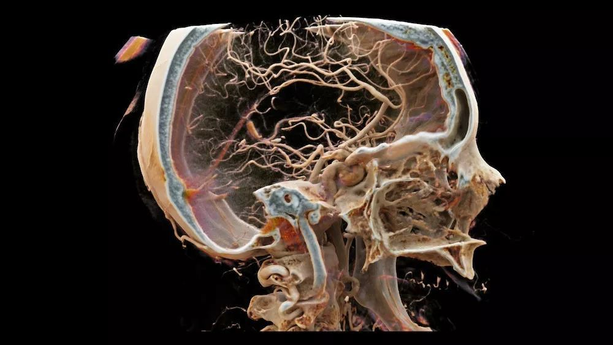

Currently, the top three giants in the medical equipment industry are commonly referred to as GPS within the industry: GE (General Electric), Philips and Siemens. Some people also refer to them as the three major mountains that weigh heavily on China's medical industry.

Interestingly, these three century-old shops used to manufacture light bulbs.

In fact, there are still many shops selling these bulbs on the streets, but Siemens has separated from OSRAM.

So the question arises, is there a connection between light bulbs and medical devices? There is actually a close relationship.

Toshiba, a Japanese company known for making light bulbs, is now also one of the major players in the LED industry. Their medical imaging equipment is also highly regarded, ranking in the Top 5, but they have recently merged with Canon. Another major player among the Big Five, Hitachi, also manufactures light bulbs.

In this article, I will talk about some interesting stories ranging from light bulbs to medical equipment.

### One,

In the Bible, God said, "Let there be light," and thus the first day of the world was created. Light is truly the most wonderful gift for humanity. Our science has been tirelessly studying light from prehistoric times to the present day.

The greatest invention of humanity is undoubtedly the light bulb: 200 years ago, it illuminated the night, and now it illuminates phone screens.

Edison was not the inventor of the light bulb. He wasn't even born when the light bulb was invented. Even the tungsten filament incandescent light bulb we use today was not invented by him. However, he was indeed one of the founders of General Electric and introduced early long-lasting light bulbs. The screw thread interface standard on our light bulbs is defined by Edison.

Is Edison really the king of invention? It's now hard to verify, as the authenticity of the articles written by journalists at that time is difficult to determine. However, he was definitely a far-sighted and savvy businessman, and applying for patents was his trump card.

### Two,

Due to General Electric's control of a large number of patents, it forces light bulb companies that require its patent authorization to comply with strict production quotas, such as Philips being limited to producing only half of its capacity.

Werner von Siemens once expressed in a letter that Edison's light bulb prices were absurd and that our own light bulbs were brighter. However, Siemens was soon forced to cooperate with Edison's German company. This partnership eventually gave rise to Osram.

However, with the outbreak of World War I, the established quota system in Europe was disrupted. After the war, in 1924, General Electric once again pushed for a meeting in Switzerland among major light bulb companies from Germany, France, the Netherlands, the United Kingdom, Japan, and others, and established a cartel called Phoebus, which redefined the quotas for each manufacturer.

It is criticized that Phoebus has also established technical specifications that shorten the average lifespan of light bulbs by 30-50% in order to increase sales. If a light bulb from a certain factory exceeds the specified lifespan upon inspection, a fine will be imposed.

This clearly infringes on the interests of consumers, but what can be done? Only a few small Japanese factories took the opportunity to introduce high-life light bulbs, resulting in a several-fold increase in sales volume, but their impact on the world is still limited.

Fortunately, World War II broke out soon after and Phoebus died a natural death.

### Three,

X-rays are also a form of light, so they are emitted by a type of light bulb (more commonly known as an X-ray tube) and the technical difficulty is not particularly high. Therefore, after Mr. Roentgen announced the discovery of X-rays in January 1896, this technology was only used for half a year for the treatment of battlefield casualties because it was extremely convenient for locating bullets.

In the same year, Siemens launched the industrial production of medical X-ray equipment, and General Electric's X-ray machine was also born in 1896. Our Qing Dynasty imported the Siemens X-ray machine in 1899.

Philips started relatively late, not because of technical problems, but due to the heavy casualties of World War I that resulted in a surge in demand for X-ray machines in hospitals, leading Philips to join the war effort.

The launch of Toshiba X-ray was several years earlier than Philips.

Therefore, the medical imaging giants we see today actually started out 100 years ago from light bulbs.

### Four,

The technology of medical imaging equipment can be summarized as using various electromagnetic waves to pass through the human body, and then receiving the signal and processing the image from the receiving end. So, besides the light source (radiation source), what is GPS good at? The answer is electronics.

With the rapid development of electronic technology after World War II, medical equipment has made tremendous progress in the combination of light (electromagnetic waves) and electricity (semiconductors and computers) fields.

1950s: Biochemical Analyzer (for examining blood and urine, etc.)

1960s: Ultrasound scanner (non-invasive examination of organs and fetuses, etc.)

1970s: CT scanner (Computerized Tomography scan using X-rays)

1980s: MRI (Magnetic Resonance Imaging Machine)

2000s: PET/CT machine (positron emission tomography scanner used for whole body scanning)

The 2010s: Advanced 3D Imaging (Three-dimensional reconstruction and rendering of medical images)

 (3D影像重建，Photo Credit: Siemens Healthineers)

3D image reconstruction, Photo Credit: Siemens Healthineers

Imaging equipment is the largest part of medical equipment, and the technology of the three major GPS companies is certainly not just empty talk.

The three GPS companies are all pioneers in the semiconductor field. They were among the first to sign up in the wonderful public authorization of AT&T in 1952.

The legacy of two companies in the semiconductor industry, Philips and Siemens, has been continued through NXP and Infineon, respectively, and they still dominate a large portion of the European semiconductor market. Toshiba and Hitachi have also been major players in the industry at one point.

RCA, a subsidiary of General Electric, was not only a pioneer in American broadcasting and television technology, but also a pioneer in semiconductor technology. TSMC's earliest technology was introduced from RCA, and Intersil, which was later acquired by Renesas, was also one of RCA's legacies.

These giants have experienced the transition from the era of electric lighting and electrical appliances to the era of microelectronics and information technology. These technologies have also been continuously introduced into medical devices, and a century of accumulation seems to have made their position impregnable today.

### Five,

The largest domestic medical device manufacturer, Shenzhen Mindray, is known as the "little Huawei," adopting a strategy similar to surrounding the city with rural areas, attacking relatively low-end areas such as electrocardiogram monitoring, biochemical analysis equipment, and ultrasound equipment. However, in the high-end field of radiation equipment, Mindray still avoids direct confrontation with GPS.

The founder comes from Siemens Healthineers, and is not afraid of competition as they directly enter the radiology imaging equipment market. Leanding Imaging can be compared to SMIC in the semiconductor industry, and I hope they will succeed in their IPO on the Science and Technology Innovation Board.

The popularization of microelectronics technology and rapid development of software technology, 3D, AI and other technologies have indeed given us the opportunity to take a shortcut. Conversely, optical technology, which requires patience, may be a bottleneck in development.

Twenty years ago, I briefly worked as a software engineer, as mentioned in "The God of Programmers," where I developed a connection with Delphi. At the time, I was involved in the information technology work of biochemical analyzers. The original biochemical analyzers were only able to print an English thermal paper strip similar to a cash register's, and the development work involved reading the data from the biochemical analyzer and storing it into the hospital system. This allowed hospitals to directly retrieve Chinese laboratory test results from the database according to the medical record number.

Back then, in the inspection department, I saw many beautiful imported equipment that could measure blood indicators in just a minute, making me realize the huge gap between us and the world. Surprisingly, not long after, our Shenzhen manufacturing had caught up with it.

### Six,

Today, undergoing a PET scan in a hospital costs about ten thousand yuan. In the wake of medical reforms, medicine is no longer the primary source of profit for hospitals, and various examination equipment and disposable medical devices have become the money-making machines.

The prices of imported products in here are frightening: my mother paid 15,000 Yuan for three injection syringes used during her surgery, and my friend had to pay nearly 20,000 Yuan for an imported screw used in orthopedics. All of these expenses were out-of-pocket, and only made possible through knowing the department head personally.

Hopefully, all of this will change with the release of domestically produced high-quality products.
