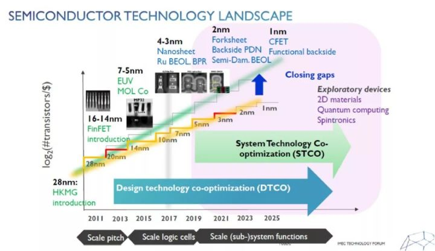
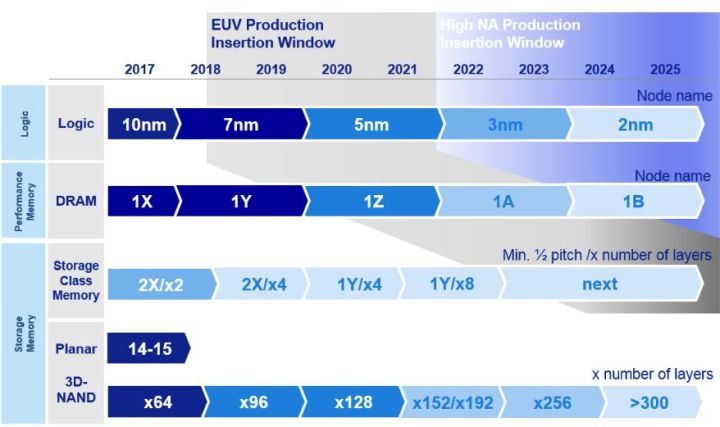
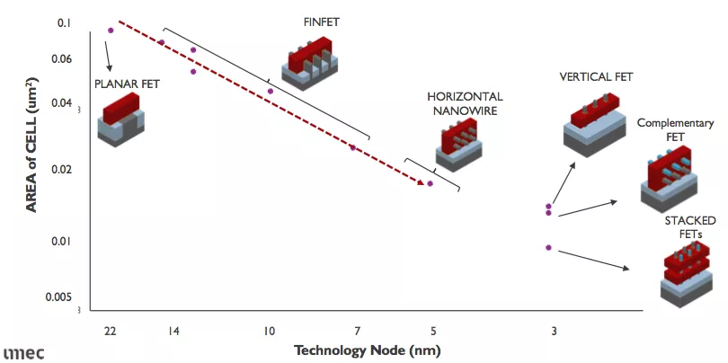
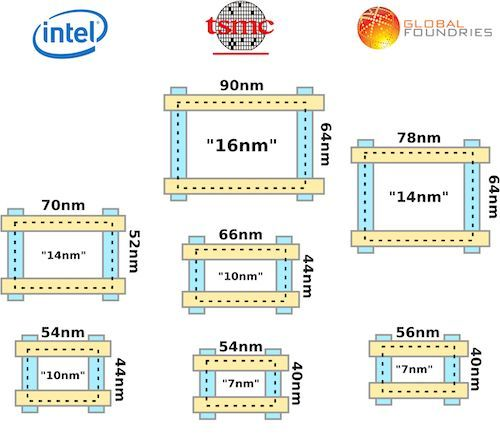
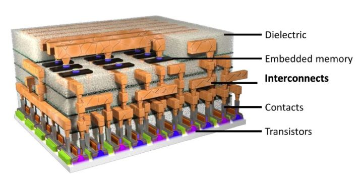
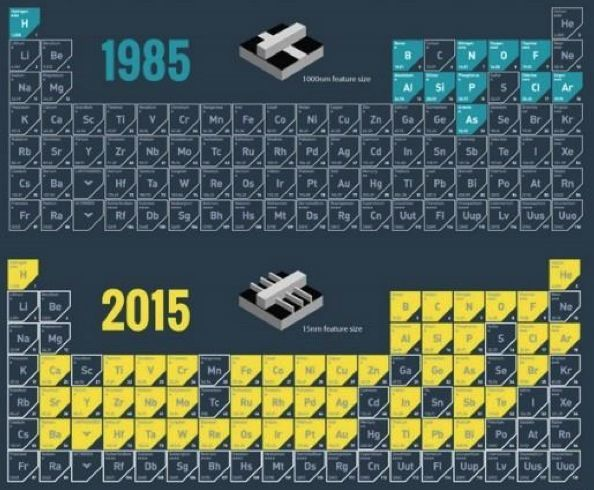
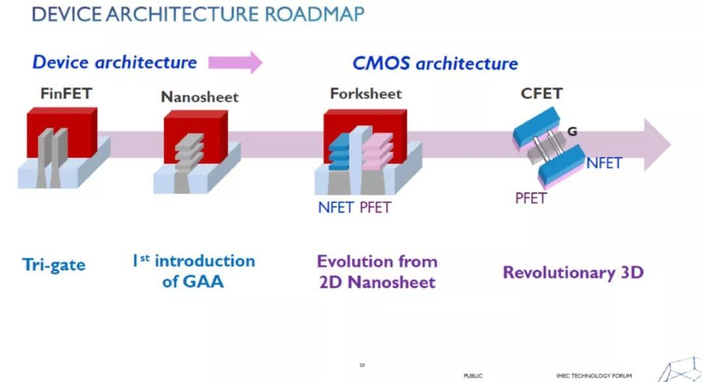

2018 was a sad year for Intel. Just one month before the company's 50th anniversary celebration, CEO Brian Krzanich, who had been squeezed toothpaste with the company for five years, resigned due to a scandal involving his personal life.

The outside speculation is that this is just an excuse the board found to get rid of him, as the relationship itself is insignificant.

The most critical point is that Brian Krzanich is practically the antonym of Moore's Law. During his tenure, the progression from 14nm to 14nm+++ was incredibly awkward. Meanwhile, Moore's Law is the fundamental principle of Intel.

In 2018, Intel, which had been leading in semiconductor manufacturing technology by a significant margin for half a century, was surpassed by TSMC. AMD's Ryzen, which used to be overshadowed, surprisingly caught up as well.

Jensen Huang of Nvidia said that Moore's Law is dead. David Patterson, a pioneer of the first-generation RISC, also said that Moore's Law is dead.

This is almost equivalent to saying that Intel's purpose no longer exists. A beacon in the technology industry has become a mere money-making machine.

### Chapter One

If we just look at Intel's financial report, overall, it is quite good. Although they are struggling with new products, with the strong support of cloud computing, Intel's CPU is still in high demand.

If time were to turn back more than a decade, Intel would surely regret the two times it refused Apple. Because Apple nurtured two of its biggest competitors: Samsung and TSMC.

One year before the release of the first generation iPhone, Intel refused to provide a mobile CPU for Jobs and sold its own ARM division, XScale. Apple chose Samsung instead.

In 2012-2013, Apple sought to diversify from Samsung and looked for a foundry to manufacture the A7 processor for the iPhone 5s. The rumored candidate, Intel, declined the offer, and TSMC was not prepared to handle such a large order at the time.

After enduring Samsung for a year, Apple invested heavily in Taiwan Semiconductor Manufacturing Company and finally achieved mass production of 20nm A8. At that time, Intel had already begun mass producing 14nm, leading Taiwan Semiconductor Manufacturing Company by 1-1.5 generations. Apple's totemic demands for CPU performance have forced Taiwan Semiconductor Manufacturing Company to charge forward.

The advanced semiconductor production process requires a significant amount of investment, and Apple's patronage has finally given TSMC the impetus to excel in 7nm technology. In contrast, GlobalFoundries clearly suffers from a lack of advanced process customers, resulting in a shortage of funds to continue the arms race.

### Chapter Two

Hindsight is pointless, as everyone makes mistakes: even Steve Jobs once sold all his ARM stocks, and Microsoft once sold all its Apple stocks.

After gossiping for a while, we need to return to the topic of Moore's Law.

While Intel's lighthouse is dimming, the small Belgian town of Leuven on the other side of the ocean is shining brightly. The following figure shows IMEC's latest roadmap, with 1nm already making its debut. In fact, IMEC has had unwavering faith in this for several years, while Intel's roadmap has long since become mediocre.

（Photo Credit: IMEC）

IMEC is a symbol of the return of cutting-edge technology to Europe. As a staunch ally of ASML and a semiconductor research powerhouse deploying the latest NXE3400 series EUV technology, IMEC is also a joint development partner for the High NA EUV prototype. Therefore, IMEC has the most confidence in saying that it has achieved 1-3nm technology on real machines.

The following image is ASML's roadmap. As High NA EUV has already been designed, it can be considered from a lithography perspective that the control of Moore's Law will be maintained for at least the next ten years.

（Photo Credit: ASML）

IMEC believes that beyond 5nm, the transistor cell pattern may be variously shaped FET tubes.  (Photo Credit: IMEC)

Do you feel like it's getting more and more like LEGO blocks? Next, I'll explain some basic knowledge in simple terms.

### Chapter Three

First of all, some may question: with an atomic diameter of only 0.1nm (1 Å), how is it possible to create such complex transistors at 1nm?

That is correct. Currently, the so-called process technology or technology node in terms of nanometers does not necessarily mean that transistors have been made that small.

The early shrinking of transistors was similar to two-dimensional shrinking. In order to achieve Moore's Law, the length and width were shrunk by 0.7 times, resulting in an area reduction of nearly 50% (0.7x0.7=0.5). The traditional ITRS defines the technology node as half of the minimum metal pitch (MMP, the blue line in the figure below). However, with the introduction of FinFET at 20/22nm, the decrease in MMP began to slow down. Nonetheless, due to the significant increase in transistor count through 3D technology, using 1/2MMP alone would not be able to showcase technological advancements. Therefore, each vendor began to name their nodes differently, resulting in confusion.

20nm x 0.7 = 14nm, so the new generation is called 14nm.

14nm x0.7=9.8nm, therefore the next generation is called 10nm.

10nm x 0.7 = 7nm, therefore the next generation is called 7nm. 7nm x 0.7 = 4.9nm, so the subsequent generation is called 5nm.

Please note that the aforementioned 0.7 does not actually appear physically, it is only a hypothetical scenario if the two dimensions were reduced by 0.7. As shown in the figure below, in fact, the distance between MMP in TSMC's 10nm and 7nm technologies has only decreased from 42/44nm to 40nm.

（Photo Credit: WikiChip）

From the above picture, it can be seen that Intel's 10nm and TSMC's 7nm planar base sizes are similar. To compare the technological gap, the number of transistors per unit area has become a good method. According to analyzed data, both have approximately one billion transistors per square millimeter. However, TSMC has already started mass production (Kirin 980/990, A12/A13, AMD Ryzen 3000, etc.), but Intel has been struggling with yield problems for years.

### Chapter Four

Some experts speculate that the problems encountered by Intel's 10nm chips may be related to its radical switch from copper to cobalt conductors, while TSMC and Samsung continue to use copper or plated cobalt. Copper is a good conductor, but it has a annoying characteristic, which is that the resistance increases dramatically at the nanoscale.

The following image is a beautiful schematic diagram, wherein the copper-colored layer represents copper. In reality, there can be up to 12 layers of metal in the chip, which are interconnected to form circuits by linking the bottommost transistors together.

This is a magnificent building constructed at the most microscopic level. Just imagine, in a space as tiny as a sesame seed, billions of transistors have been intricately arranged to create a concrete structure supported by billions of copper wires.

Metal rhenium is another option for replacing copper. As for transistor materials, silicon-germanium alloys as well as indium, gallium, and arsenide compounds with better electrical properties are also being strongly considered or already in use.

The following diagram effectively illustrates how humans exhaustively utilized the various possibilities on the periodic table of elements in the course of semiconductor development. This does not even include various compounds.

（Photo Credit: SEMI）

With this kind of spirit, do you think it would be easy for tech elites to simply abandon Moore's Law?

### Chapter Five

The 5nm manufacturing process will still use the mature FinFET architecture, which provides larger current and faster switching speed than the planar technology, thus capable of supporting the 5nm node. However, EUV lithography is required in the process, otherwise the number of mask layers will be too many to control.

Currently, all the 3nm plans from various companies are based on more three-dimensional FET designs which include nanosheets and nanowires, collectively known as GAA (Gate All Around). The name "gate all around" reflects the peculiar appearance of these tiny Lego-like transistors. They also encompass various complex materials including carbon nanotubes.

IMEC currently firmly believes that CFET will be the key to unlocking the 1nm door, and at that time, the unit promoted by various factory marketing departments will be Ami, not nanometers.

Although these technologies have been realized in the laboratory, there are countless obstacles to mass production. However, the biggest obstacle is: money.

Currently, the cost of developing a 7nm chip is $300 million, with a projected cost of $500 million for 5nm, and the cost of 3nm is likely to reach $1 billion.

How many companies in the future will actually require the production of these chips?

At this moment, the terrifying Moore's Second Law demonstrates its power: "The cost of a new wafer fab doubles every two years."

Currently, the cost of building a new 7nm factory is $15 billion. Therefore, a 5nm factory would require an investment of $30 billion, and theoretically a 3nm factory would cost $60 billion.

### Chapter Sixth

The increasing uncertainty and pessimism have led to a growing number of voices rejecting Moore's Law. Indeed, the current silicon architecture is limited by quantum tunneling effects.

However, there are feasible methods beyond simply reducing the size of transistors, including schemes such as multi-layered transistors and stacked wafers.

Intel is also trying to improve the method of processor architecture to achieve an alternative Moore's Law, because our ultimate goal is to achieve an annual increase in computing power per unit chip area. Early CPU performance was achieved by increasing clock frequency, but later Intel's Core architecture and AMD's Zen architecture both successfully achieved a breakthrough in computing power with constant clock frequency. Therefore, this idea must still have room for breakthroughs.

From the current situation, there are still sufficient technological means for humans to continue to double the performance of chips for at least the next ten years. Beyond that, perhaps quantum computing will really arrive?
