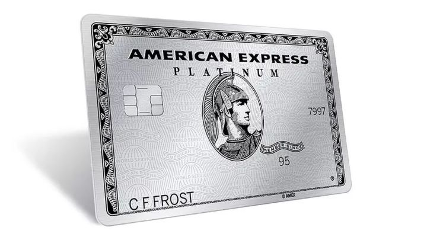
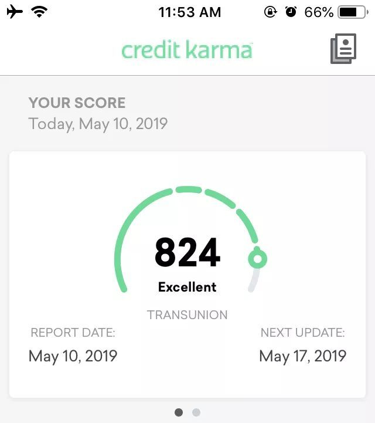
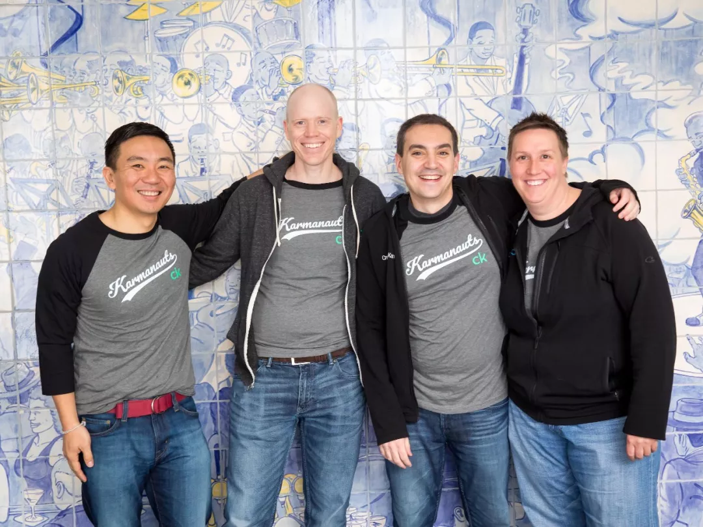

"Is there a possibility of success in being honest and kind?"

In 1979, four-year-old Lin Jian followed his parents from impoverished China to the prosperous Las Vegas in the United States.

In that era, how they arrived in the United States was certainly fascinating, but cannot be verified.

All day long, Mr. Lin works tirelessly at a local Chinese restaurant from dawn until dusk, while Mrs. Lin spends her days at a bakery and her nights dealing cards at a 21-point table in a casino.

"Mr. Kobayashi has become Kennith Lin (hereinafter referred to as Ken), and has been earning money to support his family since the age of 9."

After working hard and being thrifty, Ken's family saved enough money to send him to Boston University to study mathematics and economics. Although he was the only one in his family to attend university, his highest level of education was only at the undergraduate level.

Although the University of California, Berkeley is still quite good, it is definitely not considered one of the top universities in the United States, ranking at 42nd place in the 2019 US News rankings. Compared to the nearby Harvard and MIT, it cannot even hold its head up high.

In the environment on the East Coast where WASP and Jewish elites gather and old money flows, it is simply impossible for a poor Chinese person to enter high society.

In fact, this is the case. After graduation, Ken only did some odd jobs.

However,

Today, Ken owns a company worth 4 billion dollars and holds confidential information of 80 million American adults. Everyone's residential address, phone number, occupation, number of bank accounts, loans, monthly credit card statements, debts and legal disputes are all in his hands.

The privacy most cherished by Americans is nonexistent in front of Ken. The reason why Americans are suppressing Huawei is because they are afraid that foreigners will steal valuable information, but they voluntarily offer it up to Ken.

How did a simple-looking Chinese-American grassroot person succeed in the American financial technology industry and create an American-style Ant Financial?

Ken Lin, Credit: Credit Karma

### One,

Let's discuss the credit system in the United States.

Unlike China's credit reports that are managed by the central bank, the United States has three major credit bureaus - Equifax, Experian, and TransUnion. These three companies each have access to different personal information within banks and other financial institutions, but they share information with each other, forming a kind of monopoly.

You can go to any credit company to check your credit, but you will probably have to pay a monthly subscription fee of $20.

Because there are too many poor people in the United States, the government requires the three major institutions to allow Americans to query for free once a year. However, the process is extremely cumbersome, requiring the completion of complicated forms and the submission of copied documents to them. They then send the report back by ordinary mail, and cunningly, this free report only contains records without scores.

Due to the long cycle, many people are anxious to apply for loans or forced to pay fees to check their credit scores online.

Apart from loans and installment payments, Americans are required to check their credit reports when opening a savings account, obtaining a mobile phone plan, applying for a credit card, and even when setting up household water and electricity services at home. This type of inquiry made by institutions to credit bureaus is called a "hard pull," and each pull causes a decrease in the credit score. Hard pulls are painful, as the term suggests.

Self-inquiry, or background investigation conducted for employment purposes, is called Soft Pull and does not affect credit scores.

Therefore, applying for multiple credit cards or obtaining loans from various banks in order to compare them requires a great deal of caution in the United States. Multiple hard credit inquiries will significantly reduce your credit score, which is directly related to your ability to obtain loans and whether or not you receive favorable interest rates.

It is precisely for this reason that Hard Pulls in the United States are so precious. Credit card companies offer very favorable conditions to apply for new cards, and the value of opening rewards can easily exceed $500.

This makes it very common for friends in the United States to take advantage of credit card rewards. American Express, which is Warren Buffett's favorite company, is particularly generous in this regard. For example, the Platinum Card provides a beautiful metal card and free access to global airport VIP lounges with a companion. It also automatically extends the warranty for any product you purchase, such as an iPhone, by one year. Within a certain period, if your phone is broken, or if you say it has been lost or stolen, American Express can compensate you.

Amex Platinum Card, Credit: Amex.

### Two,

Credit history is extremely important to Americans because they typically do not have cash deposits. More than 60% of Americans have deposits of less than $1,000. Therefore, their spending habits are to use credit cards to spend money first and pay it back when they receive their salary. It is obvious that there are many situations where they accidentally overspend and cannot pay it back. Therefore, they will use the installment repayment function of their credit cards.

"The installment payment has also flourished in China in recent years, as it is a small-scale loan business. In the United States, credit card installment payments are actually usurious loans, with an annual interest rate of around 20%."

The main source of profit for American credit card companies is these penalty fees, unlike in China where it is primarily card processing fees.

The arithmetic skills of Americans are generally poor. If the price of a commodity is $5.30 and you give the cashier $10.30, most likely she cannot calculate how much change to give you which is $5. This is what experts criticize as the natural stratification of classes in America today, where families who do not prioritize education end up working as cashiers without doing homework.

Because their math skills are poor, they cannot accurately understand how credit card companies squeeze money out of them, so they simply make installment payments obediently. When they can't afford to pay for big-ticket items like TVs or washing machines in cash, they often opt for installment payments.

Many credit card companies in the US offer rewards of 1-3%, and sometimes even up to 5%, to encourage card usage. This has become a significant source of profit for many overseas purchasing agents. First-class flights between China and the US are often filled with international students who have amassed a substantial amount of credit card points.

Someone asked, where does the 1-3% cashback come from? Wouldn't the credit card companies lose money? In fact, the credit card transaction fees in the United States are much higher than those of China UnionPay. The credit card companies provide these discounts to encourage you to use your card more.

In order to pay for this transaction fee, the merchant has secretly increased the selling price of the goods.

So the truth is, consumers who don't use credit cards and pay with cash are actually the ones footing the bill for those who take advantage of discounts and special offers.

### Three,

After such a long wait, we finally come back to talk about the great Ken.

After graduating in 1998, Ken worked as a card issuer at a small credit union called Partner First. He felt like he was competing with us on the street stalls, often pushing credit cards one-on-one.

At that time, it was just the beginning of the rise of the Internet, and Ken was a loyal believer. He started a small website selling computer parts as a hobby, while also running a four-year Internet cafe at Harvard for students to play games online in his spare time.

From 2003 to 2006, Ken worked as a data analyst at Upromise, a membership services company, and E-Loan, a small loan company.

During his time at E-Loan, Ken met his future business partner, Nichole Mustard.

Nichole Mustard is also an absolute grassroots person, with a simple and honest image. She grew up in a relatively underdeveloped small town in Ohio and earned a degree in zoology, but she didn't actually enjoy it.

Nichole went to Los Angeles alone and started her internship at a Pizza Hut, despite having no acquaintances. She enjoyed interacting with people and eventually, through hard work and certification exams, became a financial planner.

Nichole Mustard, Credit: Credit Karma

Nichole is a lesbian and her girlfriend found a job in Boston. Therefore, she gave up her business in Los Angeles and flew to Boston to get married and find a job. (This is a love story).

More importantly, after working in Boston for several years due to work relationships, she met Ken.

I don't know if it's a natural attraction among common people, but Ken invited Nichole to start a business together.

But they still lack a programmer.

Apparently, they still need to find a grassroots individual, most likely someone with an educational background no higher than a bachelor's degree.

This person is Ryan Graciano, who was a junior-level software developer at IBM when he was 26 years old. This partner was found online and they had never met before.

### Four,

The best place for working in the internet industry is undoubtedly Silicon Valley. In 2007, three individuals arrived in the unfamiliar city of San Francisco to settle down.

Nichole sold her house in Boston and moved with her wife and child (let's give a shout-out to love).

This new company is called Credit Karma (pun intended, sorry for the clickbait headline).

Ken's approach is very simple, which is to always provide users with free credit reports and then earn money through advertising by generating traffic.

He has persisted in this idea for more than a decade.

The new company received angel investment from Ken's former boss, and credit bureau TransUnion agreed to provide credit report data for free for a period of time, as they wanted to try out new models due to their low ranking in the three major bureaus in previous years.

At first everything seemed to be going smoothly, with Silicon Valley investors queuing up to talk with them.

After listening to explanations from three honest and sincere grassroots individuals, hundreds of venture capitalists praised their dreams.

However, no one believed they could succeed because the three major credit bureaus had become so powerful that they controlled every American household.

No one is investing.

For three years, Ken didn't receive any salary, whereas Nichole only received 60%. Ken even set up his workspace next to the toilet.

Next, they will try to convince ordinary Americans on their website to enter their personal information (address, phone number, employer, social security number, etc.) to obtain a free credit score.

American people who are used to paying for services are very suspicious of this fishing website. Now in China, we also have similar websites for credit checking services, would you dare to use them?

Credit score on the Credit Karma app.

Fortunately, a journalist wrote an article and posted it on Reddit. The younger generation is still willing to try new things, so Credit Karma has gained its earliest group of users.

Ken particularly enjoys interacting with users on forums and listening to their opinions, which has also earned him a loyal following of fans. (Would Lei Jun and Huang Zhang give him a thumbs up here?)

Ken thinks, "We have users now, surely there must be someone who can invest in us."

Then in 2008, the financial crisis hit and no one had money to invest anymore.

### Five,

Ken has always been persevering, and has never thought of selling user information to make a profit.

By 2009, he finally gained 300,000 users and dozens of advertising clients, but he still needed to pay TransUnion, so he hadn't really made a profit. However, having validated the business model, Ken finally received long-awaited series A investment.

In 2010, the number of Credit Karma users reached 1 million.

The reputable company Credit Karma has always adhered to keeping customer information confidential and avoiding quick profits, which has resulted in increasingly positive user feedback.

It wasn't until the Fintech boom of 2014 that Ken finally made a name for himself.

Google leads series C funding, Credit Karma officially joins the unicorn club with a user base of 20 million.

Ken's business has expanded to include personal loans, home loans, and car loans. Depending on the credit status of the user, he also offers refinancing and insurance services, as well as tax-related services.

Credit Karma is becoming more and more like Ant Financial: Alibaba provides seller loans, Huabei and insurance services based on Sesame Credit. However, compared to Sesame Credit which is based on small-scale consumption on Taobao, it lacks comprehensive information on users' credit cards and loans from financial institutions, which may be a long-term weakness.

"Ending" or "Conclusion".

Today, Credit Karma has become one of the largest loan and credit card referral companies in the United States, with 75 million users and an estimated service revenue of $500 million for merchants.

Its commitment to users is: Credit Karma will always be free.

The company's several founders still retain a strong grassroots flavor. Credit: Credit Karma.

The most admirable thing about these founders is that even after their success, they remain humble and dedicated to their ultimate goal of helping users save money. Being gentle can bring difficulties in managing employees, but sticking to the kind-heartedness of their original intentions is even harder.
