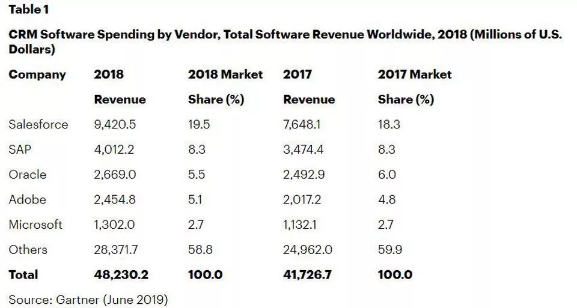

In the world of old software, there were once two major players: Bell Labs and IBM.

Bell Labs' UNIX and C language can be considered as the true essence of martial arts, later on copied by several prominent schools such as IBM, Berkeley, Sun and Apple.

The Finnish lad, Linus, who belongs to no sect, has gathered a group to imitate UNIX.

IBM's foothold is a bit higher, and SAP and Microsoft both originated from its former subsidiary businesses.

The IBM relational database paper is like the Nine Yin Manual, which was copied by the first senior brother Oracle and quickly became dominant, with subsequent junior brothers and sisters copying it and engaging in chaotic battles.

Today, the most profitable software packages still come from the same few companies, including various operating systems and commercial databases.

However, the overall situation in the world has changed.

If a company doesn't package itself as a "cloud computing" firm, its stock price cannot be attractive.

A small artificial intelligence flower must be inserted on top of the head.

### 1\. IBM

As the biggest player in the old world, IBM has lost many battles in the competition of business software.

OS/2 Warp vs. Windows 95

OS/2 Warp vs. Windows 95.

DB2/Informix vs. Oracle

DB2/Informix vs. Oracle

Lotus Notes vs. Exchange/ Outlook

Lotus Notes and Exchange/Outlook comparison.

Lotus 1-2-3 vs. Excel

Lotus 1-2-3 vs. Excel

...

I have actually seen all of these software mentioned above. Especially during the years when I used Notes, I really could only admire their clever and indirect design approach.

When J2EE was popular, the WebSphere, Eclipse, DB2, Rational, and Tivoli full suite felt like a strong Maginot Line.

Unexpectedly, cloud computing broke through this defense line later.

IBM has now rebranded itself as the world's largest "hybrid cloud" company and the largest "business AI" company, with its second largest business being "cognitive solutions". However, it seems that no one is asking too many questions about what exactly constitutes this hybrid or cognitive approach, or how much of their traditional business is included.

### 2\. Oracle

Like IBM, Oracle's all-in-one system used to make Ellison look down on cloud computing. However, the situation changed drastically and he eventually went "all in".

The acquisitions in Oracle's history were definitely fast, accurate, and ruthless. The acquisitions of Sun, BEA, PeopleSoft, Siebel, NetSuite, and others were all considered perfect. (On a side note, it seems like HP messed up a lot of its own acquisitions.)

There are several bugs in Oracle's business software empire in the new era:

How to control the open source Java and MySQL under its banner.

The hardware system does not have as many loyal fans as IBM.

ERP and CRM cannot rank first.

The threshold for databases is becoming lower and lower.

Cloud computing started too late.

Therefore, it's very interesting and courageous that Ellison stepped down from being CEO to become CTO.

More than 80% of Oracle's business in the financial report is labeled as either Cloud Services or Cloud License. To be honest, putting the name "cloud" on almost all businesses is a bit heavy-handed.

In the past, Oracle had the vision to recognize talent, appointing Benioff as a vice president at the age of 26. However, birds of a feather flock together, Benioff later soared to great heights with Salesforce.

Ten years ago, I used Salesforce and with just a few clicks, various opportunities were presented in a report. To be honest, at the time, it felt like a web-based Excel tracking sheet, without any significant technical depth. However, the fact has proven that simplicity and practicality are the key to success in SaaS.

### Three, SAP

SAP is the one who stabbed Oracle in the back.

Most of SAP's major customers originally used Oracle databases, and Ellison proudly boasted that SAP and Amazon paid him a lot of money.

It wasn't until I attended the SAP Beijing conference in 2013 that I was suddenly shocked. It turned out that HANA was SAP's trump card: an extremely fast in-memory database. And in that year, HANA had already been integrated with ERP.

For Oracle, which is extremely proud of its database, this is a matter of losing face and losing business.

It's truly a German mindset: Although your Toyota has been optimized well, big companies just have the money to buy Porsches and leave you in the dust.

The free boxed lunch provided during that year's conference left a deep impression on me - a wooden box resembling a ThinkPad filled with cold dishes, Blue Stream water and fruit, which would typically retail for around 50 yuan. Having eaten many free boxed lunches before, this standard was a rarity at the time.

The strategy of SAP is indeed very sophisticated, which others cannot imitate. This has also forced Oracle to explore a different direction by acquiring NetSuites and venturing down the path of SaaS ERP.

I also used R/3 about 20 years ago, which was a Java version, and it was slow as a dog. At that time, I could not understand how computers could run Java, but later it was proven that SAP had a visionary foresight.

### 4\. Google

In the early 2000s, during the battles between several established factories, Google, which claimed to "do no evil", suddenly released a few articles announcing the arrival of a new era. Jeff Dean emerged as the ultimate victor.

The missing pages of the Bible, GFS, MapReduce and BigTable, bring together a bunch of ordinary hardware challenges that have undergone self-improvement with the respectable SQL. Let's skip the conflicts in between.

Then some big companies started using the banner of going towards IOE and learned about the direction of distributed concurrency processing. They mixed some open source SQL and NoSQL, and transformed themselves into respected and reputable organizations.

The elderly grandfather IBM Z processes 30 billion transactions worldwide every day, while sighing on the side.

Ten years ago was the era of Google's dominance, with top-notch products like Gmail, Earth/Maps, Drive, YouTube, Android, Picasa, Art, Voice, Reader, Chrome, and more. Back then, Microsoft was left scrambling in the dust.

However, in the past decade, Google has hardly offered any new products for users to play with. Rather, it has focused on developing various advanced technologies such as Caffeine, Dremel, and TensorFlow, which may seem mysterious and powerful to outsiders but have limited direct usefulness for end-users.

Google's core technology is likely years ahead of everything else, so when they launched their cloud platform GAE, they followed this path. However, they ended up getting beaten by the then smaller company Amazon.

When GAE was first released, me and a circle of friends around me all used it for scientific navigation, but it didn't work very well after half a year. At that time, not many people could actually understand the value of this cloud, and everyone thought that the way of not being able to control virtual machines was very strange. But in fact, this is what is called "cloud computing", not "cloud hosting".

Nowadays, Google Cloud has already provided many advanced services such as Spanner and Kubernetes. However, interestingly, many companies still keep their distance from it.

### 5\. Amazon

I have been using AWS for ten years myself. Initially, I thought the one-year free trial was unbeatable. When it expired, I simply registered for a new account to continue using it for free.

As a result, I have spent tens of thousands of dollars on AWS credit cards over the past decade. Can't deny the effectiveness, can you?

Initially, I felt familiar but unfamiliar with terms like Instance, volume, image, block store, and so on, and found the concept quite strange. However, AWS cultivated the market, and later on, major domestic companies almost copied it entirely.

In the early days of AWS, the service menu consisted of only a few items such as EC2, S3, and EBS. Over time, it kept increasing and now there are so many that they can't even fit on one screen. AWS has truly transitioned from IaaS to comprehensive cloud computing.

AWS is indeed rock solid. I have hardly ever experienced any downtime over the years.

AWS also has very responsive customer service, which is a rare advantage compared to several other arrogant giants.

With AWS constantly taking the initiative to decrease prices, I really can't find any faults myself.

One interesting person worth gossiping about is Mr. Chris Pinkham, also known as "Hammer Pinkham." After graduating from a university in South Africa, he started his own ISP and sold it off. After achieving financial freedom at the age of 30, he bought a boat and sailed around the world with his wife for a year.

Afterwards, Bezos invited him to work as Engineering VP at Amazon, in charge of infrastructure. After he and Black proposed the idea for EC2, he mentioned he needed to go back to South Africa to take care of his wife who was expecting their second child. Surprisingly, the notoriously cold-hearted Bezos opened a new office in South Africa for him, allowing him to recruit local talent for EC2.

This story illustrates that: if your boss treats you poorly, perhaps you are really not competent enough.

### Sixth, Microsoft.

In many articles in recent years, Azure and Nadella have been mythologized.

What should be cleared for Ballmer is that, during his tenure, he had already made great efforts in promoting cloud computing, which is also the reason for Nadella's succession.

In the latest 2019 financial report by Microsoft, cloud revenue was 38.1 billion US dollars, accounting for approximately 30% of total revenue. While the amount seems significant, it includes commercial revenue from Office 365, Dynamic 365, and LinkedIn, thus blurring the lines between SaaS and Azure businesses.

The profit growth brought by the subscription model of Microsoft 365, strictly speaking, cannot be considered technology-driven (which was already available in Google Docs more than a decade ago), nor can it be attributed to a significant relationship with Azure.

Actually, Microsoft's good performance is due to the timing, as it is currently a golden era: apart from Azure, consumer businesses such as Windows licensing, Bing, Xbox, and Surface are all experiencing comprehensive growth.

### Seven, Artificial Intelligence

Cloud computing has gone from being despised in many ways to being a dominant force in the industry over the past decade or so. Compared to AI, it is fortunate to have achieved such success.

AI has always been like a flower on our heads, it can only be used to attract people, but it is difficult to bear profitable fruits.

IBM has been dedicated to AI for decades, and can be considered the leader of the Five Great Sword Schools. It was one of the first companies to introduce speech recognition software, but has now been surpassed by younger competitors. Although IBM was once called the "Go Saint", it did not bring about a revolution in the industry.

Watson aggressively promotes medical AI, but is caught in a quagmire of standards. In my opinion, at least one third of the information in human medical records contains errors, and unlike playing chess, the notion of right and wrong is not always clear when it comes to wrong medical records. The same thing applies to AI in law, no matter how many case files it learns, it does not necessarily guarantee that it will learn to act justly.

The AlphaGo released by the everlasting Google clan can be deemed as the new generation "Kuji-in" (secret martial arts manual). Suddenly, practitioners of the martial arts community had an epiphany, and now they always make reference to "machine learning".

"Even DeepMind itself doesn't know how to land and has become a money-losing dog, causing headaches for various companies in the industry who want to make quick profits."

The most successful one is probably the security image recognition, because there are many large clients paying for it.

Everyone has noticed that imitating AI seems to be more profitable. Nowadays, anything that appeals to your preferences is referred to as AI, even automatic photo editing. Ticket scalping, cryptocurrency and shady dealings in the internet finance industry are all claiming they've implemented AI technology.

Apple may not hype up artificial intelligence, but it does provide a framework for machine learning. After carefully examining Microsoft's financial reports, it seems they also downplay their involvement in AI. Microsoft, like IBM, just uses the buzzword "cognitive" in the field of AI.

AI is certainly the future, but it may just be a bubble for now.

Tesla is the company that I truly believe is dedicated to researching vertical applications for AI, even though they don't necessarily promote it as such.

Tesla is a company that integrates hardware and software, much like Apple. Next year, the Model 3/Y should be considered the revolutionary iPhone 4. Similar to Apple's first A4 chip, the Model 3/Y features a super dual-chip designed by Jim Keller, which utilizes neural networks to process real-time images from 8 to 10 cameras located throughout the vehicle. In principle, even the most expensive lidar is still only a radar and cannot simulate all that human eyes can see, such as reading various road signs.

This is really difficult, very difficult, but the road must be taken one step at a time.

Only those who deeply understand the essence and ethics of AI and actively face its challenges are truly courageous.

* * *

Finally, the oscar goes to OpenAI.(Added in 2022)
