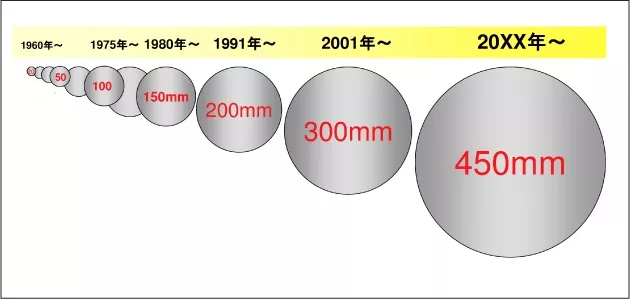

Currently, over 70% of the world's chip production capacity utilizes 12-inch (300mm) wafers. However, despite the establishment of the first 12-inch fabrication line almost twenty years ago, why haven't we seen the emergence of the next generation 18-inch (450mm) wafer factories yet.

### Chapter One

Firstly, let's take a look at why the next generation needs to be 18 inches, rather than 14 inches or 16 inches? This is an interesting question.

In the 1990s, Japanese people who still saw themselves as masters of the semiconductor industry formed a super silicon research institute and attempted to directly upgrade from 200mm wafers to 400mm wafers.

The Japanese successfully pulled out a crystal rod of more than one meter, with a diameter of 400mm, and believed that technically it was possible to achieve 450mm. However, they would need a very large crucible, and unfortunately, there is no such crucible available at present.

Under the La Jing furnace lies a quartz crucible used for melting polycrystalline silicon chunks. Creating a perfectly pure large pot of silicon dioxide is a highly skilled technical task.

Meanwhile, in order to pull a 450mm silicon ingot, approximately one ton of silicon blocks must be placed in the pot, which is twice as heavy as boiling a 300mm soup, and the pulling process will also take several hours longer.

How to maintain a stable temperature for this large pot of silica slurry, which is like molten lava, and ensure that the pulling and rotating speed of the silicon rod are also extremely stable, has become a greater challenge than the 300mm size.

Later on, various methods of continuously adding ingredients using small pots were constantly being designed.

Although it is not easy, the semiconductor industry looks down upon this kind of difficulty.

Because 200mm x 1.5 = 300mm.

Therefore, 300mm x 1.5 = 450mm.

That's how it is.

### Chapter Two

In history, larger silicon wafers have significantly reduced the cost per unit area of chips. However, the exact process of how this reduction occurs is a complex issue.

In the process of chip production, equipment cost and time cost are two essential factors.

Can production efficiency also be doubled if the area of a 450mm wafer is more than twice the area of a 300mm wafer?

Unfortunately, it doesn't work that way.

Larger wafers do not necessarily save time for processes such as lithography and testing, but only for wafer loading, etching, and various cleaning and polishing processes.

Can the increased equipment cost really translate into higher production efficiency.

The answer is: I don't know.

It is said that photolithography accounts for half of the manufacturing cost of a 300mm wafer factory, which is much higher than that of a 200mm factory.

SEMI predicted that each 450mm wafer fab would cost $10 billion, but the cost per unit area of chips would only drop by 8%.

### Chapter Three

Due to the enormous changes in the entire industry chain, involving upstream and downstream, associated with 450mm wafers, the total investment is on the level of tens of billions of dollars. There is no longer any semiconductor company that is able to single-handedly formulate standards and bear the risk.

At this time, it is still necessary to combine industry, academia, and research with government guidance.

In 2011, the newly appointed governor of New York, Andrew Cuomo, vigorously pursued a major political achievement.

Cuomo successfully invited the top five chip makers (IBM, Intel, GlobalFoundries, TSMC, and Samsung) to vigorously develop the next generation chip technologies in New York State, with a commitment to invest $4.4 billion to advance 450mm wafer technology, which is known as the Global 450 Consortium (G450C).

The key foundation of this alliance is the strength of SUNY Polytechnic Institute and the years of cultivation by IBM's microelectronics headquarters in the state, as well as the government subsidies promised by the state of New York.

Cuomo also teamed up with Nikon to invest $350 million in developing a 450mm immersion lithography machine.

The EU had previously launched a cooperative program EEMI450, and Israel had also implemented a Metro450 program.

However, all collaborations have failed to make 450mm successful.

### Chapter Four

IBM, which is no longer interested in hardware, has sold its semiconductor division to GlobalFoundries. However, GlobalFoundries did not have enough funds to undertake the large-scale 450mm project, resulting in a significant loss of previous investments.

Lack of funds perhaps was one reason that led later to GlobalFoundries abandoning research and development of 7nm. IBM had always been a proponent of SOI technology and GlobalFoundries can be seen as inheriting this legacy.

Intel is actually the most actively promoting company in the 450mm industry. Unfortunately, the G450C period (2011-2016) happened to be the time when Intel was developing the 14nm Broadwell.

The extensively used DUV lithography machines and complex FinFET resulted in very low yield rates and various delays in Intel's roadmap at that time. It was not meaningful to distract attention on 450mm wafers without resolving the technical issues.

ASML is also struggling with EUV lithography, as issues with source efficiency continue to delay the production schedule. Financial pressure has prompted ASML to be the first to announce its withdrawal from 450mm cooperation.

Although supported by Nikon lithography machines, if the overall yield and efficiency of 450mm wafers cannot be significantly improved, the cost will not be lower than that of 300mm wafers.

From the process perspective, Samsung and TSMC seemed to be the least proactive. At that time, they were still working with 20nm technology and were likely aware of the costs associated with transitioning to 450mm wafers.

When the 300mm wafer plant was established, about seven or eight semiconductor giants acted in unison, which helped to evenly distribute the risks.

### Chapter Four

The CEO of SUNY Poly stepped down in 2016 amidst scandal, while Intel has remained mired in the 10nm quagmire with no company willing to take the lead. Consequently, the G450C alliance has completely dissolved.

Governor Cuomo has been re-elected continuously up to now. It seems that leaders who are capable of managing the economy are popular everywhere.

Missing the only opportunity, there will no longer be a leading company to develop 450mm wafers, and the economy of using 450mm wafers has become an unknown mystery.

Not to mention whether there is a suitable economic model to simulate the cost increase of various equipment for 450mm, as well as various production efficiencies and utilization rates, every step of yield is an extremely unpredictable variable.

With a multi-billion dollar investment in 450mm wafer fab, only Intel, Samsung, and TSMC are left to play the game. It's evident that they have collectively invested their money into EUV technology.

The pattern throughout history has been to develop new process technologies on new wafer sizes, such as most 200mm factories still being at 90nm. However, currently we do not see any indication of technology development slowing down at 300mm factories.

### Chapter Five

The initial cost of developing a new 7nm chip on a 300mm wafer is estimated at $300 million, and it is expected to be even more terrifying on a 450mm wafer.

Currently, the PC market is already saturated and the smartphone market is approaching saturation as well. New applications such as IOT are still relatively weak. In the context of the overall semiconductor industry downturn, it is a very real problem to digest production capacity with huge investments in 450mm wafer factories that can produce tens of thousands of wafers per month.

Perhaps we must wait until the physical limit of Moore's law is reached and the world is filled with robots before we can have the chance to witness the launch of 450mm again.
