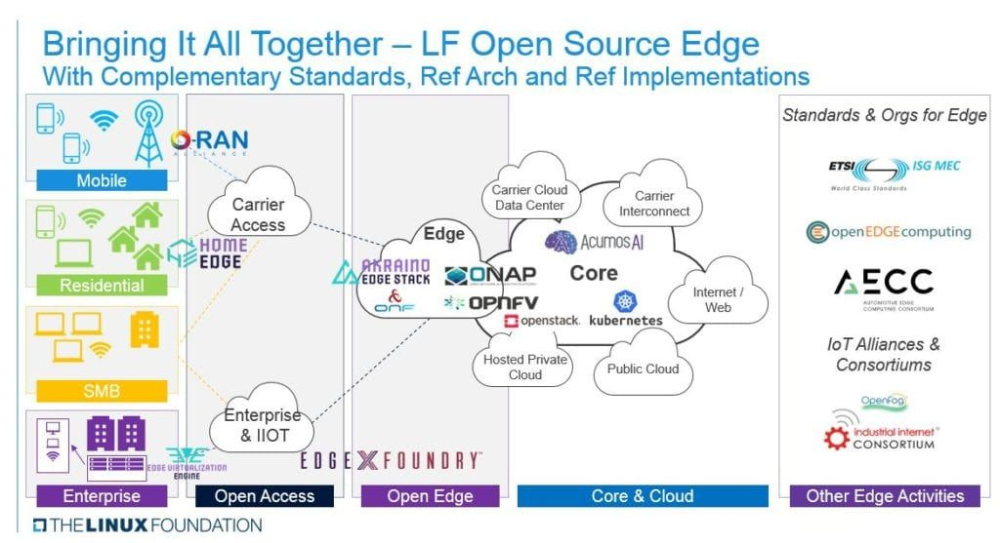
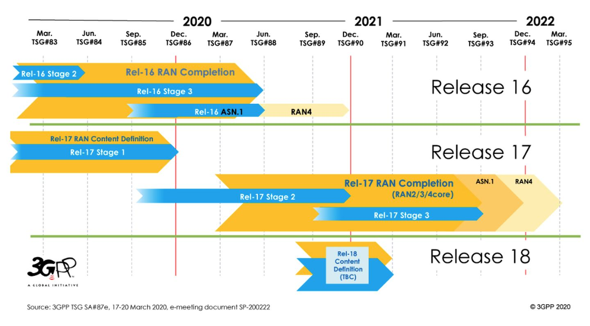

This article may overturn some people's understanding. The reason is simple: fragmented information from sensationalist media may not necessarily form a meaningful whole.

Is 5G a battle for the nation's fate?

Unfortunately, I have to tell those pink-faced friends who crave war after enjoying forty years of peace that it certainly is not what they are looking for.

Why?

Not to mention that the use of 5G is still unclear, but the entry barrier for 5G has actually been lowered instead of raised.

"In the global 5G realm, you will see more suppliers rather than the past monopolies of a few giants."

In the mouths of most self-media, 5G is the greatest hardware, a gem that only companies wearing a crown can touch.

But the true core of 5G is actually software.

### One.

5G is a significant revolution in the history of mobile communications, not because it is several times faster than 4G or because it reduces latency by a certain factor.

This revolution lies in the shift of communication technology standards from hardware-dominated to software-defined, enabling internet IP technology to fully take over various proprietary hardware devices of telecommunications equipment vendors.

Actually, it is highly possible that there won't be anything that can be regarded as true 6G, apart from new frequency bands and marketing campaigns, because 5G is a software-driven network, which can self-upgrade and doesn't require synchronous hardware upgrade.

The internet is not called 2G internet or 4G internet.

In simple terms, it can be said that from 5G base stations to the transport network to the core network, everything can be implemented using x86 or ARM standard servers (COTS or white box hardware) and internet technology. The radio frequency unit of the base station is the only remaining communication box (like an oversized cell phone), and the technical solution can be directly purchased from the baseband manufacturer.

### Two,

This is a perfect question.

Rome was not built in a day.

The technology reserve of the operators is not sufficient, and the pure software 5G solution is not yet mature. They also do not want to immediately smash their existing equipment and replace it with inexpensive commercial servers.

Telecom equipment suppliers are still needed by the operators to help them make the most of their existing equipment, gradually upgrade to 5G, and then consider how to replace suppliers or lower prices.

What about equipment suppliers? Of course, they should do their best to prevent or delay operators from switching from dedicated mobile communication equipment to Internet standard equipment.

Therefore, a subtle relationship has emerged between telecommunications operators and equipment providers in the 5G era.

### Three,

As is commonly known, the United States has long since retreated from the field of telecommunication equipment, but it still reigns supreme in the realm of internet hardware without question.

So are these hardware giants eyeing the 5G cake? The answer is, of course they are.

Intel said, "Use my x86 CPU. I have even made a dedicated Atom for base stations, and FPGA is also possible." Furthermore, Intel has only sold 5G terminal baseband to Apple, while keeping baseband for stations to itself.

HPE and Dell/EMC say, "Use my servers and storage."

Cisco said, "Use my networking devices."

Wait, but they don't have 5G software.

The software's new features include virtualization, slicing, and AI, which can greatly enhance network functions and reduce maintenance costs.

At this time, the software power of the United States entered the scene. Many small and medium-sized companies emerged and could provide end-to-end 5G software, such as Mavenir, Altiostar, and Parallel. They were also allied with companies such as Cisco and NEC to jointly challenge traditional telecommunications equipment manufacturers.

### Four,

Now things are getting interesting as internet companies challenge telecom equipment manufacturers.

In fact, this happened once during the 4G era. It was when WiMax challenged LTE, and the result was that LTE secretly learned the opponent's tricks and defeated WiMax.

In the long run, the 5G battle is not just between Huawei and Ericsson, but also involves the competition between them, telecommunications companies, and internet companies.

Has the 5G core network already integrated with Internet technology, but the access network (RAN) is still mainly controlled by telecommunication equipment, isn't it?

Starting in 2018, major telecom operators from China, Japan, the United States, and the United Kingdom formed the O-RAN Alliance, inviting nearly all the well-known internet and computer giants, to formulate open RAN standards.

O-RAN has also partnered with the Linux Foundation to form the O-RAN Software Community, attempting to disrupt the last stronghold of traditional telecom equipment vendors through open source means.

 Linux基金会号召用开源实现无线通信

The Linux Foundation calls for using open source to achieve wireless communication.

Please note that O-RAN was initiated by China Mobile and all three major Chinese operators are members.

Nokia and Ericsson realized the unstoppable trend and subsequently joined O-RAN. The two sides are competing to meet the operators' demand for O-RAN compatibility, but under political influences, they may neglect this in their haste to move forward.

The only one refusing O-RAN is Huawei.

Huawei firmly states that the performance of general-purpose devices is worse than that of specialized ones. Indeed, in the absence of optimization, the power consumption of general-purpose servers is higher, and the stability of software has not yet been validated by time.

Proprietary equipment and protocols (especially CPRI) in themselves serve as strong barriers, let alone the fact that operators are very averse to risk.

Taking the banking industry as an example, nowadays server clusters are already capable of replacing IBM mainframes in terms of performance. However, which bank president would dare to make the decision not to use IBM?

### Five,

As 5G network virtualization advances and even sinks to the base station, the weaknesses of distributed networks that are vulnerable to attacks become more evident. Therefore, prior to approving 5G, countries require the design of network protection, which differs significantly from previous generations.

Therefore, the United States' framing of Huawei has become a national policy, and it is now impossible to distinguish whether it is a telecommunications or trade war.

Operators such as Vodafone and AT&T have started exploring a shift towards software-defined networking (SDN), which is the first step in disrupting the old model dominated by Huawei and Ericsson.

However, at present, it is painful for operators not to use Huawei. 5G itself requires massive investment, and it is difficult to afford the cost of replacing Huawei's 4G equipment.

New operators without historical device burdens, such as Japan's Rakuten, are becoming crab-eaters of 5G full cloud software with support from NEC and US software vendors. Rakuten believes that total investment can be reduced by 40-50%, with the key being that operation and maintenance costs and personnel can be reduced to a fraction of traditional hardware, with 100 people being able to maintain tens of thousands of base stations. Rakuten's consumer mobile rates are also only half those of competitors.

What's more interesting is that Lotte believes it can transform itself into a direct competitor of Huawei and Ericsson. Small and medium-sized operators only need to purchase Lotte's full set of software (communication platform), which can quickly help them build their own 5G network.

Industry experts are eagerly watching to see if Lotte can succeed.

### Six,

American chip manufacturers still dominate the 5G hardware ecosystem, but the market validation and improvement of 5G fully virtualized software is still needed.

Many people doubt whether the software-defined paradigm will be successful. Here we should see the examples of Tesla and SpaceX, both of which have accomplished software-defined disruptions in fields that everyone thought impossible. Not to mention that Tesla's software-defined cars have left traditional car companies in the dust, while SpaceX has achieved incredible rapid iteration using ordinary x86 hardware with the Linux platform and a way of automatically discovering hardware issues through software.

The standards for 5G are still evolving. This month, 3GPP is expected to release the 16th edition, which is 5G Phase 2, including standards for IoT, autonomous driving, and many features to improve 5G efficiency.

3GPP 5G Standard Timeline.

The 16th edition of 5G is a crucial version, representing a milestone in the development of fully enhanced functionalities.

The evolution of 5G is also related to spectrum, and considering the different spectrum allocation and technology development processes in various countries, it is also gradually progressive.

So, the mobile phone we previously bought was actually an incomplete version of 5G? Then, are those base stations also incomplete versions of base stations?

I can only emphasize once again that the core concept of 5G lies in long-term upgradable software. In this regard, a fully cloud-based software 5G solution offers significant advantages in terms of upgrades and maintenance.

### Epilogue,

As infrastructure, 5G undoubtedly plays a positive role in investment, employment, and socioeconomic development. It is important for us to strongly support it.

5G has definitely become a political concept. However, its revolutionary technological elements allow us to see the possibility of new changes, and the United States and Japan may have some advantages.

The main uses of 5G, perhaps initially, will be concentrated in the commercial sector. And for consumers? Perhaps nothing more than watching videos and watching videos again.
