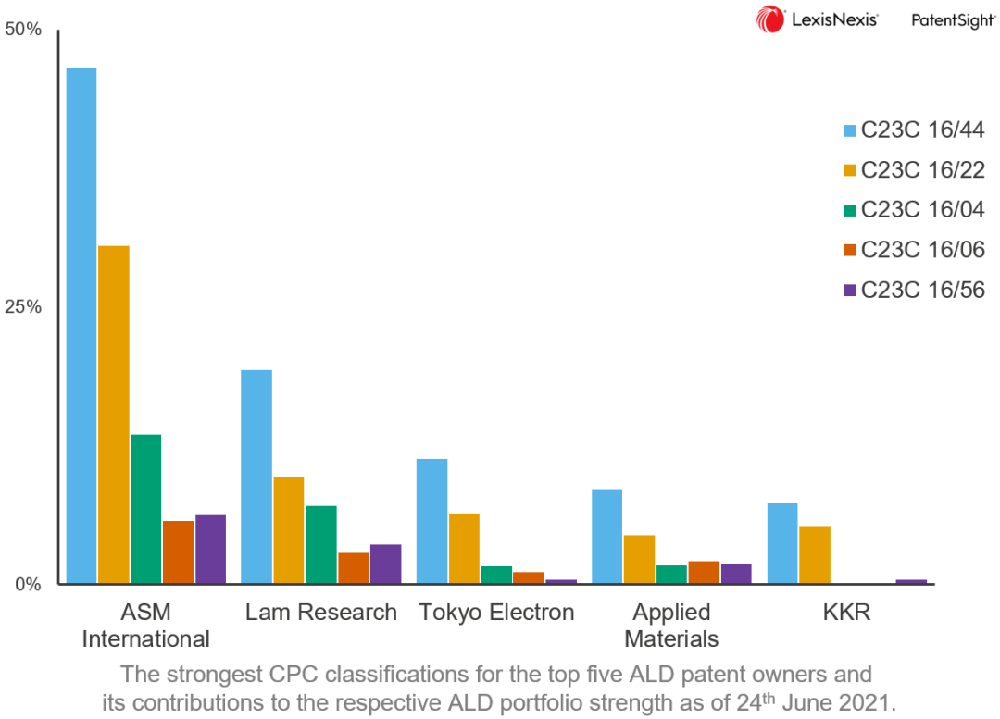

AMAT is one of the most prominent representatives in this regard: its long-standing and reliable manufacturing process, significant investment in anti-cyclical research and development, and global service layout are all important advantages. However, increasingly unpredictable geopolitics have added a great deal of uncertainty to the future of the entire industry.

### 1\. AMAT's territorial expansion

Despite the failure of its acquisition of Tokyo Electron (TEL), semiconductor equipment leader Applied Materials Inc. (AMAT) remains determined to continue expanding its operations and filling its gaps, which remains a crucial objective for the company.

The next prey is Kokusai Electric (KE).

Kokusai means "international" in Japanese. "Kokusai Denchi" was established as the official wireless equipment company during Japan's invasion of China. In 2000, it merged with Hitachi Electronics to become Hitachi Kokusai Electric.

Within Hitachi International, which primarily specializes in broadcasting and communication, there is a rather mysterious department that deals exclusively in semiconductor films.

The LPCVD (tube CVD) and oxidation/diffusion capabilities of this department are very strong, while AMAT is very weak in this area. Acquiring this department from Hitachi will give them an added advantage.

But how do we proceed with this matter? Hitachi didn't say they really want to sell it.

This requires private equity funds to come in and sew up the gap.

### 2\. KKR battles Elliott

In early 2017, KKR continuously purchased stocks of Hitachi International, and then reached an agreement with Hitachi in April to split off the film division for 2.2 billion US dollars, which later became KE.

Unexpectedly, another radical hedge fund giant in the United States, Elliott, has also pulled out their swords.

Although Elliott is relatively smaller in scale, its famous singer-turned-businessman Paul Singer's ruthless reputation surpasses that of KKR. At one point, Elliott held nearly 9% of the shares, forcing KKR to increase the acquisition price from $2.2 billion to $3 billion.

Although there is no solid evidence to prove that AMAT is behind KKR, I find it hard to believe that there is no relationship between them, given that KKR was able to complete the acquisition at a high price and then sell KE to AMAT for $3.5 billion within a year.

Ireland, Japan, and South Korea swiftly approved the AMAT merger. However, AMAT waited for two years and did not receive the final approval.

China didn't approve.

### Three, AMAT's Hidden Losses.

In 2019, Trump's attack on Huawei has made China especially cautious of acquiring American companies. Domestic equipment vendors such as North China Huachuang and Shenyang Tuojing focus on the production of thin films such as deposition and furnace tubes, which has a high degree of similarity with KE.

Until the end of March 2021, when the engagement contract expired, the Chinese authorities had not responded, and AMAT had to announce the failure of the acquisition.

AMAT suffers another setback in its attempt to reclaim the memory device market from KE. The title of this article reveals an additional implicit loss.

Atomic layer deposition (ALD).

ALD is a surface coating technique that covers a thin layer of atoms. Compared to traditional techniques such as CVD, sputtering, and evaporation, the film thickness is extremely uniform and has small defects, making it increasingly widely used.

### Four, the tormenting ASM.

In the article "ASM and Electron Beam Lithography," it was mentioned that ALD is the key to ASM International's comeback.

I also mentioned that it was not until 2009 that Intel provided ASM with a lifeline, and it was not until 2013 when ALD's substantial shipments helped ASM's front-end business (WFE) to recover profitability.

So during the painful stage of introducing new technologies in the semiconductor industry, how did ASM rescue itself?

In 2007 and 2008, ASM licensed its valuable ALD technology to KE and TEL, with a licensing period of 10 years.

This is somewhat like inviting the wolf into the house. But on the one hand, those licensing fees have helped ASM survive until 2009, and on the other hand, ASM also needs support from Japanese giants to help push ALD into the market. DRAM manufacturers introduced ALD earlier than Intel, and if they hadn't taken the first bite, Intel's High-K may have been further delayed.

### 5\. The Cost of ASM

Currently, 2/3 of ASM's revenue comes from ALD, which is experiencing rapid growth in demand. ASM's ALD is far ahead, holding about half of the market share.

After all, the total TAM of ALD is still limited relative to that of the ASM, so holding onto ALD is the bottom line for ASM.

ALD equipment can be divided into two main categories: single-wafer processing and multi-wafer processing. The former is mostly used for high-end logic chips, requiring extremely high accuracy control; while the latter is mostly used for memory chips (DRAM and NAND).

In advanced manufacturing processes, single wafer ALD equipment is dominated by ASM. Meanwhile, in multi-wafer batch ALD processing, TEL and KE have a clear advantage, with Japanese ALD equipment capable of processing 100 or even more wafers at once.

Samsung's memory production line was once filled entirely with KE's ALD, but after the trade war between Japan and South Korea, they began supporting domestic brand Eugene. Hynix similarly gave their full support to South Korean brands Jusung and Wonik IPS.

It is impossible not to associate Korean device vendors' technological origins with Japan's influence.

So, under the siege from all sides, what are the remaining trump cards of ASM's ALD?

### Sixth, ASM's patents.

Someone suddenly thought: Oh yes, didn't the ten-year technology authorization from ASM to KE expire in 2017?

Indeed, in 2017 ASM immediately initiated a technology infringement arbitration against KE, and two years later KE (KKR) paid a settlement of 115 million US dollars.

On KE's official website, you cannot even see the letters "ALD", only multiple mentions of "batch processing equipment". This could be seen as a sign of respect for ASM's authority, or perhaps it is part of a reconciliation.

The two figures below demonstrate that ASM is still far ahead in the combined strength of ALD patents.

 (Chart Credit: LexisNexis)

### 7\. Resistance against AMAT invasion.

In our previous article, we mentioned that AMAT's associated private equity firm, Mellon/Fursa, attempted to take over ASM during the subprime crisis and even took personal action, which made us marvel at AMAT's foresight in ALD.

In 2007, Jr. del Prado (comrade Chuck) was entrusted with a critical mission and withstood wave after wave of fierce attacks during the company's most difficult period. The opposing party continuously slandered and purchased stocks in an attempt to overthrow him from the board of directors. Despite losing the legal battle in court, he persisted with gritted teeth until he was exhausted and made it to the highest court after years.

During the process of continuous hemorrhaging in the company, ASM WFE had to lay off a quarter of its staff, split the company, and sell technology licenses. If it weren't for their love for and firm belief in their own enterprise, most people would not be able to withstand such pressure and would simply give up.

The unyielding spirit of the Del Prado family runs through the veins of their son. After enduring five years of hardships, ASM's ALD technology took off and soared to new heights. Since Chuck took over the company, the stock price of ASM International has increased by 100 times, and its market value of tens of billions of euros is no longer something that AMAT can easily handle.

ALD is like a magical necklace. The wealthy and powerful AMAT repeatedly pursued the elegant beauties (ASM, TEL, and KE) who wore this necklace, offering excessive dowries, but still could not marry them.
