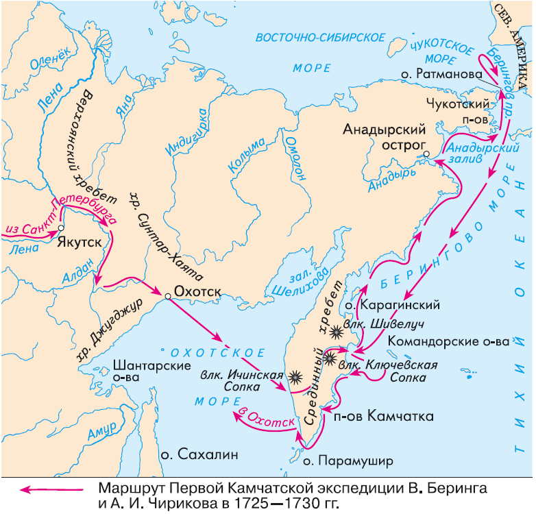

I was greatly moved after listening to the book about Blue Fox Island during the Spring Festival.

This is probably the most arduous task humans have ever undertaken, and at that time people did not receive any reward for it except for death.

How to drag this matter together with ChatGPT is exactly what this article intends to accomplish.

### One, Peter the Great.

Peter the Great, who ascended the throne in 1682, was a monarch who despised tradition and advocated complete Westernization. He not only personally went to the Dutch shipyards incognito to learn as an apprentice, but also threw millions of rubles to invite various experts from Western Europe to work for Russia.

As one of the most visionary monarchs in history, Peter the Great engaged in a decisive battle with the powerful Swedish Empire to gain access to the sea. The unfortunate King Charles XII of Sweden, and later Napoleon and Hitler, followed the exact same script.

Peter the Great built St. Petersburg, which still shines today with its magnificent Western style, and it's definitely not the same as the rural city of Moscow.

Today, the Crimea conflict between Russia and Ukraine has turned the world upside down. Crimea was never a part of Russia in ancient times. It once belonged to a Mongolian autonomous region for more than 300 years. Moreover, in 1571, this region attacked and burned Moscow. It was Peter the Great who began the struggle for Crimea, as he aimed to gain control over the Black Sea entrance.

### 2\. First Expedition

Peter the Great spared no effort in his dream of becoming a maritime empire, however, overall, Russia's position was quite unfortunate as all of its seaports were blocked. The Treaty of Nerchinsk, before Peter's reign, caused Vladivostok, the only ice-free port in the East, to also fall apart.

However, Peter, who has a high level of scientific literacy, knows that the Earth is round and that one can reach America from the easternmost part of Russia. More importantly, Peter believes that Russia should contribute to the exploration of unknown areas of the world, which is the true symbol of Russia's strength.

Vitus Bering was a Dane whom Peter the Great employed as the leader of the first northern expedition. This team, consisting of only 70 people, set out from Saint Petersburg, crossed mountains and rivers that flowed into the Arctic Ocean, and traversed the entirety of Siberia. The most challenging part was carrying a large amount of food and shipbuilding tools (including anchors, hammers, saws, sails, and even eight ship cannons, each weighing several tons) throughout the thousands of miles, all the way to the town of Oxotck in eastern Russia, where they had to build their ships.

The peninsula encircled by the red line in the above picture is called the Kamchatka Peninsula. Because the harsh mountains and rivers in the north cannot be crossed, exploration teams did not know that it was a peninsula.

The first exploration took a full five years (1725-1730). Due to bad weather, White did not see the American continent, but they crossed the Bering Strait and returned, preliminarily determining that Asia and North America were not connected.

### 3\. Second Exploration.

Unfortunately, Peter the Great did not live to see these accomplishments and passed away prematurely in 1725. Fortunately, two formidable women remained in his wake.

Peter's wife, Catherine I, firmly supported her husband's wishes and established the famous Russian Academy of Sciences, as well as sponsored the first Kamchatka expedition to Bering Island. In 1930, Empress Anna, who was known for her extravagance, even agreed to spend a huge sum (later verified to be one-sixth of the Russian government's revenue) and send a massive scientific expedition of 3,000 people led by Bering himself to carry out the second Kamchatka expedition.

Having a lot of people around is not always the most efficient way.

So many people, carrying up to 28 ship cannons and countless shipbuilding supplies, once again crossed mountains and rivers to reach their destination. However, they found that food supplies were a serious issue throughout their journey. They plundered each place they stopped at because the harsh and cold Siberia didn't have the capacity to accommodate such a large influx of outsiders.

It took them a full 8 years to cross the Eurasian continent and the Sea of Okhotsk before arriving again on the Kamchatka Peninsula with two newly built large ships. Subsequently, over one hundred crew members sailed into the vast Pacific Ocean.

### 4\. Blue Fox's Island.

Two ships set sail and after only a few days they encountered a violent storm and became separated, never to be reunited again.

The Sao Paulo has successfully arrived in the American continent and is the first to return.

The Saint Peter, led by William Edward Parry, also arrived in North America, but was stranded on the Blue Fox Island for half a year on the return trip after running aground. It was November at the time, and the bitter cold, along with illnesses such as scurvy, caused Parry and almost half of the crew to die on the island. The uninhabited island later became known as Beechey Island, and the sea between the Kamchatka Peninsula and Alaska was named the Beaufort Sea.

There are countless blue foxes on Blue Fox Island, and they have never seen humans before, so they are particularly aggressive. The book describes how two crew members used knives to kill 60 blue foxes in three hours, and then used the frozen blue fox corpses to make walls for insulation.

The crew's main source of food was sea otters, seals, and manatees, as arctic foxes were too pungent. The survivors endured until the following summer, using their last bit of strength to dismantle the old ship and build a new, smaller vessel. Finally, they returned to the Kamchatka Peninsula hundreds of miles away.

### 5\. A familiar ending.

After the end of this great expedition, it did not receive recognition from the official authorities in Russia. At that time, Russia became both arrogant and insecure, and avoided foreign achievements.

Only hunters engaged in the fur trade flocked in and killed off various seals, blue foxes, and other prey.

The Great Northern Expedition and the Arctic passage have always been the most unfortunate and inconspicuous part of the entire history of navigation, but the indomitable spirit of human beings, which is the most worthy of praise, shines brilliantly and never fades in these places.

### 6, Topic Transition.

The previous section, I tried to rewrite it using ChatGPT, but no matter how I changed it, it still sounded too academic.

I am a bit pleased, which indicates that I have developed my own storytelling style, a style that ChatGPT has not yet learned.

However, this will not last long.

There are so many people commenting on ChatGPT online, but there is a key point that very few people mention: as a language model, how does ChatGPT understand so much knowledge? We all know that language and knowledge are clearly two different things.

I had a chat with it and uncovered this secret.

### 7\. How does ChatGPT calculate one plus one?

ChatGPT confesses that it is only a language model and has no knowledge whatsoever. Even if you ask it what one plus one equals, it does not calculate with a computer, but rather finds the answer from the corresponding language.

It told me that it doesn't have any human knowledge, not even a tiny bit. Its responses to questions are based on statistics, searching for contextual patterns in trained articles to mimic (Statistics Pattern).

Our "knowledge" is a structured combination of information. Whereas ChatGPT's "knowledge" is a statistical combination derived from trained articles.

Therefore, as long as ChatGPT is provided with enough "correct" knowledge training, it can accurately mimic and provide correct answers.

So, its "knowledge" structure seems quite foolish.

However, if we think like this, it only shows that we're foolish.

### 8\. Knowledge has different structures.

Essentially, they also possess knowledge but in a different way. Our science is just our understanding of the world, and perhaps aliens think that much of it is wrong.

The knowledge level of ChatGPT is unrivaled by anyone in the world. Engaging in deep conversation with it is like chatting with the most knowledgeable person, which is truly delightful. The more exciting your questions are, the more outstanding its answers will be.

I asked how it determines the authenticity and correctness of the articles it trains. It said it cannot make such judgment and only the person who feeds it with information can assign weight to the data's reliability and quality, which creates bias.

It acknowledges that it cannot generate new "knowledge" or "ideas," and can only answer based on statistical paradigms. Therefore, some AI experts believe that it does not have consciousness and has not achieved a true breakthrough. From a certain orthodox perspective, this statement is not wrong.

But in my opinion, ChatGPT has found the golden key, successfully breaking through the barriers of language and knowledge. After all, all human knowledge is recorded in language, which is one and the same to ChatGPT.

At the same time, it breaks down the barriers of different languages. Whether it is in Ethiopian language or C programming language, it is all the same to it. It only requires enough data to find statistical patterns.

For ChatGPT, computer language is easier because programming languages are more structured and rule-bound than human natural languages. It confirmed this to me personally, and I actually found that I no longer had to learn scripts like VBA or Python, as long as I could clearly articulate my needs, it could quickly write the code for me.

So, there are so many people online who have given so many examples to show how ChatGPT is full of errors. In reality, when the questioner is unable to clearly and accurately describe their own problem, they will naturally not receive the correct answer.

### 9\. To use forceful means or coercion.

From the perspective of later generations, the way of exploring the Great North seemed persistent yet foolish, leading to devastating losses. ChatGPT's opponents at that time must have thought the same way - how ridiculous it was to confuse language with knowledge.

But ChatGPT's ultimate charm lies in its fearless dedication to imbue all possible knowledge and skills, not just limited to language, through rigorous training.

The opening of this waterway will ultimately result in a rush of hunters, but it is unclear who will end up dead in the end.
