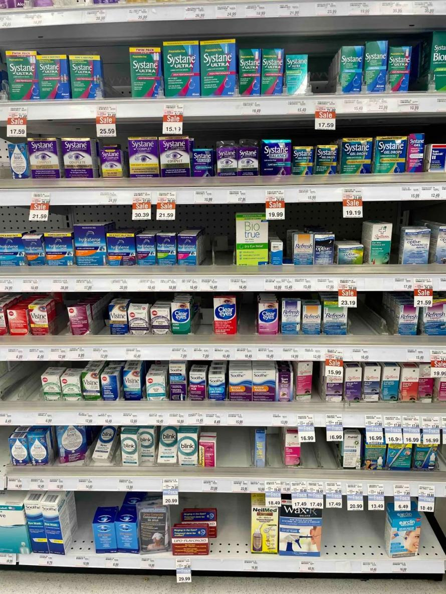
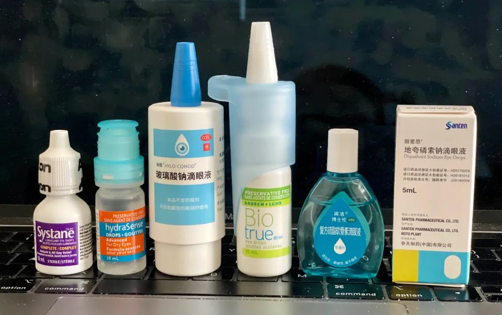

This article was written during the Chinese New Year period, and it summarizes my personal experience of struggling with eye problems for many years.

In the late 1990s, I once attempted to become a programmer. Unfortunately, I encountered a serious problem - eye fatigue.

Back in the day, CRT was the predominant type of computer monitor, and the level of eye strain and flicker was so severe that I estimate people nowadays couldn't bear to look at it for more than 10 minutes. I have particularly poor eyesight, and experienced severe symptoms such as dryness and stinging in my eyes. Back then, there were many quack doctors who almost invariably misdiagnosed my condition as either conjunctivitis or even keratitis. I tried a long list of medications, including chloramphenicol, erythromycin, ofloxacin, and gentamicin.

Of course, nothing works because it is a sterile inflammation.

Finally, I gritted my teeth and spent 100 yuan to see the deputy director of the VIP department at Tongren Hospital. At that time, 100 yuan was probably equivalent to 1000+ yuan now. After the examination, the deputy director advised me not to be too anxious and consider changing my job. Additionally, he prescribed "Runshu" for me. I said, "Isn't Runshu just chloramphenicol? Antibiotics are useless." The deputy director said it has a different formulation. And then? I bid farewell to my career as a programmer and lost the chance to become rich overnight, but my eyes gradually recovered.

### 1\. Sodium Silicate.

I have always remembered the two words "dosage form" that were mentioned by an experienced colleague. Sodium hyaluronate in "Runshu" also gave me my first intimate contact with artificial tears. Behind "Runshu" is an incredibly impressive story: Shandong Forydah achieved original creation, original research, and world-renowned success at a time when China was far behind. Hyaluronic acid, also known as HA or hyaluronan, is stabilized as its sodium salt, which has excellent biocompatibility and is widely used in medical and cosmetic fields.

In order to reduce my intake of chloramphenicol, I switched from Runchu to Alcon's TEARS NATURALE. After 2000, Alcon became almost synonymous with artificial tears in the industry and held an absolute dominant position. However, who would have guessed that after another 10 years, sodium hyaluronate would make a comeback and give Alcon a bit of a struggle.

In North America, there is a wide variety of artificial tears, and the competition is fierce.

### 2\. American products

The formula for Alcon's Tears Naturale is quite complex, and terms such as hydroxypropyl methylcellulose and dextran certainly make it impressive. This is indeed a fact as it needs to adjust viscosity, electrolyte, pH and flowability.

However, interestingly enough, its competitor, sodium hyaluronate, naturally has advantages in human adaptation, which seems to have led to a significant upgrade of Alcon, replacing Tears Naturale with Systane, and changing its core ingredient. Even so, Alcon is still facing a huge challenge: preservatives.

Due to the industry's tendencies and publicity, preservatives have become a pariah. Alcon's products in North America were originally preservative-containing, and the ordinary packaging was mostly discarded after 30 days of opening, while the small packaging without preservatives was expensive to use and waste was large.

The characteristics of American artificial tears are interesting, as they seem to be designed as consumer goods, with a variety of low-cost options. Like Americans' preference for painkillers, artificial tears are also long-term consumer goods that treat symptoms rather than the root cause, with the goal of allowing people to carry them with them and feel comfortable immediately, regardless of side effects.

Although both Alcon and Allergan have various complex relationships in Europe, for convenience, I will simply classify them as American eye drops. These two product lines are complete and diverse. Using Systane as an example, there are the hydration and ultra subcategories that tend to be water-replenishing, the balanced subcategory that tends to replenish the oil layer, the comprehensive subcategory, the anti-allergic subcategory Zaditor, the night-time subcategory Gel, and the contact lens subcategory Contacts.

In response to Alcon replacing Tears Naturale, Allergan's product, Refresh, has also undergone a significant upgrade, with the addition of sub-brands, Optive, Reliva, and Digital. Reliva is a combination of carboxymethylcellulose, hyaluronic acid, and glycerol, which should correspond to Systane Complete. Optive, on the other hand, is a more extensive product line, which further divides into various sub-categories such as water-replenishing, oil-replenishing, and anti-allergic. And Digital? That is certainly for electronic products, such as products that cultivate consumers.

It is worth noting that, with so many choices, the manufacturers have not provided a detailed product selection guide, perhaps to encourage consumers to try different products and find the one that suits them best. Overall, American products are increasingly providing preservative-free packaging, but sodium hyaluronate is still not mainstream. The universal artificial tears recommended by me in the American series is Systane Complete PF (preservative-free version).

### 3\. German-made products

In recent years, the issue of preservatives has been widely promoted by doctors, journalists, and writers, leading to the fierce retaliation of artificial tears made with sodium hyaluronate. The German products are the most representative of this trend. URSAPHARM's Hylo artificial tears have achieved great success in China due to their combination of preservative-free and different concentrations of high molecular weight sodium hyaluronate, which has received excellent reviews among consumers.

The problem of eye fatigue from prolonged use of WeChat and TikTok/Kuaishou has also led to an extremely strong demand for the product. Hylo's patented pump-style bottle minimizes the problem of contamination after opening, and a single bottle can be used for up to six months, becoming its unique selling point.

Hylo is almost nonexistent in North American pharmacies, and online sales are over three times more expensive than American-made eye drops, possibly due to differences in consumer habits. Additionally, the other two German-made sodium hyaluronate eye drops are also highly effective.

Image: My recent friends.

Dr. Bausch + Lomb's BioTrue sodium hyaluronate eye drops are mostly produced in Germany. Its bottle design is very unique (as seen on the upper right of the image) and even better than that of Systane (on the upper left), as it can also be used for up to 6 months after opening. The only thing that somewhat bothers me is that this product uses phosphate as a buffering agent to adjust the pH level. However, BioTrue aims for natural ingredients and it is said that the human eye surface naturally contains phosphates, so the somewhat alarming information in the label may be overlooked.

The HydroSense artificial tears from the German manufacturer Bayer claim, just like Sea Dew, that their sodium borate is derived from natural sources and does not contain phosphates. Surprisingly, a single bottle can last for 12 months after opening. What's even more amazing is that its bottle design is much smaller than Sea Dew's (second from left in the picture), making it more convenient to carry around, although it requires more force to squeeze the bottle each time. The latest Biotrue Hydration Boost appears to use the same bottle design, but it's unclear who has the patent for it. This formula contains oil, which we'll discuss later.

For German brands I still recommend Comod from Halo, using citrates as a buffering agent sounds more appealing (mystical), and the cost-effectiveness of domestic packaging is very good.

### Four, Japanese Products.

Japanese products, represented by the familiar brand Rohto, are like consumer goods. They contain taurine and the cooling menthol crystals of Peppermint oil, as well as various vitamins and some vasoconstrictive anti-allergy drugs, aiming to provide immediate comfort. There is a big difference between the Japanese and American styles: although both are over-the-counter medicines, American style is more like Western medicine while Japanese style is like traditional Chinese medicine, adding whatever they want to add.

The aforementioned Forya (now under Bausch & Lomb) has a "Runjie" series which is similar to the Rohto series: different colors have different functions. The Japanese style has a certain temporary effect on allergies or inflammation caused by visual fatigue, but there are not many moisturizers. I think it should not be considered an artificial tears mainstream, so I will not go into detail about it.

American eye drops usually add anti-allergy ingredients as a separate product line in artificial tears, but generally do not add stimulating ingredients such as menthol.

There is a large Japanese factory that doesn't seem like a consumer goods company, called Santen, which is a legitimate pharmaceutical company. Santen's sodium hyaluronate, called "Airy," is available in normal bottles with preservatives, which in my mind scores lower than German products. However, Santen has a special product called "Liais," which is a prescription drug (shown on the right in the figure above). I was given a bottle by a doctor when I visited Tongren Hospital earlier this year. In my opinion, it doesn't feel much like artificial tears and isn't soothing when applied to the eyes, but after a wave of tingling, it stimulates the secretion of tears and mucoprotein, effectively solving the problem of dry eyes. This approach is excellent because it solves the root cause rather than just alleviating the symptoms, and the durability of natural tears far surpasses that of artificial tears.

I temporarily gave up using "Li Aisi" after two bottles because I felt that the effect became less and less obvious with continued use. In addition, the US FDA has never approved this drug, maybe there is a reason that I don't know. Speaking of which, Japanese-style products have no market in North America, and it is unclear whether it is due to different consumer concepts or different regulations.

There are currently no recommendations for Japanese products. If you prefer something short and refreshing, you can purchase Lanrunjie to support domestic products (shown in the second position on the right in the picture).

### 5\. Dysfunction of Meibomian Glands.

I came across an analysis that suggests that 40% or even more cases of dry eye syndrome are caused by dysfunction of the meibomian glands (MGD), and I happen to be one of the individuals affected. The tear film is a three-layer structure, with an outermost layer of oil to prevent water evaporation, which means that saline solution cannot replace artificial tears. Blinking helps to replenish the tear film when it breaks, but when we are intensely focused on our phones or computers, we tend to blink less frequently, causing the tear film to dry up without us even realizing it. Over time, this can lead to various eye-related problems, with MGD at the core of it all, and unfortunately, it is irreversible.

The meibomian glands can easily become blocked if not used frequently, and once blocked, they stop producing oil, rendering tears useless, as the tear film breaks down too quickly. Practically all artificial tears in the market cannot solve the problem of unblocking the meibomian glands. Although some may claim to target MGD, they are merely adding oil to prolong the tear film, which is not treating the root cause.

When seeking treatment for MGD, one is usually advised to use hot compresses at home and meibomian gland massage at the clinic. The latter may sound pleasant, but it can be an excruciating process that may even require anesthesia. The nurse repeatedly pinches your eyelids for about 10 minutes, extracting the oil and leaving you with swollen, red eyes and blurry vision. Even after such a painful experience, the meibomian glands may still remain blocked, and many people need to undergo this procedure 5-10 times per year. iLux2 is a small eyelid massager from Alcon that is not available for personal sales, while Alcon also abandoned a portable instrument called TrueTear, which may indicate its ineffectiveness. Intense pulsed light (IPL) is a more expensive physical therapy option offered in hospitals, but there is still no consensus on its proper usage, dosage, or effectiveness. Next month, I plan to try a more expensive heated compress and expression machine called LipiFlow, but according to Reddit discussions with other patients, the effectiveness may vary.

On the other hand, there is a home-use eye massager called NuLids that costs enough to buy three LipiFlow machines at once, but I have not seen many user reviews of it yet. In terms of artificial tears, American brands tend to excel in MGD products, with Refresh Optive Mega-3 being the top-rated one, and Systane Balance also worth trying.

### Sixth, Conclusion.

The development history of artificial tears is not very long, and the Western world has only begun to pay more attention to it in the past twenty years, which is obviously related to the explosion of electronic products. Dry eye syndrome and visual fatigue are closely related, and the tear film has a certain effect on improving refraction. Insufficient tear film can cause blurred vision, headaches and further fatigue, creating a vicious cycle.

After all, the speed of human bodily evolution cannot keep up with the evolution of electronic opiates (computer games, cellphones, and apps). With the rapid expansion of the market, the renewal of tear products is also becoming faster, and the overall suggestion is to buy new rather than old.

Drug development for dry eye disease (DED) started much later, and cyclosporine (such as Restasis) is almost the only well-known drug (Xiidra is another), but it is very slow to take effect and the results are not obvious. The good news is that German company Novaliq's CyclASo (for tear deficiency) and NOV03 (for MGD) have both received FDA new drug acceptance, and Hengrui Medicine foresightfully signed an early authorization in China, which gives us the opportunity to enjoy the benefits of new drugs in sync with the rest of the world.

However, for those suffering from dry eye syndrome, they still experience considerable discomfort. The safest methods include applying warm compresses and using certain types of artificial tears. Additionally, consuming supplements such as goji and chrysanthemum, Omega 3, and lutein can provide some comfort.

The causes of dry eye syndrome are numerous, but the drug approach mainly focuses on immunosuppressants. Therefore, some doctors now advocate for eliminating allergens and strictly adhering to a low-carbohydrate, red meat-free diet (to reduce fat) in an attempt to reduce unknown allergies or inflammation within the body. This sounds easy, but it is incredibly difficult to implement in practice as carbohydrates and red meat are the absolute mainstays of our daily diet.

Overall, there are not many effective methods for doctors to treat dry eye syndrome. Most artificial tears are non-prescription drugs, with very little objective evaluation and data analysis, and may only provide temporary relief without addressing the root cause, leading to potential dependence.

This article is intended to spur discussions. Theoretically, any discomfort in our bodies serves as a warning for us to make changes.

If one has strong willpower, this is an opportunity to throw away the mobile phone, engage in more physical activity, adjust one's lifestyle, and optimize dietary habits, which can promote a positive attitude towards health.
